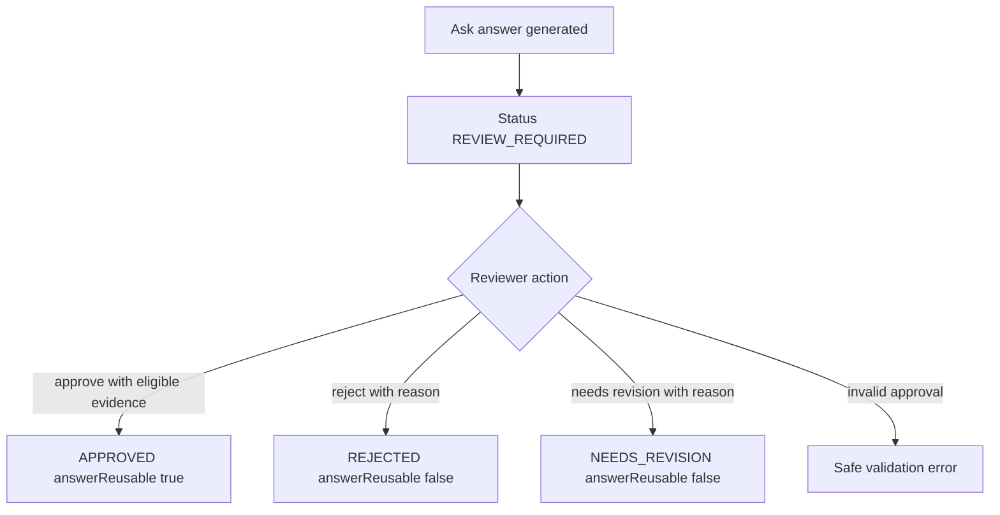

# Feature Specification: Answer Review Governance

> Source stories: US-ANSWER-REVIEW-GOVERNANCE-001 through US-ANSWER-REVIEW-GOVERNANCE-004  
> Spec status: Accepted by goal preauthorization  
> Last updated: 2026-07-07

## Overview

Answer Review Governance adds an Ask-answer-specific governance state to Trusted Ask. The feature lets Atlas expose whether an answer is generated and review-required, approved for reuse, rejected, or needs revision while preserving citations and evidence metadata.

## Actors

| Actor | Role |
|---|---|
| Trusted Ask user | Reads answers and trust state. |
| SME reviewer | Applies answer governance status and safe reason text. |
| Knowledge governance owner | Relies on reusable eligibility boundaries. |

## Functional Scope

- Create Ask runs with answer governance status `REVIEW_REQUIRED`.
- Read Ask runs with answer governance metadata and citations.
- Submit answer review actions against existing Ask runs.
- Compute `answerReusable` from status plus answer/evidence eligibility.
- Display answer governance state in Trusted Ask UI.

## Functional Requirements

### Status Model

- FR-01: Answer governance status values are `REVIEW_REQUIRED`, `APPROVED`, `REJECTED`, and `NEEDS_REVISION`.
- FR-02: Answer governance status is separate from evidence `reviewStatus`; evidence keeps document/Wiki/source review status.
- FR-03: Generated model answers default to `REVIEW_REQUIRED`.

### Review Actions

- FR-04: Review requests accept `status`, `reviewer`, and optional `reason`.
- FR-05: `REJECTED` and `NEEDS_REVISION` require a reason.
- FR-06: `APPROVED` requires a terminal successful-or-partial Ask run with answer text and at least one eligible evidence item.
- FR-07: Review metadata must be persisted as reviewer-safe fields: `answerReviewedBy`, `answerReviewReason`, and `answerReviewedAt`.

### Reuse Boundary

- FR-08: `answerReusable` is true only for `APPROVED` answers that have answer text and at least one eligible evidence item.
- FR-09: `REVIEW_REQUIRED`, `REJECTED`, and `NEEDS_REVISION` answers must never be presented as reusable approved knowledge.

### Safe Display

- FR-10: API and UI must not expose raw secrets, private paths, raw provider payloads, internal endpoints, stack traces, or raw source documents.
- FR-11: UI must show governance label, reviewer-safe reason, reuse hint, and citations.

## Non-Functional Requirements

- Security: validate and sanitize review text before persistence.
- Data safety: mock/sample data only; no external cloud calls or real company content.
- Compatibility: preserve existing Ask create/read behavior and evidence response shape except additive governance fields.
- Audit/RBAC: do not introduce new production audit or RBAC semantics in this slice.

## Workflow

## Data Requirements

| Entity | Fields |
|---|---|
| AskRun | `answerReviewStatus`, `answerReviewReason`, `answerReviewedBy`, `answerReviewedAt` |
| API response | Add `answerReviewLabel`, `answerReviewReason`, `answerReviewedBy`, `answerReviewedAt`, `answerReusable` |
| Review request | `status`, `reviewer`, `reason` |

## API Contract Summary

| Operation | Method | Path |
|---|---|---|
| Create Ask run | POST | `/api/spaces/{spaceId}/ask` |
| Read Ask run | GET | `/api/ask-runs/{runId}` |
| Review Ask answer | POST | `/api/spaces/{spaceId}/ask/{runId}/review-actions` |

## Acceptance Matrix

| Requirement | Observable Check |
|---|---|
| REQ-ANSWER-REVIEW-GOVERNANCE-001 | API contract test sees all answer governance statuses. |
| REQ-ANSWER-REVIEW-GOVERNANCE-002 | Existing Ask create test returns `REVIEW_REQUIRED`. |
| REQ-ANSWER-REVIEW-GOVERNANCE-003 | Review action persists reviewer/reason/timestamp. |
| REQ-ANSWER-REVIEW-GOVERNANCE-004 | Approved without eligible evidence fails; non-approved states set `answerReusable=false`. |
| REQ-ANSWER-REVIEW-GOVERNANCE-005 | Evidence remains visible after review. |
| REQ-ANSWER-REVIEW-GOVERNANCE-006 | Safe text tests reject secrets/endpoints/private paths. |
| REQ-ANSWER-REVIEW-GOVERNANCE-007 | Frontend tests verify governance label and reuse hint. |
| REQ-ANSWER-REVIEW-GOVERNANCE-008 | Existing Ask contract/frontend tests pass. |

## Out Of Scope

`ask-session-citations`, retrieval metrics, graph extraction, provider strategy, production workflow queues, notifications, legal/compliance sign-off, and production RBAC/audit changes.

## Open Questions

None blocking. Future slices may decide how approved answers flow into answer reuse indexes.
