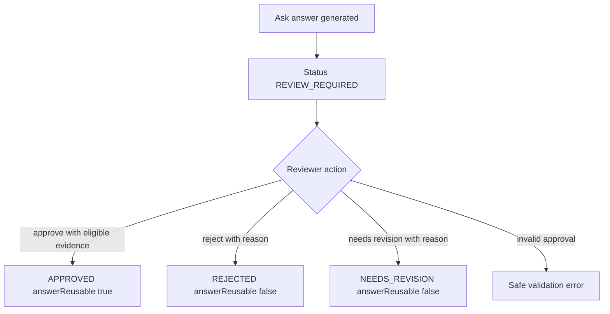

# 功能规格：Answer Review Governance

> 来源故事：US-ANSWER-REVIEW-GOVERNANCE-001 到 US-ANSWER-REVIEW-GOVERNANCE-004  
> Spec 状态：已按 goal 预授权接受  
> 最后更新：2026-07-07

## 概览

Answer Review Governance 为 Trusted Ask 增加 Ask answer 专用治理状态。该功能让 Atlas 暴露答案是生成后待审、已批准可复用、被拒绝，还是需要修订，同时保留 citations 和 evidence metadata。

## 参与者

| Actor | Role |
|---|---|
| Trusted Ask user | 阅读答案和 trust state。 |
| SME reviewer | 应用 answer governance status 和安全 reason text。 |
| Knowledge governance owner | 依赖 reusable eligibility 边界。 |

## 功能范围

- 创建 Ask run 时 answer governance status 为 `REVIEW_REQUIRED`。
- 读取 Ask run 时包含 answer governance metadata 和 citations。
- 对已有 Ask run 提交 answer review actions。
- 根据 status、answer 和 evidence eligibility 计算 `answerReusable`。
- 在 Trusted Ask UI 显示 answer governance state。

## 功能需求

### 状态模型

- FR-01：Answer governance status values 为 `REVIEW_REQUIRED`、`APPROVED`、`REJECTED` 和 `NEEDS_REVISION`。
- FR-02：Answer governance status 独立于 evidence `reviewStatus`；evidence 保留 document/Wiki/source review status。
- FR-03：模型生成答案默认 `REVIEW_REQUIRED`。

### Review Actions

- FR-04：Review requests 接受 `status`、`reviewer` 和可选 `reason`。
- FR-05：`REJECTED` 和 `NEEDS_REVISION` 必须提供 reason。
- FR-06：`APPROVED` 需要 terminal successful-or-partial Ask run、有 answer text 且至少有一个 eligible evidence item。
- FR-07：Review metadata 必须持久化为 reviewer-safe fields：`answerReviewedBy`、`answerReviewReason` 和 `answerReviewedAt`。

### 复用边界

- FR-08：只有 `APPROVED` 且有 answer text 和至少一个 eligible evidence item 时，`answerReusable` 为 true。
- FR-09：`REVIEW_REQUIRED`、`REJECTED` 和 `NEEDS_REVISION` answers 绝不能被呈现为 reusable approved knowledge。

### 安全展示

- FR-10：API 和 UI 不得暴露 raw secrets、private paths、raw provider payloads、internal endpoints、stack traces 或 raw source documents。
- FR-11：UI 必须显示 governance label、reviewer-safe reason、reuse hint 和 citations。

## 非功能需求

- Security：review text 持久化前必须校验和清洗。
- Data safety：只使用 mock/sample data；不新增 external cloud calls 或真实公司内容。
- Compatibility：保留既有 Ask create/read behavior 和 evidence response shape，只增加 governance fields。
- Audit/RBAC：本切片不新增 production audit 或 RBAC 语义。

## 工作流

## 数据需求

| Entity | Fields |
|---|---|
| AskRun | `answerReviewStatus`、`answerReviewReason`、`answerReviewedBy`、`answerReviewedAt` |
| API response | 增加 `answerReviewLabel`、`answerReviewReason`、`answerReviewedBy`、`answerReviewedAt`、`answerReusable` |
| Review request | `status`、`reviewer`、`reason` |

## API Contract Summary

| Operation | Method | Path |
|---|---|---|
| Create Ask run | POST | `/api/spaces/{spaceId}/ask` |
| Read Ask run | GET | `/api/ask-runs/{runId}` |
| Review Ask answer | POST | `/api/spaces/{spaceId}/ask/{runId}/review-actions` |

## 验收矩阵

| Requirement | Observable Check |
|---|---|
| REQ-ANSWER-REVIEW-GOVERNANCE-001 | API contract test 验证所有 answer governance statuses。 |
| REQ-ANSWER-REVIEW-GOVERNANCE-002 | 既有 Ask create test 返回 `REVIEW_REQUIRED`。 |
| REQ-ANSWER-REVIEW-GOVERNANCE-003 | Review action 持久化 reviewer/reason/timestamp。 |
| REQ-ANSWER-REVIEW-GOVERNANCE-004 | 无 eligible evidence approval 失败；非 approved states 设置 `answerReusable=false`。 |
| REQ-ANSWER-REVIEW-GOVERNANCE-005 | Review 后 evidence 仍可见。 |
| REQ-ANSWER-REVIEW-GOVERNANCE-006 | Safe text tests 拒绝 secrets/endpoints/private paths。 |
| REQ-ANSWER-REVIEW-GOVERNANCE-007 | Frontend tests 验证 governance label 和 reuse hint。 |
| REQ-ANSWER-REVIEW-GOVERNANCE-008 | 既有 Ask contract/frontend tests 通过。 |

## 范围外

`ask-session-citations`、retrieval metrics、graph extraction、provider strategy、production workflow queues、notifications、legal/compliance sign-off 和 production RBAC/audit changes。

## 未决问题

无阻塞项。未来切片可决定 approved answers 如何进入 answer reuse indexes。
