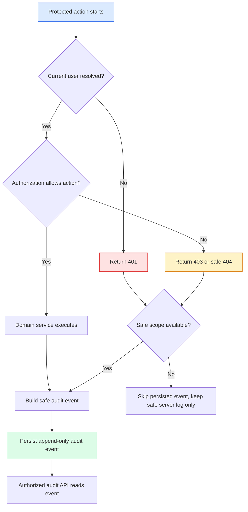

# Feature Specification: audit-log-foundation

> Source stories: US-AUDIT-LOG-FOUNDATION-001 through US-AUDIT-LOG-FOUNDATION-005
> Spec status: Draft for human review
> Last updated: 2026-07-06

## Overview

**Feature summary:** Atlas shall add a general, safe, append-only audit log foundation for security and governance events across auth, membership, representative knowledge operations, Graph, Ask, and a capability-gated audit reader. Broader Wiki ingest/linkify-lint and adapter/runtime operation emitters are documented as deferred follow-on coverage, not part of this foundation closeout.

**Business objective:** Make internal beta governance inspectable without turning audit logs into a secondary store for confidential content.

**In-scope outcome:** Backend services can emit safe audit events, authorized users can read paginated audit events by scope, and the frontend can present read-only audit history when backend capabilities allow it.

## Source Stories

| Story | Title / Summary | Key Capability |
|---|---|---|
| US-AUDIT-LOG-FOUNDATION-001 | Persist safe audit events | General audit event data model |
| US-AUDIT-LOG-FOUNDATION-002 | Capture core governance actions | Event capture for sensitive operations |
| US-AUDIT-LOG-FOUNDATION-003 | Read audit events safely | RBAC-protected audit APIs |
| US-AUDIT-LOG-FOUNDATION-004 | Inspect audit events in UI | Read-only audit panel |
| US-AUDIT-LOG-FOUNDATION-005 | Verify audit safety | Tests, scans, and closeout gates |

## Actors / Users

| Actor | Role |
|---|---|
| Auditor | Reviews governance and security events for permitted spaces. |
| Space Owner | Reviews audit history and membership changes for owned spaces. |
| Knowledge Manager | Reviews knowledge-operation events for permitted spaces. |
| Platform Admin | Reviews mock/internal global governance events. |
| Viewer / Editor | Uses Atlas without audit-log read access by default. |
| Security reviewer | Validates data-safety and denied-access behavior. |

## Functional Scope

Core capability domains:

- Audit event model: immutable event shape and stable enums.
- Audit capture: service-level and auth-boundary recording for representative sensitive operations.
- Audit read APIs: space-scoped and target-scoped filtering with pagination.
- Frontend inspection: read-only audit panel with safe empty/error/denied states.
- Verification: migration, repository, service, API, frontend, E2E, and safety scans.

Workflow boundaries:

- Entry point: a protected API request, governance action, knowledge operation, or settings/adapter operation.
- Exit point: one or more audit events persisted with safe summaries, or intentionally skipped because the target scope cannot be resolved safely.
- Terminal states: `SUCCEEDED`, `DENIED`, `FAILED`, `CONFLICT`, `SKIPPED`, `SAFE_NOT_FOUND`.

## Functional Requirements

### Audit Event Model

- **FR-AUDIT-LOG-FOUNDATION-001:** The backend shall persist an append-only `AuditEvent` record with id, created time, actor user id, actor display label, action, category, result, severity, space id, target type, target id, request id, safe summary, and metadata fields. *(REQ-AUDIT-LOG-FOUNDATION-001)*
- **FR-AUDIT-LOG-FOUNDATION-002:** Audit metadata shall be bounded allowlisted safe JSON containing counts, enum states, correlation ids, and sanitized reason codes only. *(REQ-AUDIT-LOG-FOUNDATION-002)*
- **FR-AUDIT-LOG-FOUNDATION-003:** Product APIs shall not expose an update or delete operation for audit events. *(REQ-AUDIT-LOG-FOUNDATION-001)*
- **FR-AUDIT-LOG-FOUNDATION-004:** Action, category, result, and severity values shall be documented and covered by tests. *(REQ-AUDIT-LOG-FOUNDATION-011)*

### Audit Capture

- **FR-AUDIT-LOG-FOUNDATION-005:** The auth/RBAC boundary shall emit denied-event records for `UNAUTHENTICATED`, `FORBIDDEN`, and `SAFE_NOT_FOUND` outcomes when a safe target scope can be derived. *(REQ-AUDIT-LOG-FOUNDATION-003)*
- **FR-AUDIT-LOG-FOUNDATION-006:** Membership management shall emit audit events for create, update, remove, deny, and last-owner conflict outcomes. *(REQ-AUDIT-LOG-FOUNDATION-004)*
- **FR-AUDIT-LOG-FOUNDATION-007:** Wiki publish operations shall emit audit events with target ids, action/result, actor id, safe count metadata, and safe summary. File review approval audit emission is deferred to a later review-governance hardening slice. *(REQ-AUDIT-LOG-FOUNDATION-005)*
- **FR-AUDIT-LOG-FOUNDATION-008:** Wiki ingest and linkify/lint operation audit emission shall be documented as deferred follow-on coverage; this foundation slice shall not change those services. *(REQ-AUDIT-LOG-FOUNDATION-005)*
- **FR-AUDIT-LOG-FOUNDATION-009:** Graph projection/review and Ask create operations shall emit audit events and preserve existing graph audit semantics. *(REQ-AUDIT-LOG-FOUNDATION-005, REQ-AUDIT-LOG-FOUNDATION-006)*
- **FR-AUDIT-LOG-FOUNDATION-010:** Model configuration, parser/converter/storage/vector/model operation-start or completion audit emission shall be deferred to dedicated adapter/runtime governance slices; this foundation slice shall keep raw provider/runtime payloads out of audit records. *(REQ-AUDIT-LOG-FOUNDATION-005)*

### Audit Read APIs

- **FR-AUDIT-LOG-FOUNDATION-011:** The backend shall provide a space-scoped audit list API with filters for actor, action, category, result, target type, target id, and time range. *(REQ-AUDIT-LOG-FOUNDATION-007)*
- **FR-AUDIT-LOG-FOUNDATION-012:** The backend shall provide a target-scoped audit list API for inspecting history of a permitted target resource. *(REQ-AUDIT-LOG-FOUNDATION-007)*
- **FR-AUDIT-LOG-FOUNDATION-013:** Audit list responses shall use the standard `ApiEnvelope` and `PageMeta` pagination pattern. *(REQ-AUDIT-LOG-FOUNDATION-012)*
- **FR-AUDIT-LOG-FOUNDATION-014:** Audit read APIs shall require governance read permission for the target space or platform-admin authority for allowed mock/internal global scopes. *(REQ-AUDIT-LOG-FOUNDATION-008)*
- **FR-AUDIT-LOG-FOUNDATION-015:** Cross-space audit access shall not disclose event existence, target labels, source paths, user emails outside scope, or content. *(REQ-AUDIT-LOG-FOUNDATION-009)*

### Frontend Behavior

- **FR-AUDIT-LOG-FOUNDATION-016:** Frontend shall render an audit panel only when `/api/auth/me` capabilities and API responses allow governance audit visibility. *(REQ-AUDIT-LOG-FOUNDATION-010)*
- **FR-AUDIT-LOG-FOUNDATION-017:** Frontend audit rows shall display time, actor label, action, result, target type/id, category, severity, and safe summary only. *(REQ-AUDIT-LOG-FOUNDATION-010)*
- **FR-AUDIT-LOG-FOUNDATION-018:** Frontend shall handle empty, loading, error, and denied states without showing stale data. *(REQ-AUDIT-LOG-FOUNDATION-010)*

## Non-Functional Requirements

- **Security:** Audit events must exclude raw secrets, raw tokens, raw request/response bodies, passwords, API keys, provider payloads, raw prompts, raw document text, private paths, stack traces, and raw runtime logs.
- **Reliability:** Audit write failures for non-critical informational events may not block the original business action, but audit failures for explicitly governed actions must be visible in server-side safe logs and tests. The implementation must choose and document blocking behavior per action category.
- **Auditability:** Audit event ids and request ids must allow correlation between denied responses and persisted events when the scope is safe.
- **Performance:** List APIs must be paginated and indexed by space/time and target/time.
- **Environment support:** Local/test only; no external cloud calls or real company data.

## Workflow / System Flow

Main flow:

1. A user or system operation enters a protected Atlas API.
2. The auth boundary resolves current-user context and authorization result.
3. Denied requests return safe errors and, when a safe scope is available, persist a denied audit event.
4. Allowed sensitive operations execute domain logic and emit safe audit summaries.
5. Authorized audit readers query paginated audit events for a permitted space or target.

## Data / Configuration Requirements

| Entity | Description | Key Attributes |
|---|---|---|
| AuditEvent | Append-only governance/security event | id, createdAt, actorUserId, action, category, result, severity, spaceId, targetType, targetId, requestId, safeSummary, metadata |
| AuditEventQuery | Filter contract for audit API | spaceId, actorUserId, action, category, result, targetType, targetId, createdFrom, createdTo, page, size |

Valid results: `SUCCEEDED`, `DENIED`, `FAILED`, `CONFLICT`, `SKIPPED`, `SAFE_NOT_FOUND`.

Valid categories: `AUTH`, `MEMBERSHIP`, `REVIEW`, `PUBLISH`, `WIKI`, `GRAPH`, `ASK`, `MODEL`, `ADAPTER`, `SETTINGS`.

## Integrations

- Current auth/RBAC context from `auth-space-rbac`.
- Existing domain services for publish, graph, Ask, auth, membership, and deferred Wiki/adapter emitters.
- No external SIEM, identity provider, cloud logging provider, or secret manager integration in this slice.

## Acceptance Matrix

| Acceptance | Requirements | Verification |
|---|---|---|
| AC-AUDIT-LOG-FOUNDATION-001 | REQ-001, REQ-002 | Migration/repository tests prove append-only safe event persistence. |
| AC-AUDIT-LOG-FOUNDATION-002 | REQ-003, REQ-004, REQ-005 | Service/API tests prove representative events for denied auth, membership, Wiki publish, graph projection/review/access-denied, and Ask operations; deferred Wiki ingest/linkify-lint and adapter/runtime emitters remain documented follow-on work. |
| AC-AUDIT-LOG-FOUNDATION-003 | REQ-006 | Existing graph audit behavior remains visible or is mapped to general audit records. |
| AC-AUDIT-LOG-FOUNDATION-004 | REQ-007, REQ-008, REQ-009 | Audit APIs enforce filters, pagination, RBAC, and cross-space non-disclosure. |
| AC-AUDIT-LOG-FOUNDATION-005 | REQ-010 | Frontend renders read-only audit panel and denied/empty states. |
| AC-AUDIT-LOG-FOUNDATION-006 | REQ-002, REQ-012 | Secret/private-path, network/dependency, and workflow gates pass. |

## Out of Scope

- Production SIEM export, alerting, retention jobs, tamper-evident signing, legal hold, rate limiting, secret manager, and live SSO/OIDC.
- Raw payload/body capture or raw log storage.
- Public audit endpoints.

## Risks / Ambiguities

| ID | Description | Mitigation |
|---|---|---|
| R-AUDIT-LOG-FOUNDATION-001 | Auditing too many read operations may create noise and storage pressure. | v0 captures denied requests and high-value governance writes first. |
| R-AUDIT-LOG-FOUNDATION-002 | Audit summaries can accidentally leak sensitive content. | Strict safe metadata allowlist plus tests and scans. |
| R-AUDIT-LOG-FOUNDATION-003 | Existing graph audit records may duplicate general audit events. | Document bridge/migration behavior and keep one read model authoritative for new UI. |

## Open Questions

| ID | Question | Owner |
|---|---|---|
| OQ-AUDIT-LOG-FOUNDATION-001 | Should `AUDITOR` read all categories or only governance/security categories? | Product / Security |
| OQ-AUDIT-LOG-FOUNDATION-002 | Should `graph_audit_record` be backfilled or bridged as legacy data? | Engineering |
