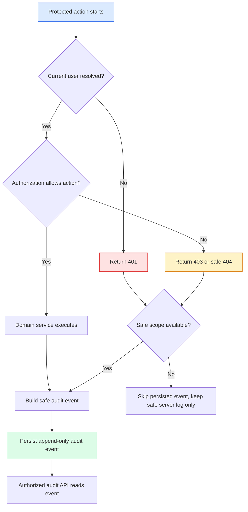

# 功能规格：audit-log-foundation

> Source stories: US-AUDIT-LOG-FOUNDATION-001 through US-AUDIT-LOG-FOUNDATION-005
> Spec status: 待人工审阅的草案
> Last updated: 2026-07-06

## Overview

**Feature summary:** Atlas 将增加通用、安全、append-only 的 audit log foundation，覆盖 auth、membership、代表性 knowledge operations、Graph、Ask 与 capability-gated audit reader。更广的 Wiki ingest/linkify-lint 以及 adapter/runtime operation emitters 记录为后续覆盖，不属于本 foundation closeout。

**Business objective:** 让 internal beta governance 可检查，同时避免 audit logs 成为机密内容的二次存储。

**In-scope outcome:** Backend services 可以产生 safe audit events，授权用户可以按 scope 读取 paginated audit events，frontend 可以在 backend capabilities 允许时展示只读 audit history。

## Source Stories

| Story | Title / Summary | Key Capability |
|---|---|---|
| US-AUDIT-LOG-FOUNDATION-001 | Persist safe audit events | 通用 audit event data model |
| US-AUDIT-LOG-FOUNDATION-002 | Capture core governance actions | 敏感操作 event capture |
| US-AUDIT-LOG-FOUNDATION-003 | Read audit events safely | RBAC-protected audit APIs |
| US-AUDIT-LOG-FOUNDATION-004 | Inspect audit events in UI | 只读 audit panel |
| US-AUDIT-LOG-FOUNDATION-005 | Verify audit safety | Tests、scans 与 closeout gates |

## Actors / Users

| Actor | Role |
|---|---|
| Auditor | 审阅被授权 spaces 的 governance 与 security events。 |
| Space Owner | 审阅 owned spaces 的 audit history 与 membership changes。 |
| Knowledge Manager | 审阅被授权 spaces 的 knowledge-operation events。 |
| Platform Admin | 审阅 mock/internal global governance events。 |
| Viewer / Editor | 默认没有 audit-log read access。 |
| Security reviewer | 验证 data-safety 与 denied-access behavior。 |

## Functional Scope

Core capability domains:

- Audit event model：immutable event shape 与 stable enums。
- Audit capture：对代表性敏感操作进行 service-level 与 auth-boundary recording。
- Audit read APIs：space-scoped 与 target-scoped filtering with pagination。
- Frontend inspection：带 safe empty/error/denied states 的只读 audit panel。
- Verification：migration、repository、service、API、frontend、E2E 与 safety scans。

Workflow boundaries:

- Entry point：protected API request、governance action、knowledge operation 或 settings/adapter operation。
- Exit point：一个或多个带 safe summaries 的 audit events，或因 target scope 不能安全解析而 intentionally skipped。
- Terminal states：`SUCCEEDED`、`DENIED`、`FAILED`、`CONFLICT`、`SKIPPED`、`SAFE_NOT_FOUND`。

## Functional Requirements

### Audit Event Model

- **FR-AUDIT-LOG-FOUNDATION-001:** Backend 必须持久化 append-only `AuditEvent` record，包含 id、created time、actor user id、actor display label、action、category、result、severity、space id、target type、target id、request id、safe summary 与 metadata fields。*(REQ-AUDIT-LOG-FOUNDATION-001)*
- **FR-AUDIT-LOG-FOUNDATION-002:** Audit metadata 必须是 bounded allowlisted safe JSON，只包含 counts、enum states、correlation ids 与 sanitized reason codes。*(REQ-AUDIT-LOG-FOUNDATION-002)*
- **FR-AUDIT-LOG-FOUNDATION-003:** Product APIs 不得暴露 audit event update 或 delete operation。*(REQ-AUDIT-LOG-FOUNDATION-001)*
- **FR-AUDIT-LOG-FOUNDATION-004:** Action、category、result 与 severity values 必须被文档化并由测试覆盖。*(REQ-AUDIT-LOG-FOUNDATION-011)*

### Audit Capture

- **FR-AUDIT-LOG-FOUNDATION-005:** Auth/RBAC boundary 必须在能安全推导 target scope 时，为 `UNAUTHENTICATED`、`FORBIDDEN` 与 `SAFE_NOT_FOUND` outcomes 产生 denied-event records。*(REQ-AUDIT-LOG-FOUNDATION-003)*
- **FR-AUDIT-LOG-FOUNDATION-006:** Membership management 必须为 create、update、remove、deny 与 last-owner conflict outcomes 产生 audit events。*(REQ-AUDIT-LOG-FOUNDATION-004)*
- **FR-AUDIT-LOG-FOUNDATION-007:** Wiki publish operations 必须产生包含 target ids、action/result、actor id、安全 count metadata 与 safe summary 的 audit events。File review approval audit emission 延后到后续 review-governance hardening slice。*(REQ-AUDIT-LOG-FOUNDATION-005)*
- **FR-AUDIT-LOG-FOUNDATION-008:** Wiki ingest 与 linkify/lint operation audit emission 记录为后续覆盖；本 foundation slice 不修改这些 services。*(REQ-AUDIT-LOG-FOUNDATION-005)*
- **FR-AUDIT-LOG-FOUNDATION-009:** Graph projection/review 与 Ask create operations 必须产生 audit events，并保留 existing graph audit semantics。*(REQ-AUDIT-LOG-FOUNDATION-005, REQ-AUDIT-LOG-FOUNDATION-006)*
- **FR-AUDIT-LOG-FOUNDATION-010:** Model configuration、parser/converter/storage/vector/model operation-start 或 completion audit emission 延后到 dedicated adapter/runtime governance slices；本 foundation slice 必须保证 audit records 不包含 raw provider/runtime payloads。*(REQ-AUDIT-LOG-FOUNDATION-005)*

### Audit Read APIs

- **FR-AUDIT-LOG-FOUNDATION-011:** Backend 必须提供 space-scoped audit list API，支持 actor、action、category、result、target type、target id 与 time range filters。*(REQ-AUDIT-LOG-FOUNDATION-007)*
- **FR-AUDIT-LOG-FOUNDATION-012:** Backend 必须提供 target-scoped audit list API，用于检查被授权 target resource 的 history。*(REQ-AUDIT-LOG-FOUNDATION-007)*
- **FR-AUDIT-LOG-FOUNDATION-013:** Audit list responses 必须使用标准 `ApiEnvelope` 与 `PageMeta` pagination pattern。*(REQ-AUDIT-LOG-FOUNDATION-012)*
- **FR-AUDIT-LOG-FOUNDATION-014:** Audit read APIs 必须要求 target space 的 governance read permission，或 mock/internal global scopes 的 platform-admin authority。*(REQ-AUDIT-LOG-FOUNDATION-008)*
- **FR-AUDIT-LOG-FOUNDATION-015:** Cross-space audit access 不得披露 event existence、target labels、source paths、scope 外 user emails 或 content。*(REQ-AUDIT-LOG-FOUNDATION-009)*

### Frontend Behavior

- **FR-AUDIT-LOG-FOUNDATION-016:** Frontend 只有在 `/api/auth/me` capabilities 与 API responses 允许 governance audit visibility 时才渲染 audit panel。*(REQ-AUDIT-LOG-FOUNDATION-010)*
- **FR-AUDIT-LOG-FOUNDATION-017:** Frontend audit rows 只展示 time、actor label、action、result、target type/id、category、severity 与 safe summary。*(REQ-AUDIT-LOG-FOUNDATION-010)*
- **FR-AUDIT-LOG-FOUNDATION-018:** Frontend 必须处理 empty、loading、error 与 denied states，且不显示 stale data。*(REQ-AUDIT-LOG-FOUNDATION-010)*

## Non-Functional Requirements

- **Security:** Audit events 必须排除 raw secrets、raw tokens、raw request/response bodies、passwords、API keys、provider payloads、raw prompts、raw document text、private paths、stack traces 与 raw runtime logs。
- **Reliability:** 非关键 informational events 的 audit write failure 可以不阻塞原业务动作，但 explicitly governed actions 的 audit failures 必须在 server-side safe logs 与 tests 中可见。实现必须按 action category 选择并记录 blocking behavior。
- **Auditability:** Audit event ids 与 request ids 必须能在 scope 安全时关联 denied responses 与 persisted events。
- **Performance:** List APIs 必须分页，并通过 space/time 与 target/time indexes 支撑。
- **Environment support:** 仅 local/test；无 external cloud calls 或 real company data。

## Workflow / System Flow

## Data / Configuration Requirements

| Entity | Description | Key Attributes |
|---|---|---|
| AuditEvent | Append-only governance/security event | id, createdAt, actorUserId, action, category, result, severity, spaceId, targetType, targetId, requestId, safeSummary, metadata |
| AuditEventQuery | Audit API filter contract | spaceId, actorUserId, action, category, result, targetType, targetId, createdFrom, createdTo, page, size |

Valid results：`SUCCEEDED`、`DENIED`、`FAILED`、`CONFLICT`、`SKIPPED`、`SAFE_NOT_FOUND`。

Valid categories：`AUTH`、`MEMBERSHIP`、`REVIEW`、`PUBLISH`、`WIKI`、`GRAPH`、`ASK`、`MODEL`、`ADAPTER`、`SETTINGS`。

## Acceptance Matrix

| Acceptance | Requirements | Verification |
|---|---|---|
| AC-AUDIT-LOG-FOUNDATION-001 | REQ-001, REQ-002 | Migration/repository tests 验证 append-only safe event persistence。 |
| AC-AUDIT-LOG-FOUNDATION-002 | REQ-003, REQ-004, REQ-005 | Service/API tests 验证 denied auth、membership、Wiki publish、graph projection/review/access-denied 与 Ask operations 的代表性 events；deferred Wiki ingest/linkify-lint 与 adapter/runtime emitters 保留为后续工作。 |
| AC-AUDIT-LOG-FOUNDATION-003 | REQ-006 | Existing graph audit behavior 仍可见或映射到 general audit records。 |
| AC-AUDIT-LOG-FOUNDATION-004 | REQ-007, REQ-008, REQ-009 | Audit APIs 执行 filters、pagination、RBAC 与 cross-space non-disclosure。 |
| AC-AUDIT-LOG-FOUNDATION-005 | REQ-010 | Frontend 渲染只读 audit panel 与 denied/empty states。 |
| AC-AUDIT-LOG-FOUNDATION-006 | REQ-002, REQ-012 | Secret/private-path、network/dependency 与 workflow gates 通过。 |

## Out of Scope

- Production SIEM export、alerting、retention jobs、tamper-evident signing、legal hold、rate limiting、secret manager 与 live SSO/OIDC。
- Raw payload/body capture 或 raw log storage。
- Public audit endpoints。

## Risks / Ambiguities

| ID | Description | Mitigation |
|---|---|---|
| R-AUDIT-LOG-FOUNDATION-001 | 审计过多 read operations 会产生噪音和存储压力。 | v0 优先覆盖 denied requests 与 high-value governance writes。 |
| R-AUDIT-LOG-FOUNDATION-002 | Audit summaries 可能意外泄露敏感内容。 | 使用严格 safe metadata allowlist、测试与扫描。 |
| R-AUDIT-LOG-FOUNDATION-003 | Existing graph audit records 可能与 general audit events 重复。 | 记录 bridge/migration behavior，并让新 UI 以一个 read model 为准。 |

## Open Questions

| ID | Question | Owner |
|---|---|---|
| OQ-AUDIT-LOG-FOUNDATION-001 | `AUDITOR` 应读取所有 categories，还是只读取 governance/security categories？ | Product / Security |
| OQ-AUDIT-LOG-FOUNDATION-002 | `graph_audit_record` 应 backfill 还是作为 legacy data bridge？ | Engineering |
