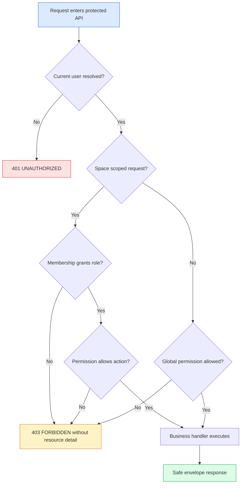

# Feature Specification: auth-space-rbac

> Source stories: US-AUTH-SPACE-RBAC-001, US-AUTH-SPACE-RBAC-002, US-AUTH-SPACE-RBAC-003, US-AUTH-SPACE-RBAC-004, US-AUTH-SPACE-RBAC-005, US-AUTH-SPACE-RBAC-006
> Spec status: Draft
> Last updated: 2026-07-05

## Overview

**Feature summary:** Atlas will introduce a backend-enforced current-user and space RBAC foundation for controlled internal beta. The slice replaces graph-only demo header authorization with a common auth context and permission policy across core APIs.

**Business objective:** Prevent internal beta users from reading, changing, publishing, asking over, or configuring knowledge spaces outside their permitted role.

**In-scope outcome:** Protected APIs return deterministic `401`/`403` outcomes, membership data is persisted, `/api/auth/me` exposes safe capabilities, and tests prove role differences for `VIEWER`, `KNOWLEDGE_MANAGER`, and `SPACE_OWNER`.

## Source Stories

| Story | Title / Summary | Key Capability |
|---|---|---|
| US-AUTH-SPACE-RBAC-001 | Resolve current user context | Auth provider boundary and `/api/auth/me` context |
| US-AUTH-SPACE-RBAC-002 | Enforce space role matrix | Space-scoped role matrix and backend guards |
| US-AUTH-SPACE-RBAC-003 | Protect membership management | Membership APIs and owner invariants |
| US-AUTH-SPACE-RBAC-004 | Prevent unauthorized resource disclosure | Safe `401`/`403` and non-disclosure behavior |
| US-AUTH-SPACE-RBAC-005 | Show permission-aware UI | Frontend capabilities from backend |
| US-AUTH-SPACE-RBAC-006 | Verify role differences | Integration and E2E coverage |

## Actors / Users

| Actor | Role |
|---|---|
| Internal user | Authenticated Atlas user with one or more space memberships. |
| Viewer | Reads permitted knowledge spaces only. |
| Editor | Uploads and updates document/batch content in permitted spaces. |
| Knowledge Manager | Runs ingest/review/publish/Wiki/graph/Ask knowledge operations. |
| Space Owner | Manages space settings and memberships for owned spaces. |
| Auditor | Reads audit-oriented metadata without write permissions. |
| Platform Admin | Has platform-wide administrative authority for internal beta. |
| Security reviewer | Validates denied access and data safety behavior. |

## Functional Scope

Core capability domains:

- Authentication context: resolve current user through mock auth now and an SSO/OIDC boundary later.
- Role matrix: map roles to readable, writable, reviewable, publishable, configurable, and membership-management capabilities.
- Membership model: persist Atlas users and space memberships with active/suspended states.
- Backend guards: enforce auth decisions consistently across existing API domains.
- Frontend awareness: consume `/api/auth/me` to present allowed actions without becoming the security boundary.
- Verification: prove role behavior, safe errors, and no real-data leakage.

Workflow boundaries:

- Entry point: protected API request or frontend boot.
- Exit point: authorized success, `401`, `403`, safe not-found for cross-space lookup, or validation/conflict for invalid membership transitions.
- Out-of-band transitions: future production SSO/OIDC, full audit retention, secret manager, and rate limiting are separate slices.

## Functional Requirements

### Authentication Context

- **FR-AUTH-SPACE-RBAC-001:** The backend shall protect all non-public Atlas product APIs by resolving a current user context before business logic executes. *(Source: US-AUTH-SPACE-RBAC-001; REQ-AUTH-SPACE-RBAC-001)*
- **FR-AUTH-SPACE-RBAC-002:** The backend shall provide a local mock auth provider that maps safe test headers or test profile defaults to seeded mock users and memberships without external calls. *(Source: US-AUTH-SPACE-RBAC-001; REQ-AUTH-SPACE-RBAC-002)*
- **FR-AUTH-SPACE-RBAC-003:** The backend shall define a company SSO/OIDC provider boundary, but this slice shall not call a real identity provider. *(Source: US-AUTH-SPACE-RBAC-001; REQ-AUTH-SPACE-RBAC-003)*
- **FR-AUTH-SPACE-RBAC-004:** `/api/auth/me` shall return safe current user profile, global roles, memberships, active space, effective roles, and capabilities. *(Source: US-AUTH-SPACE-RBAC-001, US-AUTH-SPACE-RBAC-005; REQ-AUTH-SPACE-RBAC-004)*

### Role Matrix

- **FR-AUTH-SPACE-RBAC-005:** The supported roles are `VIEWER`, `EDITOR`, `KNOWLEDGE_MANAGER`, `SPACE_OWNER`, `AUDITOR`, and `PLATFORM_ADMIN`. *(Source: US-AUTH-SPACE-RBAC-002; REQ-AUTH-SPACE-RBAC-006)*
- **FR-AUTH-SPACE-RBAC-006:** `VIEWER` can read permitted spaces, batches, files, chunks, published Wiki, graph, and completed Ask reports, but cannot create or mutate product resources. *(Source: US-AUTH-SPACE-RBAC-002; REQ-AUTH-SPACE-RBAC-007)*
- **FR-AUTH-SPACE-RBAC-007:** `EDITOR` can perform document, batch, conversion, parser, storage, and ingest write actions for permitted spaces, but cannot approve, publish, manage memberships, or change provider/settings configuration. *(Source: US-AUTH-SPACE-RBAC-002; REQ-AUTH-SPACE-RBAC-007)*
- **FR-AUTH-SPACE-RBAC-008:** `KNOWLEDGE_MANAGER` can perform review, publish, Wiki ingest/linkify/lint, graph projection/review, vector indexing/query, and Ask create actions in permitted spaces. *(Source: US-AUTH-SPACE-RBAC-002; REQ-AUTH-SPACE-RBAC-007)*
- **FR-AUTH-SPACE-RBAC-009:** `SPACE_OWNER` can manage space-scoped settings and membership for owned spaces, while also inheriting knowledge-management capabilities. *(Source: US-AUTH-SPACE-RBAC-002, US-AUTH-SPACE-RBAC-003; REQ-AUTH-SPACE-RBAC-012)*
- **FR-AUTH-SPACE-RBAC-010:** `AUDITOR` can read permitted spaces and governance metadata, but cannot run writes or membership changes. *(Source: US-AUTH-SPACE-RBAC-002; REQ-AUTH-SPACE-RBAC-006)*
- **FR-AUTH-SPACE-RBAC-011:** `PLATFORM_ADMIN` can administer spaces and settings across Atlas internal beta, using safe mock/test identities only in this slice. *(Source: US-AUTH-SPACE-RBAC-002; REQ-AUTH-SPACE-RBAC-014)*

### Backend Guards And Error Behavior

- **FR-AUTH-SPACE-RBAC-012:** Backend guards shall cover space, batch, file, chunk, review/publish, Wiki, graph, Ask, model, storage, vector, and parser APIs. *(Source: US-AUTH-SPACE-RBAC-002; REQ-AUTH-SPACE-RBAC-007)*
- **FR-AUTH-SPACE-RBAC-013:** Missing authentication on protected APIs shall return `401` with code `UNAUTHORIZED`. *(Source: US-AUTH-SPACE-RBAC-004; REQ-AUTH-SPACE-RBAC-009)*
- **FR-AUTH-SPACE-RBAC-014:** Authenticated users without a required permission shall return `403` with code `FORBIDDEN`. *(Source: US-AUTH-SPACE-RBAC-004; REQ-AUTH-SPACE-RBAC-010)*
- **FR-AUTH-SPACE-RBAC-015:** Cross-space resource access shall use generic denied responses and shall not return protected title, source path, owner, email, graph labels, Ask question text, or settings details. *(Source: US-AUTH-SPACE-RBAC-004; REQ-AUTH-SPACE-RBAC-011)*
- **FR-AUTH-SPACE-RBAC-016:** The existing graph-only header guard shall be replaced or wrapped by the common authorization path. *(Source: US-AUTH-SPACE-RBAC-002; REQ-AUTH-SPACE-RBAC-007)*

### Membership Management

- **FR-AUTH-SPACE-RBAC-017:** Atlas shall persist users and space memberships with statuses `ACTIVE`, `INVITED`, `SUSPENDED`, and `REMOVED`. *(Source: US-AUTH-SPACE-RBAC-003; REQ-AUTH-SPACE-RBAC-005)*
- **FR-AUTH-SPACE-RBAC-018:** Membership create/update/remove actions shall require `SPACE_OWNER` for the target space or `PLATFORM_ADMIN`. *(Source: US-AUTH-SPACE-RBAC-003; REQ-AUTH-SPACE-RBAC-012)*
- **FR-AUTH-SPACE-RBAC-019:** Membership changes shall reject any operation that leaves a space without at least one active `SPACE_OWNER`. *(Source: US-AUTH-SPACE-RBAC-003; REQ-AUTH-SPACE-RBAC-012)*
- **FR-AUTH-SPACE-RBAC-020:** Membership responses shall not include raw secrets, tokens, provider claims, or private identity-provider payloads. *(Source: US-AUTH-SPACE-RBAC-003; REQ-AUTH-SPACE-RBAC-014)*

### Frontend Permission Awareness

- **FR-AUTH-SPACE-RBAC-021:** Frontend shall use `/api/auth/me` and API-returned capabilities to render allowed actions. *(Source: US-AUTH-SPACE-RBAC-005; REQ-AUTH-SPACE-RBAC-008)*
- **FR-AUTH-SPACE-RBAC-022:** Frontend shall not hardcode role headers for protected operations as the primary authorization mechanism. *(Source: US-AUTH-SPACE-RBAC-005; REQ-AUTH-SPACE-RBAC-008)*
- **FR-AUTH-SPACE-RBAC-023:** UI states for denied actions shall be non-sensitive and must not imply backend access has succeeded. *(Source: US-AUTH-SPACE-RBAC-005; REQ-AUTH-SPACE-RBAC-010)*

## Non-Functional Requirements

- **Security:** No raw tokens, passwords, provider claims, internal hostnames, private paths, stack traces, or real company identities in code, docs, responses, logs, or tests.
- **Reliability:** Auth failures must be deterministic; temporary auth-provider failures in future non-mock providers must fail closed.
- **Auditability:** Auth decisions must produce minimum actor, role, space, action, target, result, and request id fields for later audit persistence.
- **Observability:** Denied requests should be loggable with safe identifiers only; no raw credentials or sensitive resource content.
- **Performance:** Guard checks should use bounded membership lookup by user and space; list endpoints must not load all memberships for unrelated spaces.
- **Environment support:** Local/test uses mock auth; production SSO/OIDC remains a configured future provider behind the boundary.

## Workflow / System Flow

Main flow:

1. A frontend or API client calls a protected Atlas endpoint.
2. Backend auth resolves current user from local mock auth in local/test mode or from the future provider boundary when configured.
3. Backend derives active-space membership and global roles.
4. Authorization maps endpoint action to required capability.
5. Allowed requests continue to existing domain logic.
6. Denied requests return `401` or `403` through the same envelope style as existing Atlas APIs.

## Data / Configuration Requirements

| Entity | Description | Key Attributes |
|---|---|---|
| AtlasUser | Safe internal user profile | id, email, displayName, status, globalRoles, createdAt, updatedAt |
| SpaceMembership | User membership in one Knowledge Space | id, userId, spaceId, role, status, invitedBy, createdAt, updatedAt |
| AuthProviderConfig | Configuration boundary for mock and future SSO/OIDC providers | providerType, enabled, issuer/configured flags, no raw secrets in response |

Validation rules:

- Role must be one of the six accepted role values.
- Membership status must be one of the four accepted status values.
- A space must retain at least one active `SPACE_OWNER`.
- Email values in mock data must be sample-safe and not real company identities.

## Integrations

External systems:

- Company SSO/OIDC provider: future integration only; represented as an adapter boundary in this slice.

APIs / interfaces:

- `/api/auth/me`: current user context and capabilities.
- `/api/spaces/{spaceId}/members`: membership list and create.
- `/api/spaces/{spaceId}/members/{membershipId}`: membership update/remove.
- Existing protected APIs: all core Atlas endpoints listed in FR-AUTH-SPACE-RBAC-012.

Credentials / secrets:

- No raw credentials are introduced. Future provider secrets are out of scope and must later use secret manager or masked configuration.

## Risks / Ambiguities

| # | Description | Type | Impact | Recommendation |
|---|---|---|---|---|
| R-AUTH-SPACE-RBAC-001 | Existing controllers have inconsistent authorization posture; graph has a local header guard while many APIs are internal-only. | Gap | High | Centralize guards and retire graph-specific policy duplication. |
| R-AUTH-SPACE-RBAC-002 | Adding Spring Security changes test and CORS behavior. | Risk | Medium | Keep the mock auth provider explicit and add integration tests for representative endpoints. |
| R-AUTH-SPACE-RBAC-003 | Full production SSO/OIDC is intentionally out of scope. | Scope | Medium | Keep provider boundary stable and document production provider setup as a later slice. |

## Out of Scope

- Live SSO/OIDC provider calls.
- Password login, MFA, real registration, SCIM, and directory sync.
- Secret manager integration, rate limiting, production audit retention, and audit UI.
- Real company identities or credentials.

## Open Questions

| # | Question | Raised from | Owner |
|---|---|---|---|
| OQ-AUTH-SPACE-RBAC-001 | Should `AUDITOR` see future audit logs across spaces or only space-scoped governance metadata? | Role matrix | Product / Security |
| OQ-AUTH-SPACE-RBAC-002 | Should future production SSO map groups to roles automatically or require explicit Atlas membership assignment? | SSO boundary | Product / Security |
