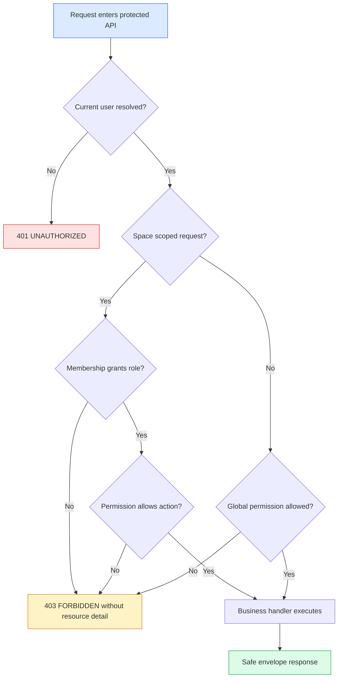

# 功能规格：auth-space-rbac

> Source stories: US-AUTH-SPACE-RBAC-001, US-AUTH-SPACE-RBAC-002, US-AUTH-SPACE-RBAC-003, US-AUTH-SPACE-RBAC-004, US-AUTH-SPACE-RBAC-005, US-AUTH-SPACE-RBAC-006
> Spec status: Draft
> Last updated: 2026-07-05

## 概览

**功能摘要：** Atlas 将为受控内部 beta 引入后端强制的 current-user 与 space RBAC foundation。本切片把 graph-only demo header 授权替换或包裹为覆盖核心 API 的通用 auth context 与 permission policy。

**业务目标：** 防止内部 beta 用户读取、修改、发布、提问或配置自己角色不允许访问的知识空间。

**范围内结果：** Protected APIs 返回确定性的 `401`/`403`，membership data 被持久化，`/api/auth/me` 暴露安全 capabilities，测试证明 `VIEWER`、`KNOWLEDGE_MANAGER` 和 `SPACE_OWNER` 的角色差异。

## Source Stories

| Story | 标题 / 摘要 | 关键能力 |
|---|---|---|
| US-AUTH-SPACE-RBAC-001 | 解析当前用户上下文 | Auth provider boundary 与 `/api/auth/me` context |
| US-AUTH-SPACE-RBAC-002 | 强制执行空间角色矩阵 | Space-scoped role matrix 与 backend guards |
| US-AUTH-SPACE-RBAC-003 | 保护成员管理 | Membership APIs 与 owner invariants |
| US-AUTH-SPACE-RBAC-004 | 防止未授权资源披露 | Safe `401`/`403` 与 non-disclosure behavior |
| US-AUTH-SPACE-RBAC-005 | 展示权限感知 UI | Frontend capabilities from backend |
| US-AUTH-SPACE-RBAC-006 | 验证角色差异 | Integration 与 E2E 覆盖 |

## Actors / Users

| Actor | Role |
|---|---|
| Internal user | 有一个或多个 space memberships 的 authenticated Atlas user。 |
| Viewer | 只读取被允许的 Knowledge Spaces。 |
| Editor | 在被允许空间中上传和更新 document/batch content。 |
| Knowledge Manager | 运行 ingest/review/publish/Wiki/graph/Ask knowledge operations。 |
| Space Owner | 管理 owned spaces 的 space settings 与 memberships。 |
| Auditor | 读取治理导向 metadata，不具备写权限。 |
| Platform Admin | 对内部 beta 拥有平台级管理权限。 |
| Security reviewer | 验证 denied access 与 data safety behavior。 |

## 功能范围

核心能力域：

- Authentication context：当前使用 mock auth，未来通过 SSO/OIDC boundary 解析 current user。
- Role matrix：把 roles 映射到 read、write、review、publish、configure 和 membership-management capabilities。
- Membership model：持久化 Atlas users 与带 active/suspended 状态的 space memberships。
- Backend guards：跨现有 API domains 一致执行 auth decisions。
- Frontend awareness：消费 `/api/auth/me` 展示允许动作，但不成为安全边界。
- Verification：证明 role behavior、safe errors 与无真实数据泄露。

工作流边界：

- 入口：protected API request 或 frontend boot。
- 出口：authorized success、`401`、`403`、cross-space lookup 的 safe not-found，或 invalid membership transition 的 validation/conflict。
- 带外转换：未来 production SSO/OIDC、full audit retention、secret manager 与 rate limiting 是独立切片。

## 功能需求

### Authentication Context

- **FR-AUTH-SPACE-RBAC-001:** 后端必须在业务逻辑执行前，为所有非公开 Atlas product APIs 解析 current user context。*(Source: US-AUTH-SPACE-RBAC-001; REQ-AUTH-SPACE-RBAC-001)*
- **FR-AUTH-SPACE-RBAC-002:** 后端必须提供 local mock auth provider，把安全 test headers 或 test profile defaults 映射到 seeded mock users 与 memberships，且不产生外部调用。*(Source: US-AUTH-SPACE-RBAC-001; REQ-AUTH-SPACE-RBAC-002)*
- **FR-AUTH-SPACE-RBAC-003:** 后端必须定义 company SSO/OIDC provider boundary，但本切片不得调用真实身份供应商。*(Source: US-AUTH-SPACE-RBAC-001; REQ-AUTH-SPACE-RBAC-003)*
- **FR-AUTH-SPACE-RBAC-004:** `/api/auth/me` 必须返回安全的 current user profile、global roles、memberships、active space、effective roles 与 capabilities。*(Source: US-AUTH-SPACE-RBAC-001, US-AUTH-SPACE-RBAC-005; REQ-AUTH-SPACE-RBAC-004)*

### Role Matrix

- **FR-AUTH-SPACE-RBAC-005:** 支持的 roles 为 `VIEWER`、`EDITOR`、`KNOWLEDGE_MANAGER`、`SPACE_OWNER`、`AUDITOR`、`PLATFORM_ADMIN`。*(Source: US-AUTH-SPACE-RBAC-002; REQ-AUTH-SPACE-RBAC-006)*
- **FR-AUTH-SPACE-RBAC-006:** `VIEWER` 可以读取 permitted spaces、batches、files、chunks、published Wiki、graph 和 completed Ask reports，但不能创建或修改产品资源。*(Source: US-AUTH-SPACE-RBAC-002; REQ-AUTH-SPACE-RBAC-007)*
- **FR-AUTH-SPACE-RBAC-007:** `EDITOR` 可以在 permitted spaces 中执行 document、batch、conversion、parser、storage 与 ingest 写动作，但不能 approve、publish、manage memberships 或变更 provider/settings configuration。*(Source: US-AUTH-SPACE-RBAC-002; REQ-AUTH-SPACE-RBAC-007)*
- **FR-AUTH-SPACE-RBAC-008:** `KNOWLEDGE_MANAGER` 可以在 permitted spaces 中执行 review、publish、Wiki ingest/linkify/lint、graph projection/review、vector indexing/query 和 Ask create。*(Source: US-AUTH-SPACE-RBAC-002; REQ-AUTH-SPACE-RBAC-007)*
- **FR-AUTH-SPACE-RBAC-009:** `SPACE_OWNER` 可以管理 owned spaces 的 space-scoped settings 与 membership，并继承 knowledge-management capabilities。*(Source: US-AUTH-SPACE-RBAC-002, US-AUTH-SPACE-RBAC-003; REQ-AUTH-SPACE-RBAC-012)*
- **FR-AUTH-SPACE-RBAC-010:** `AUDITOR` 可以读取 permitted spaces 与 governance metadata，但不能运行写操作或 membership changes。*(Source: US-AUTH-SPACE-RBAC-002; REQ-AUTH-SPACE-RBAC-006)*
- **FR-AUTH-SPACE-RBAC-011:** `PLATFORM_ADMIN` 可以跨 Atlas internal beta 管理 spaces 与 settings，本切片仅使用安全 mock/test identities。*(Source: US-AUTH-SPACE-RBAC-002; REQ-AUTH-SPACE-RBAC-014)*

### Backend Guards And Error Behavior

- **FR-AUTH-SPACE-RBAC-012:** Backend guards 必须覆盖 space、batch、file、chunk、review/publish、Wiki、graph、Ask、model、storage、vector 和 parser APIs。*(Source: US-AUTH-SPACE-RBAC-002; REQ-AUTH-SPACE-RBAC-007)*
- **FR-AUTH-SPACE-RBAC-013:** Protected APIs 缺少 authentication 时必须返回带 code `UNAUTHORIZED` 的 `401`。*(Source: US-AUTH-SPACE-RBAC-004; REQ-AUTH-SPACE-RBAC-009)*
- **FR-AUTH-SPACE-RBAC-014:** Authenticated users 缺少 required permission 时必须返回带 code `FORBIDDEN` 的 `403`。*(Source: US-AUTH-SPACE-RBAC-004; REQ-AUTH-SPACE-RBAC-010)*
- **FR-AUTH-SPACE-RBAC-015:** Cross-space resource access 必须使用通用 denied responses，且不得返回 protected title、source path、owner、email、graph labels、Ask question text 或 settings details。*(Source: US-AUTH-SPACE-RBAC-004; REQ-AUTH-SPACE-RBAC-011)*
- **FR-AUTH-SPACE-RBAC-016:** 现有 graph-only header guard 必须被 common authorization path 替换或包裹。*(Source: US-AUTH-SPACE-RBAC-002; REQ-AUTH-SPACE-RBAC-007)*

### Membership Management

- **FR-AUTH-SPACE-RBAC-017:** Atlas 必须持久化 users 与 space memberships，membership statuses 为 `ACTIVE`、`INVITED`、`SUSPENDED`、`REMOVED`。*(Source: US-AUTH-SPACE-RBAC-003; REQ-AUTH-SPACE-RBAC-005)*
- **FR-AUTH-SPACE-RBAC-018:** Membership create/update/remove actions 必须要求 target space 的 `SPACE_OWNER` 或 `PLATFORM_ADMIN`。*(Source: US-AUTH-SPACE-RBAC-003; REQ-AUTH-SPACE-RBAC-012)*
- **FR-AUTH-SPACE-RBAC-019:** Membership changes 必须拒绝任何会让 space 没有 active `SPACE_OWNER` 的操作。*(Source: US-AUTH-SPACE-RBAC-003; REQ-AUTH-SPACE-RBAC-012)*
- **FR-AUTH-SPACE-RBAC-020:** Membership responses 不得包含 raw secrets、tokens、provider claims 或 private identity-provider payloads。*(Source: US-AUTH-SPACE-RBAC-003; REQ-AUTH-SPACE-RBAC-014)*

### Frontend Permission Awareness

- **FR-AUTH-SPACE-RBAC-021:** Frontend 必须使用 `/api/auth/me` 和 API-returned capabilities 渲染 allowed actions。*(Source: US-AUTH-SPACE-RBAC-005; REQ-AUTH-SPACE-RBAC-008)*
- **FR-AUTH-SPACE-RBAC-022:** Frontend 不得把 hardcoded role headers 作为 protected operations 的主要授权机制。*(Source: US-AUTH-SPACE-RBAC-005; REQ-AUTH-SPACE-RBAC-008)*
- **FR-AUTH-SPACE-RBAC-023:** Denied actions 的 UI states 必须不含敏感信息，且不得暗示 backend access 已成功。*(Source: US-AUTH-SPACE-RBAC-005; REQ-AUTH-SPACE-RBAC-010)*

## 非功能需求

- **Security:** code、docs、responses、logs 或 tests 中不得出现 raw tokens、passwords、provider claims、internal hostnames、private paths、stack traces 或真实公司身份。
- **Reliability:** Auth failures 必须确定性；未来非 mock provider 临时失败时必须 fail closed。
- **Auditability:** Auth decisions 必须产生最小 actor、role、space、action、target、result 和 request id 字段，供后续 audit persistence 使用。
- **Observability:** Denied requests 只能用安全标识记录；不得记录 raw credentials 或敏感资源内容。
- **Performance:** Guard checks 应按 user 与 space 做 bounded membership lookup；list endpoints 不得加载无关 spaces 的所有 memberships。
- **Environment support:** Local/test 使用 mock auth；production SSO/OIDC 保持未来 provider boundary。

## Workflow / System Flow

主流程：

1. 前端或 API client 调用 protected Atlas endpoint。
2. 后端在 local/test mode 通过 local mock auth 解析 current user，在未来配置 provider 时通过 provider boundary 解析。
3. 后端派生 active-space membership 与 global roles。
4. Authorization 把 endpoint action 映射到 required capability。
5. 允许的请求继续进入现有 domain logic。
6. 被拒绝的请求通过现有 Atlas API envelope style 返回 `401` 或 `403`。

## Data / Configuration Requirements

| Entity | 描述 | 关键属性 |
|---|---|---|
| AtlasUser | 安全内部用户 profile | id, email, displayName, status, globalRoles, createdAt, updatedAt |
| SpaceMembership | 用户在一个 Knowledge Space 中的 membership | id, userId, spaceId, role, status, invitedBy, createdAt, updatedAt |
| AuthProviderConfig | mock 与未来 SSO/OIDC providers 的配置边界 | providerType, enabled, issuer/configured flags, no raw secrets in response |

Validation rules：

- Role 必须是六个 accepted role values 之一。
- Membership status 必须是四个 accepted status values 之一。
- Space 必须保留至少一个 active `SPACE_OWNER`。
- Mock data 中的 email 必须 sample-safe，不得是真实公司身份。

## Integrations

External systems：

- Company SSO/OIDC provider：只作为未来集成；本切片表示为 adapter boundary。

APIs / interfaces：

- `/api/auth/me`：current user context 与 capabilities。
- `/api/spaces/{spaceId}/members`：membership list 与 create。
- `/api/spaces/{spaceId}/members/{membershipId}`：membership update/remove。
- Existing protected APIs：FR-AUTH-SPACE-RBAC-012 中列出的所有核心 Atlas endpoints。

Credentials / secrets：

- 不引入 raw credentials。未来 provider secrets 不在范围内，必须后续使用 secret manager 或 masked configuration。

## Risks / Ambiguities

| # | 描述 | 类型 | 影响 | 建议 |
|---|---|---|---|---|
| R-AUTH-SPACE-RBAC-001 | 现有 controllers 的 authorization posture 不一致；graph 有本地 header guard，许多 APIs 仍是 internal-only。 | Gap | High | 集中 guards 并移除 graph-specific policy duplication。 |
| R-AUTH-SPACE-RBAC-002 | 引入 Spring Security 会改变测试与 CORS 行为。 | Risk | Medium | 明确 mock auth provider，并为代表性 endpoints 增加 integration tests。 |
| R-AUTH-SPACE-RBAC-003 | 完整 production SSO/OIDC 被有意排除。 | Scope | Medium | 保持 provider boundary 稳定，并把 production provider setup 记录为后续切片。 |

## 范围外

- Live SSO/OIDC provider calls。
- Password login、MFA、real registration、SCIM 与 directory sync。
- Secret manager integration、rate limiting、production audit retention 与 audit UI。
- 真实公司身份或凭证。

## 开放问题

| # | Question | Raised from | Owner |
|---|---|---|---|
| OQ-AUTH-SPACE-RBAC-001 | `AUDITOR` 未来应跨空间查看 audit logs，还是只看 space-scoped governance metadata？ | Role matrix | Product / Security |
| OQ-AUTH-SPACE-RBAC-002 | 未来 production SSO 应自动把 groups 映射到 roles，还是要求显式 Atlas membership assignment？ | SSO boundary | Product / Security |
