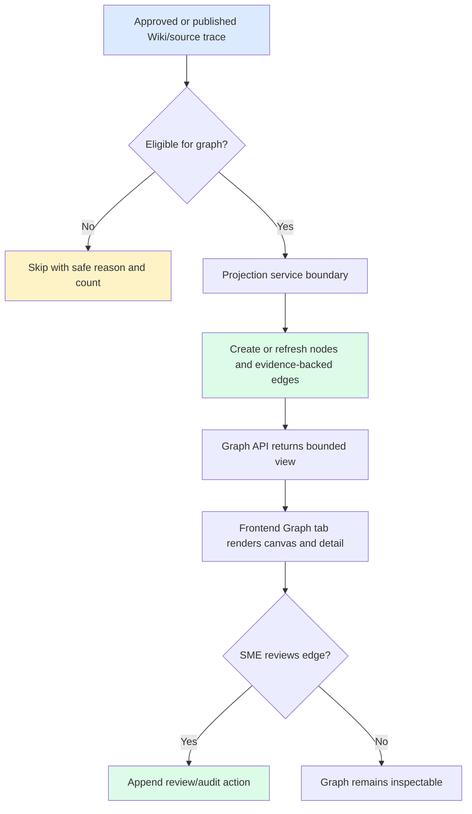

# Feature Specification: Knowledge Graph

> **Source stories:** US-KG-001, US-KG-002, US-KG-003, US-KG-004
> **Spec status:** Draft
> **Last updated:** 2026-07-03

## Overview

The `knowledge-graph` slice hardens Atlas Graph from a mock/prototype view into a trusted, inspectable full-stack capability. It projects graph nodes and edges only from approved/published Wiki and source-trace metadata, exposes bounded graph APIs, and keeps evidence, confidence, review status, authorization, and audit visible across backend and frontend.

## Actors

| Actor | Role |
|---|---|
| Knowledge user | Explores graph relationships and evidence. |
| SME reviewer | Reviews relationship trust and disputes unsupported edges. |
| Delivery lead | Checks graph readiness and quality gates. |
| Frontend engineer | Integrates Graph tab with graph API data. |
| Platform administrator | Configures and audits projection behavior. |

## Functional Scope

### S1. Graph Trust Gate

- Graph projection must read only approved or published Wiki/source trace metadata.
- Unapproved, review-required, low-confidence without approval, missing-source-trace, failed, unsupported, or unsafe records must be excluded from trusted graph outputs.
- Excluded records must be counted or reported safely so operators can understand why graph coverage is incomplete.

### S2. Graph Projection Boundary

- Projection runs through a product-facing graph projection service/adapter boundary.
- The first implementation may be deterministic and metadata-driven.
- Future model/graph engines must remain behind adapter/worker boundaries and must not leak into controllers, frontend components, or generic metadata services.
- Projection must be idempotent by stable node/edge identifiers for the same space and source evidence.

### S3. Graph Data Contract

- Nodes: `KNOWLEDGE_SPACE`, `DOCUMENT`, `WIKI_PAGE`, `CONCEPT`, `ENTITY`, `SOURCE_CHUNK`.
- Edges: `CONTAINS`, `DERIVED_FROM`, `MENTIONS`, `DEFINES`, `RELATED_TO`, `BELONGS_TO`, `USES`, `DEPENDS_ON`, `REVIEWED_BY`.
- Every trustable edge must include evidence references to source chunks or Wiki pages.
- Node and edge responses must include `reviewStatus`, `confidence` when available, and evidence summaries.

### S4. Graph API

- `GET /api/spaces/{spaceId}/graph` returns a bounded graph view.
- `GET /api/spaces/{spaceId}/graph/nodes/{nodeId}` returns selected node detail and adjacent evidence.
- `POST /api/spaces/{spaceId}/graph/projection-runs` triggers a projection run for approved/published evidence.
- `GET /api/graph/projection-runs/{runId}` returns projection summary and item outcomes.
- `POST /api/spaces/{spaceId}/graph/edges/{edgeId}/review-actions` records review action for a relationship.
- All endpoints use the Atlas `ApiEnvelope` shape and safe error bodies.

### S5. Frontend Graph Experience

- The Graph tab keeps the accepted prototype layout: graph canvas, search/filter, floating or equivalent legend/control affordances, hover/focus feedback, click detail panel, and evidence path details.
- Graph rendering must not depend on a third-party CDN or external network call.
- Empty, loading, error, unauthorized, partial, and no-evidence states must be visible.
- Graph evidence details must not display raw confidential document bodies.

### S6. Security, Audit, And Operations

- Backend must enforce authentication/authorization for graph endpoints in Phase 4.
- Authorization errors must use the same user-safe response conventions as other APIs.
- Projection runs and graph review actions must produce audit evidence.
- Secrets, internal endpoints, private absolute paths, raw stack traces, SQL, raw vectors, raw prompts, and raw model/provider diagnostics must not appear in API responses or frontend-visible errors.

## Workflow

## State Rules

| Entity | State rule |
|---|---|
| Graph node | Cannot be trusted without approved/published source lineage. |
| Graph edge | Cannot be trusted without at least one evidence reference. |
| Projection run | `REQUESTED -> RUNNING -> SUCCEEDED`, `PARTIAL_FAILED`, or `FAILED`. |
| Review action | Append-only; action result updates relationship review state but does not erase history. |

## Acceptance Matrix

| Requirement | Observable check |
|---|---|
| REQ-KG-001 | Projection tests reject unapproved/review-required raw parser output. |
| REQ-KG-002 | Node enum/API contract exposes the approved node type set. |
| REQ-KG-003 | Edge enum/API contract exposes the approved edge type set. |
| REQ-KG-004 | API contract tests assert evidence references, confidence, and review status on edges. |
| REQ-KG-005 | Graph API contract tests cover list/detail/projection/review endpoints. |
| REQ-KG-006 | Auth failure tests assert `401`/`403` user-safe envelopes. |
| REQ-KG-007 | Seam guard test forbids graph-engine names outside graph adapter/worker boundary. |
| REQ-KG-008 | E2E opens Graph, filters/searches, selects a node, and sees evidence detail. |
| REQ-KG-009 | Projection summary reports excluded unsafe/unapproved evidence. |
| REQ-KG-010 | Audit tests assert projection and review actions are recorded append-only. |
| REQ-KG-011 | Secret/path/error scans and API tests assert no unsafe data leaks. |
| REQ-KG-012 | `cd backend && mvn verify`, `cd frontend && npm run typecheck && npm run test && npm run build && npm run e2e`, and `npm run e2e:loop:mock` pass after implementation. |

## Non-Functional Requirements

- Full unit, integration, API contract, and E2E coverage for touched layers.
- No external cloud calls or new external network dependencies.
- Mock/deterministic projection is required for CI verification.
- Graph data and UI must preserve source trace, confidence, and review status.
- LLM-generated content remains review-required until SME-approved or deterministically validated.

## Out Of Scope

- Implementing Ask/RAG answer generation.
- Selecting a production graph database or layout engine.
- Direct calls to `document-normalize`, vector DBs, model providers, or storage engines from product logic.
- Storing or displaying raw confidential document content in graph responses.

## Open Questions

- OQ-KG-001: Placement of rich graph editing.
- OQ-KG-002: Production graph layout engine.
- OQ-KG-003: Whether `review-publish` is implemented before this slice.
