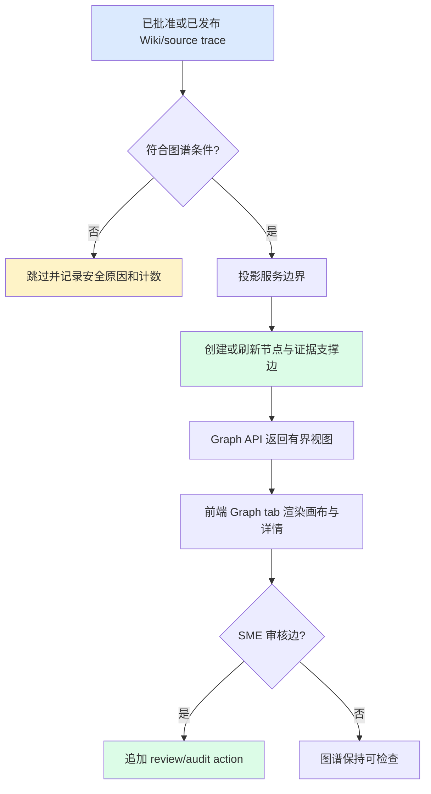

# 功能规格：知识图谱

> **来源故事：** US-KG-001、US-KG-002、US-KG-003、US-KG-004
> **规格状态：** 草稿
> **最后更新：** 2026-07-03

## 概述

`knowledge-graph` 切片将 Atlas Graph 从 mock/prototype 视图加固为可信、可检查的全栈能力。它只从已批准/已发布 Wiki 与 source-trace 元数据投影图谱节点和边，提供有界图谱 API，并在后端与前端保留 evidence、confidence、review status、authorization 和 audit。

## 参与者

| 参与者 | 角色 |
|---|---|
| 知识使用者 | 探索图谱关系和证据。 |
| SME reviewer | 审核关系可信度并质疑缺证据的边。 |
| Delivery lead | 检查图谱就绪度和质量门。 |
| 前端工程师 | 将 Graph tab 接入 graph API 数据。 |
| 平台管理员 | 配置和审计投影行为。 |

## 功能范围

### S1. 图谱可信门禁

- 图谱投影只能读取已批准或已发布 Wiki/source trace 元数据。
- 未批准、review-required、未经批准的低置信、缺少 source trace、失败、unsupported 或 unsafe 记录必须从可信图谱输出中排除。
- 被排除记录必须被安全计数或报告，让操作者理解图谱覆盖不足的原因。

### S2. 图谱投影边界

- 投影通过产品面 graph projection service/adapter 边界运行。
- 首个实现可以是确定性、元数据驱动的。
- 未来 model/graph engine 必须留在 adapter/worker 边界之后，不得泄露到 controller、前端组件或通用 metadata service。
- 对同一 space 与 source evidence，投影必须通过稳定 node/edge id 保持幂等。

### S3. 图谱数据契约

- 节点：`KNOWLEDGE_SPACE`、`DOCUMENT`、`WIKI_PAGE`、`CONCEPT`、`ENTITY`、`SOURCE_CHUNK`。
- 边：`CONTAINS`、`DERIVED_FROM`、`MENTIONS`、`DEFINES`、`RELATED_TO`、`BELONGS_TO`、`USES`、`DEPENDS_ON`、`REVIEWED_BY`。
- 每条可信边必须包含 source chunk 或 Wiki page 证据引用。
- Node 与 edge 响应必须包含 `reviewStatus`、可用时的 `confidence`，以及 evidence summaries。

### S4. 图谱 API

- `GET /api/spaces/{spaceId}/graph` 返回有界图谱视图。
- `GET /api/spaces/{spaceId}/graph/nodes/{nodeId}` 返回选中节点详情与相邻证据。
- `POST /api/spaces/{spaceId}/graph/projection-runs` 触发基于已批准/已发布证据的投影运行。
- `GET /api/graph/projection-runs/{runId}` 返回投影 summary 与 item outcomes。
- `POST /api/spaces/{spaceId}/graph/edges/{edgeId}/review-actions` 记录关系审核动作。
- 所有端点使用 Atlas `ApiEnvelope` 形态和安全错误体。

### S5. 前端图谱体验

- Graph tab 保留已接受原型布局：图谱画布、搜索/过滤、浮动或等效图例/控制、hover/focus 反馈、点击详情面板和证据路径详情。
- 图谱渲染不得依赖第三方 CDN 或外部网络调用。
- 必须展示 empty、loading、error、unauthorized、partial 和 no-evidence 状态。
- 图谱证据详情不得显示原始机密文档正文。

### S6. 安全、审计与运维

- Phase 4 后端必须对图谱端点强制 authentication/authorization。
- 授权错误必须遵守其他 API 的用户安全响应约定。
- 投影运行和图谱审核动作必须产生审计证据。
- API 响应或前端可见错误不得出现 secret、内部端点、私有绝对路径、原始 stack trace、SQL、原始向量、原始 prompt 或 provider 诊断。

## 工作流

## 状态规则

| 实体 | 状态规则 |
|---|---|
| Graph node | 没有已批准/已发布来源链路时不能被视为 trusted。 |
| Graph edge | 没有至少一个 evidence reference 时不能被视为 trusted。 |
| Projection run | `REQUESTED -> RUNNING -> SUCCEEDED`、`PARTIAL_FAILED` 或 `FAILED`。 |
| Review action | 追加写；action result 更新关系审核状态，但不抹除历史。 |

## 验收矩阵

| 需求 | 可观察检查 |
|---|---|
| REQ-KG-001 | 投影测试拒绝未批准/review-required parser 原始输出。 |
| REQ-KG-002 | Node enum/API contract 暴露批准的节点类型集合。 |
| REQ-KG-003 | Edge enum/API contract 暴露批准的边类型集合。 |
| REQ-KG-004 | API contract 测试断言 edge 上有 evidence references、confidence 和 review status。 |
| REQ-KG-005 | Graph API contract 测试覆盖 list/detail/projection/review endpoints。 |
| REQ-KG-006 | Auth failure 测试断言 `401`/`403` 用户安全 envelope。 |
| REQ-KG-007 | seam guard 测试禁止 graph-engine 名称出现在 graph adapter/worker 边界外。 |
| REQ-KG-008 | E2E 打开 Graph、过滤/搜索、选择节点并看到 evidence detail。 |
| REQ-KG-009 | 投影 summary 报告被排除的 unsafe/unapproved evidence。 |
| REQ-KG-010 | 审计测试断言 projection 与 review actions 追加记录。 |
| REQ-KG-011 | secret/path/error 扫描和 API 测试断言没有不安全数据泄露。 |
| REQ-KG-012 | 实现后 `cd backend && mvn verify`、`cd frontend && npm run typecheck && npm run test && npm run build && npm run e2e`、`npm run e2e:loop:mock` 通过。 |

## 非功能需求

- 对所触层提供完整单元、集成、API contract 和 E2E 覆盖。
- 无外部云调用或新增外部网络依赖。
- CI 验证必须使用 mock/deterministic projection。
- 图谱数据和 UI 必须保留 source trace、confidence 和 review status。
- LLM 生成内容在 SME 批准或确定性校验前保持 review-required。

## 范围外

- 实现 Ask/RAG 答案生成。
- 选择生产图数据库或布局引擎。
- 产品逻辑直连 `document-normalize`、向量库、模型供应商或存储引擎。
- 在图谱响应中存储或显示原始机密文档内容。

## 待确认问题

- OQ-KG-001：复杂图谱编辑的归属。
- OQ-KG-002：生产图谱布局引擎。
- OQ-KG-003：本切片前 `review-publish` 是否已实现。

## Product Goal Batch 3 Vue Parity Addendum

Product Goal Batch 3 将 Graph 体验扩展到真实 Vue 知识空间详情页，不改变 backend/API 范围。

| Phase | Vue Product Acceptance |
|---|---|
| Phase F 知识图谱 | 真实 Vue `IBM i Modernization` Graph 标签页提供图谱画布、Wiki Page / Entity / Concept / Document / Review Required 节点、节点选择、搜索、图例、详情面板、confidence、review status，以及所选图谱对象的 evidence/source trace。 |

该 addendum 仅更新 Vue 产品界面成熟度，不引入生产图数据库、生产布局引擎、真实数据 ingestion 或新的 API contract 行为。
