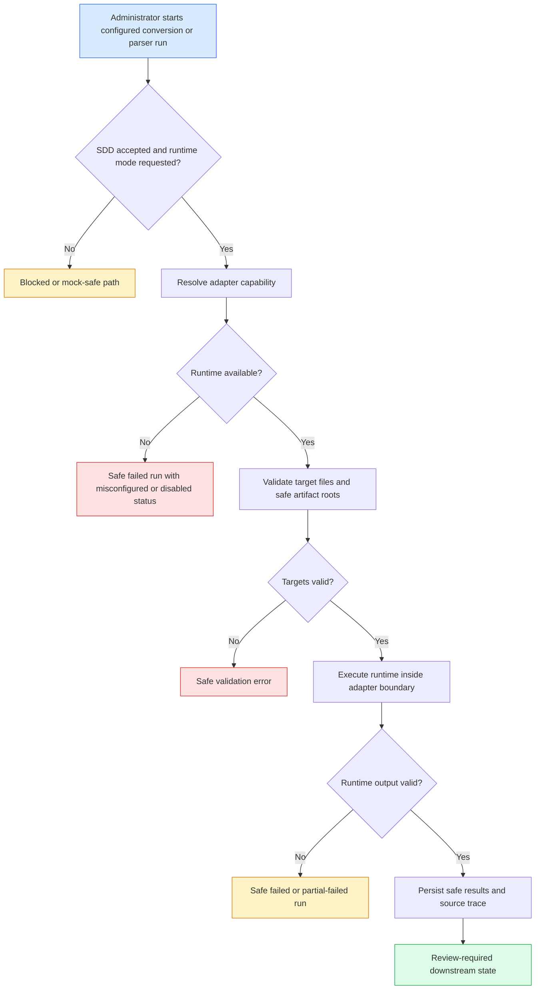

# Specification: Real Office Parser Runtime

> **Source stories:** US-REAL-OFFICE-PARSER-RUNTIME-001 to US-REAL-OFFICE-PARSER-RUNTIME-005  
> **Spec status:** Draft for user review. Product code must wait for explicit user acceptance.  
> **Last updated:** 2026-07-05

## Overview

### Feature Summary

`real-office-parser-runtime` moves Atlas from mock-only converter/parser execution toward controlled internal runtime execution for `trinity-office` and `document-normalize`, while preserving the existing converter and parser adapter contracts. The slice defines how configured runtime mode behaves, how failures are bounded, and how trace/review metadata remains safe.

### Business Objective

Atlas needs a path from API-backed mock/sample workflows to controlled internal document processing without turning the product into a script runner or coupling Wiki, Ask, Graph, or controllers directly to parser engines.

### In-Scope Outcome

After accepted implementation, Atlas can run configured internal conversion/parsing through adapter boundaries when runtime configuration is present, while normal CI and local verification still pass with mocks/fakes when no runtime is installed.

## Actors

| Actor | Role |
|---|---|
| Knowledge base administrator | Starts or monitors conversion/parser runs. |
| Platform administrator | Configures and diagnoses runtime adapter availability. |
| Delivery lead | Reviews runtime reports, partial failures, and review workload. |
| SME reviewer | Reviews generated Markdown/source chunks; does not receive auto-approved content. |
| Implementation agent | Implements only after SDD acceptance and tasks are accepted. |

## Functional Scope

### Core Capability Domains

- **SDD gate:** implementation remains blocked until the user accepts this SDD.
- **Runtime capability:** expose configured/misconfigured/disabled runtime status safely.
- **Conversion runtime:** execute Office-to-PDF through `ConverterAdapter` only.
- **Parser runtime:** execute PDF-to-Markdown/assets/chunks through `ParserAdapter` only.
- **Safety and evidence:** sanitize paths/logs/errors and preserve bounded run evidence.
- **Seam guard:** prove runtime details remain inside adapter/runtime implementation scope.

### Out Of Scope

- Production auth/RBAC, secret manager, audit policy, rate limiting, deployment runbook.
- External cloud parsing, LLM calls, graph extraction, Ask indexing, Wiki publishing, review gate changes.
- Default CI dependency on internal binaries.
- Real company documents, private paths, raw runtime logs, provider logs, or confidential screenshots in the repo.

## Functional Requirements

### SDD Gate

- **FR-REAL-OFFICE-PARSER-RUNTIME-001:** The bilingual SDD artifact set must exist before implementation starts. (REQ-REAL-OFFICE-PARSER-RUNTIME-001)
- **FR-REAL-OFFICE-PARSER-RUNTIME-002:** Traceability must record user acceptance before product code changes begin. (REQ-REAL-OFFICE-PARSER-RUNTIME-001)

### Adapter Boundary

- **FR-REAL-OFFICE-PARSER-RUNTIME-003:** Runtime execution must enter through existing converter/parser adapter interfaces, not through controllers, product services, repositories, domains, frontend code, Wiki, Ask, or Graph workflows. (REQ-REAL-OFFICE-PARSER-RUNTIME-002 to 004)
- **FR-REAL-OFFICE-PARSER-RUNTIME-004:** Runtime-specific command execution, process management, worker clients, or manifest parsing must be limited to allowed adapter/runtime implementation scope and tests. (REQ-REAL-OFFICE-PARSER-RUNTIME-004, REQ-REAL-OFFICE-PARSER-RUNTIME-015)
- **FR-REAL-OFFICE-PARSER-RUNTIME-005:** The runtime slice must not replace the existing mock adapters as the default CI path. (REQ-REAL-OFFICE-PARSER-RUNTIME-006)

### Capability And Mode

- **FR-REAL-OFFICE-PARSER-RUNTIME-006:** Converter and parser capability responses must indicate safe runtime status using existing safe status concepts: available, disabled, or misconfigured. (REQ-REAL-OFFICE-PARSER-RUNTIME-005)
- **FR-REAL-OFFICE-PARSER-RUNTIME-007:** Capability metadata must expose only masked/status-only values such as `configured`, `missing`, `disabled`, or `not-required`; it must not expose raw command paths, endpoints, hosts, tokens, passwords, environment values, or private paths. (REQ-REAL-OFFICE-PARSER-RUNTIME-005, REQ-REAL-OFFICE-PARSER-RUNTIME-009)
- **FR-REAL-OFFICE-PARSER-RUNTIME-008:** Runtime mode must be opt-in. Missing runtime config must fail safely as disabled or misconfigured and must not fall through to direct command execution. (REQ-REAL-OFFICE-PARSER-RUNTIME-005, REQ-REAL-OFFICE-PARSER-RUNTIME-014)

### Conversion Runtime

- **FR-REAL-OFFICE-PARSER-RUNTIME-009:** Configured conversion must accept the existing converter request shape: run id, batch id, target file descriptors, and artifact root hint. (REQ-REAL-OFFICE-PARSER-RUNTIME-002)
- **FR-REAL-OFFICE-PARSER-RUNTIME-010:** Successful Office conversion must return safe per-file results with `PDF_CONVERTED`, safe relative `pdfPath`, adapter key, confidence when available, and safe message. (REQ-REAL-OFFICE-PARSER-RUNTIME-010)
- **FR-REAL-OFFICE-PARSER-RUNTIME-011:** Conversion failures must map to `PDF_CONVERT_FAILED`, `OCR_REQUIRED`, `FAILED`, or `UNSUPPORTED` with bounded safe errors and no raw runtime output. (REQ-REAL-OFFICE-PARSER-RUNTIME-010, REQ-REAL-OFFICE-PARSER-RUNTIME-014)
- **FR-REAL-OFFICE-PARSER-RUNTIME-012:** Existing PDF pass-through behavior must remain compatible with the converter contract and must not require Office conversion. (REQ-REAL-OFFICE-PARSER-RUNTIME-010)

### Parser Runtime

- **FR-REAL-OFFICE-PARSER-RUNTIME-013:** Configured parsing must accept the existing parser request shape: run id, batch id, eligible file descriptors, Markdown root, assets root, and low-confidence threshold. (REQ-REAL-OFFICE-PARSER-RUNTIME-003)
- **FR-REAL-OFFICE-PARSER-RUNTIME-014:** Successful parsing must return safe relative Markdown/assets paths, confidence, adapter key, source chunks, and review-required output evidence. (REQ-REAL-OFFICE-PARSER-RUNTIME-011, REQ-REAL-OFFICE-PARSER-RUNTIME-012)
- **FR-REAL-OFFICE-PARSER-RUNTIME-015:** Parser confidence below the configured threshold must map to `LOW_CONFIDENCE`; otherwise successful Markdown output maps to `MARKDOWN_GENERATED`. (REQ-REAL-OFFICE-PARSER-RUNTIME-011)
- **FR-REAL-OFFICE-PARSER-RUNTIME-016:** Parser runtime may return `OCR_REQUIRED`, `FAILED`, or `UNSUPPORTED`; this slice does not execute OCR. (REQ-REAL-OFFICE-PARSER-RUNTIME-011, REQ-REAL-OFFICE-PARSER-RUNTIME-013)

### Safety, Validation, And Evidence

- **FR-REAL-OFFICE-PARSER-RUNTIME-017:** All runtime output paths must pass safe relative path validation before persistence or API response. (REQ-REAL-OFFICE-PARSER-RUNTIME-008)
- **FR-REAL-OFFICE-PARSER-RUNTIME-018:** Runtime stdout/stderr and exception messages must be sanitized for secrets, hosts, stack traces, private paths, and oversized messages before persistence or response. (REQ-REAL-OFFICE-PARSER-RUNTIME-009)
- **FR-REAL-OFFICE-PARSER-RUNTIME-019:** Invalid adapter output must fail safely and must not persist unsafe partial metadata. (REQ-REAL-OFFICE-PARSER-RUNTIME-014)
- **FR-REAL-OFFICE-PARSER-RUNTIME-020:** Runtime output must preserve source path, PDF path, Markdown/assets paths, confidence, adapter key, source chunks, and review status. (REQ-REAL-OFFICE-PARSER-RUNTIME-012)
- **FR-REAL-OFFICE-PARSER-RUNTIME-021:** Runtime integration must not publish Wiki pages, approve content, create graph edges, call models, or index Ask content. (REQ-REAL-OFFICE-PARSER-RUNTIME-013)

## Non-Functional Requirements

| Category | Requirement |
|---|---|
| Security | No raw secrets, command credentials, private endpoints, hostnames, private paths, stack traces, or raw runtime logs in responses, persisted safe messages, docs, or tests. |
| Reliability | Missing binary, timeout, adapter fault, invalid manifest, per-file failure, and partial success must produce deterministic safe states. |
| Extensibility | `trinity-office` and `document-normalize` remain replaceable adapter implementations; future engines must not require product-layer rewrites. |
| Auditability | Runtime attempts must be traceable through existing run/result records and safe summaries. |
| Testability | Default automated tests must pass without real binaries; opt-in runtime smoke tests must self-skip when configuration is absent. |
| Data safety | Repository fixtures remain mock/sample-safe only. |

## Workflow / System Flow

### User Flow Diagram

### Main Flow

1. User requests a configured conversion or parser run through existing API surfaces.
2. Product service validates batch and file scope.
3. Adapter registry resolves the requested adapter or default adapter.
4. Capability status is checked before execution.
5. Adapter implementation validates runtime configuration and artifact roots.
6. Runtime execution occurs only inside allowed adapter/runtime implementation scope.
7. Adapter translates runtime outputs into product-facing result records.
8. Product service validates result paths, confidence, statuses, and source chunks.
9. Safe results are persisted through existing run/result/file/chunk metadata.
10. Downstream Wiki/Graph/Ask remain review-aware and do not receive new trust claims from this slice.

## Data / Configuration Requirements

### Key Entities

| Entity | Description | Key Attributes |
|---|---|---|
| Converter capability | Safe view of converter runtime availability | adapter key, display name, version, status, default marker, supported source types, masked config |
| Conversion run | Execution evidence for Office-to-PDF conversion | run id, batch id, adapter key, status, safe summary, timestamps |
| Conversion file result | Per-file conversion evidence | file id, status, pdf path, confidence, safe error |
| Parser capability | Safe view of parser runtime availability | adapter key, display name, version, status, default marker, supported outputs, threshold, masked config |
| Parser run | Execution evidence for PDF-to-Markdown parsing | run id, batch id, adapter key, mode, status, safe summary, timestamps |
| Parser file result | Per-file parser evidence | file id, status, markdown path, assets path, confidence, chunk count, safe error |
| Source chunk | Source trace emitted by parser runtime | chunk id, file item id, source file, page, section, confidence, review status |

### Configuration Objects / Parameters

- Runtime adapter key: selects configured adapter, or default when omitted.
- Runtime mode: `mock` or `configured`; configured mode is opt-in.
- Runtime command/worker availability: status-only config, never raw path/endpoint in API response.
- Timeout and max-output limits: required implementation decisions; default values must be documented in design/tasks before coding.
- Artifact roots: safe relative roots for generated PDF, Markdown, and assets.

### Statuses / State Machine

- Conversion run: `REQUESTED -> RUNNING -> SUCCEEDED | PARTIAL_FAILED | FAILED`
- Parser run: `REQUESTED -> RUNNING -> SUCCEEDED | PARTIAL_FAILED | FAILED`
- Runtime capability: `AVAILABLE | DISABLED | MISCONFIGURED`
- File results: existing `FileStatus` values only; no new status is introduced by this slice.

## Integrations

### External/Internal Systems

| System | Purpose |
|---|---|
| `trinity-office` | Internal Office-to-PDF conversion runtime behind converter adapter. |
| `document-normalize` | Internal PDF-to-Markdown/assets parser runtime behind parser adapter. |
| Local artifact root | Stores mock/sample-safe uploaded/generated artifacts using safe relative paths. |

### APIs / Interfaces

| Interface | Direction | Purpose |
|---|---|---|
| `GET /api/converter-adapters` | Inbound | Show safe converter capability metadata. |
| `POST /api/batches/{batchId}/conversion-runs` | Inbound | Start conversion through adapter. |
| `GET /api/conversion-runs/{runId}` | Inbound | Retrieve conversion evidence. |
| `GET /api/parser-adapters` | Inbound | Show safe parser capability metadata. |
| `POST /api/batches/{batchId}/parser-runs` | Inbound | Start parsing through adapter. |
| `GET /api/parser-runs/{runId}` | Inbound | Retrieve parser evidence. |
| Converter adapter | Internal | Convert files to PDF through product-facing contract. |
| Parser adapter | Internal | Parse PDFs into Markdown/assets/chunks through product-facing contract. |

### Credentials / Secrets

- Runtime command paths, worker endpoints, and credentials, if any, must be server-side configuration only and must never be returned raw.
- This slice does not implement production secret-manager integration.

## Dependencies

### Upstream Dependencies

- Existing metadata API, file item metadata, conversion run model, parser run model, source chunks, and relative path validation.
- Existing converter/parser adapter interfaces and capability endpoints.
- User acceptance of this SDD before implementation.

### Downstream Dependencies

- Review/publish workflows rely on generated Markdown and source trace staying review-required.
- Wiki ingest/linkify relies on safe Markdown paths and source chunk metadata.
- Future worker/ops slices may replace local process execution with queue-backed runtime execution.

## Risks / Ambiguities

| # | Description | Type | Impact | Recommendation |
|---|---|---|---|---|
| R-01 | Exact `trinity-office` and `document-normalize` command or manifest contracts are not yet specified. | Gap | High | Keep implementation config-gated; add fake command/manifest tests first. |
| R-02 | Local process execution may not match future worker topology. | Assumption | Medium | Isolate execution behind a small runtime executor boundary inside adapters. |
| R-03 | Runtime output could contain private paths or noisy logs. | Risk | High | Enforce sanitization, output truncation, and diff-only secret/path scans. |
| R-04 | Real internal binaries cannot be required in default CI. | Constraint | High | Make runtime smoke tests opt-in and self-skipping. |

## Acceptance Matrix

| Requirement | Observable check |
|---|---|
| REQ-REAL-OFFICE-PARSER-RUNTIME-001 | Traceability records accepted SDD before code changes. |
| REQ-REAL-OFFICE-PARSER-RUNTIME-002 to 004 | Seam guard fails on direct runtime references outside adapter/runtime scope. |
| REQ-REAL-OFFICE-PARSER-RUNTIME-005 to 006 | Capability/API tests pass with masked status and no runtime binary installed. |
| REQ-REAL-OFFICE-PARSER-RUNTIME-007 to 009 | Secret/private-path scan and safe-message tests pass. |
| REQ-REAL-OFFICE-PARSER-RUNTIME-010 to 012 | Converter/parser service tests cover status mapping, paths, chunks, and review status. |
| REQ-REAL-OFFICE-PARSER-RUNTIME-013 | Tests prove no Wiki publish, graph, Ask, model, or approval side effects. |
| REQ-REAL-OFFICE-PARSER-RUNTIME-014 to 016 | Runtime failure, timeout, invalid manifest, missing binary, and seam guard tests pass. |

## Open Questions

| ID | Question | Raised from | Owner |
|---|---|---|---|
| OQ-REAL-OFFICE-PARSER-RUNTIME-001 | Should the first implementation use local process execution or an internal worker boundary? | Runtime topology | Architecture |
| OQ-REAL-OFFICE-PARSER-RUNTIME-002 | What exact command/manifest contract should `trinity-office` use? | Conversion runtime | Platform |
| OQ-REAL-OFFICE-PARSER-RUNTIME-003 | What exact command/manifest contract should `document-normalize` use? | Parser runtime | Platform |
| OQ-REAL-OFFICE-PARSER-RUNTIME-004 | What timeout/max-output limits should be committed for implementation? | Reliability | Platform / Security |
