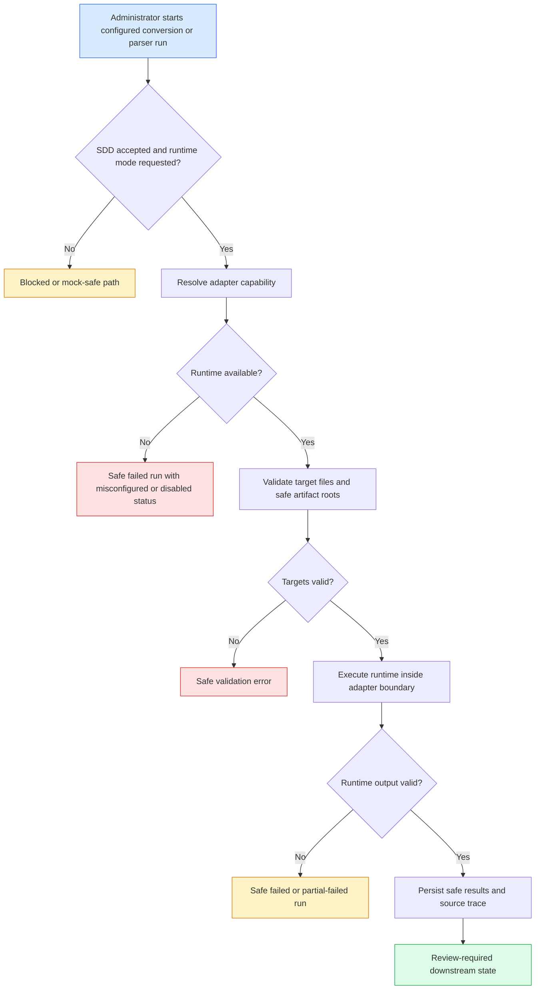

# 规格：真实 Office 解析 Runtime

> **Source stories:** US-REAL-OFFICE-PARSER-RUNTIME-001 to US-REAL-OFFICE-PARSER-RUNTIME-005
> **Spec status:** 已接受并实现。用户在 2026-07-05 的 chat 中接受本 SDD 后，才开始产品代码改动。
> **Last updated:** 2026-07-06

## 概述

### Feature Summary

`real-office-parser-runtime` 将 Atlas 从 mock-only converter/parser execution 推向受控的内部 `trinity-office` 和 `document-normalize` runtime execution，同时保留现有 converter 和 parser adapter contracts。本切片定义 configured runtime mode 的行为、失败如何有界化，以及 trace/review metadata 如何保持安全。

### Business Objective

Atlas 需要从 API-backed mock/sample workflows 走向受控内部文档处理，但不能变成脚本执行器，也不能让 Wiki、Ask、Graph 或 controllers 直接耦合 parser engines。

### In-Scope Outcome

接受并实现后，Atlas 可在 runtime configuration 存在时通过 adapter boundaries 运行 configured internal conversion/parsing；当未安装 runtime 时，正常 CI 和本地验证仍可通过 mocks/fakes。

## 角色

| Actor | Role |
|---|---|
| Knowledge base administrator | 启动或监控 conversion/parser runs。 |
| Platform administrator | 配置并诊断 runtime adapter availability。 |
| Delivery lead | 查看 runtime reports、partial failures 和 review workload。 |
| SME reviewer | 审核生成的 Markdown/source chunks；不会收到 auto-approved content。 |
| Implementation agent | 仅在 SDD acceptance 和 tasks acceptance 后实现。 |

## 功能范围

### Core Capability Domains

- **SDD gate:** 用户接受本 SDD 前，implementation 保持阻塞。
- **Runtime capability:** 安全暴露 configured/misconfigured/disabled runtime status。
- **Conversion runtime:** 只通过 `ConverterAdapter` 执行 Office-to-PDF。
- **Parser runtime:** 只通过 `ParserAdapter` 执行 PDF-to-Markdown/assets/chunks。
- **Safety and evidence:** 脱敏 paths/logs/errors，并保留有界 run evidence。
- **Seam guard:** 证明 runtime details 只存在于 adapter/runtime implementation scope。

### Out Of Scope

- 生产 auth/RBAC、secret manager、audit policy、rate limiting、deployment runbook。
- 外部 cloud parsing、LLM calls、graph extraction、Ask indexing、Wiki publishing、review gate changes。
- 默认 CI 对内部 binaries 的依赖。
- 仓库中的真实公司文档、私有路径、raw runtime logs、provider logs 或机密截图。

## 功能需求

### SDD Gate

- **FR-REAL-OFFICE-PARSER-RUNTIME-001:** 实现开始前必须存在双语 SDD artifact set。 (REQ-REAL-OFFICE-PARSER-RUNTIME-001)
- **FR-REAL-OFFICE-PARSER-RUNTIME-002:** 产品代码改动前，traceability 必须记录用户接受。 (REQ-REAL-OFFICE-PARSER-RUNTIME-001)

### Adapter Boundary

- **FR-REAL-OFFICE-PARSER-RUNTIME-003:** Runtime execution 必须通过现有 converter/parser adapter interfaces 进入，不得通过 controllers、product services、repositories、domains、frontend code、Wiki、Ask 或 Graph workflows。 (REQ-REAL-OFFICE-PARSER-RUNTIME-002 to 004)
- **FR-REAL-OFFICE-PARSER-RUNTIME-004:** Runtime-specific command execution、process management、worker clients 或 manifest parsing 只能存在于允许的 adapter/runtime implementation scope 和 tests。 (REQ-REAL-OFFICE-PARSER-RUNTIME-004, REQ-REAL-OFFICE-PARSER-RUNTIME-015)
- **FR-REAL-OFFICE-PARSER-RUNTIME-005:** Runtime slice 不得替换现有 mock adapters 作为默认 CI path。 (REQ-REAL-OFFICE-PARSER-RUNTIME-006)

### Capability And Mode

- **FR-REAL-OFFICE-PARSER-RUNTIME-006:** Converter 和 parser capability responses 必须使用现有安全 status concepts 表示 runtime status：available、disabled 或 misconfigured。 (REQ-REAL-OFFICE-PARSER-RUNTIME-005)
- **FR-REAL-OFFICE-PARSER-RUNTIME-007:** Capability metadata 只能暴露 masked/status-only values，例如 `configured`、`missing`、`disabled`、`not-required`；不得暴露 raw command paths、endpoints、hosts、tokens、passwords、environment values 或 private paths。 (REQ-REAL-OFFICE-PARSER-RUNTIME-005, REQ-REAL-OFFICE-PARSER-RUNTIME-009)
- **FR-REAL-OFFICE-PARSER-RUNTIME-008:** Runtime mode 必须 opt-in。缺少 runtime config 时必须以 disabled 或 misconfigured 安全失败，不得 fall through 到 direct command execution。 (REQ-REAL-OFFICE-PARSER-RUNTIME-005, REQ-REAL-OFFICE-PARSER-RUNTIME-014)

### Conversion Runtime

- **FR-REAL-OFFICE-PARSER-RUNTIME-009:** Configured conversion 必须接受现有 converter request shape：run id、batch id、target file descriptors、artifact root hint。 (REQ-REAL-OFFICE-PARSER-RUNTIME-002)
- **FR-REAL-OFFICE-PARSER-RUNTIME-010:** 成功 Office conversion 必须返回安全 per-file results，包含 `PDF_CONVERTED`、安全相对 `pdfPath`、adapter key、可用时的 confidence 和 safe message。 (REQ-REAL-OFFICE-PARSER-RUNTIME-010)
- **FR-REAL-OFFICE-PARSER-RUNTIME-011:** Conversion failures 必须映射为 `PDF_CONVERT_FAILED`、`OCR_REQUIRED`、`FAILED` 或 `UNSUPPORTED`，并包含有界 safe errors，不暴露 raw runtime output。 (REQ-REAL-OFFICE-PARSER-RUNTIME-010, REQ-REAL-OFFICE-PARSER-RUNTIME-014)
- **FR-REAL-OFFICE-PARSER-RUNTIME-012:** 现有 PDF pass-through behavior 必须继续兼容 converter contract，且不得要求 Office conversion。 (REQ-REAL-OFFICE-PARSER-RUNTIME-010)

### Parser Runtime

- **FR-REAL-OFFICE-PARSER-RUNTIME-013:** Configured parsing 必须接受现有 parser request shape：run id、batch id、eligible file descriptors、Markdown root、assets root、low-confidence threshold。 (REQ-REAL-OFFICE-PARSER-RUNTIME-003)
- **FR-REAL-OFFICE-PARSER-RUNTIME-014:** 成功 parsing 必须返回安全相对 Markdown/assets paths、confidence、adapter key、source chunks 和 review-required output evidence。 (REQ-REAL-OFFICE-PARSER-RUNTIME-011, REQ-REAL-OFFICE-PARSER-RUNTIME-012)
- **FR-REAL-OFFICE-PARSER-RUNTIME-015:** Parser confidence 低于 configured threshold 必须映射为 `LOW_CONFIDENCE`；否则成功 Markdown output 映射为 `MARKDOWN_GENERATED`。 (REQ-REAL-OFFICE-PARSER-RUNTIME-011)
- **FR-REAL-OFFICE-PARSER-RUNTIME-016:** Parser runtime 可以返回 `OCR_REQUIRED`、`FAILED` 或 `UNSUPPORTED`；本切片不执行 OCR。 (REQ-REAL-OFFICE-PARSER-RUNTIME-011, REQ-REAL-OFFICE-PARSER-RUNTIME-013)

### Safety, Validation, And Evidence

- **FR-REAL-OFFICE-PARSER-RUNTIME-017:** 所有 runtime output paths 在持久化或 API response 前必须通过 safe relative path validation。 (REQ-REAL-OFFICE-PARSER-RUNTIME-008)
- **FR-REAL-OFFICE-PARSER-RUNTIME-018:** Runtime stdout/stderr 和 exception messages 在持久化或 response 前必须脱敏 secrets、hosts、stack traces、private paths 和 oversized messages。 (REQ-REAL-OFFICE-PARSER-RUNTIME-009)
- **FR-REAL-OFFICE-PARSER-RUNTIME-019:** Invalid adapter output 必须安全失败，且不得持久化 unsafe partial metadata。 (REQ-REAL-OFFICE-PARSER-RUNTIME-014)
- **FR-REAL-OFFICE-PARSER-RUNTIME-020:** Runtime output 必须保留 source path、PDF path、Markdown/assets paths、confidence、adapter key、source chunks 和 review status。 (REQ-REAL-OFFICE-PARSER-RUNTIME-012)
- **FR-REAL-OFFICE-PARSER-RUNTIME-021:** Runtime integration 不得 publish Wiki pages、approve content、create graph edges、call models 或 index Ask content。 (REQ-REAL-OFFICE-PARSER-RUNTIME-013)

## 非功能需求

| Category | Requirement |
|---|---|
| Security | Responses、persisted safe messages、docs、tests 中不得出现 raw secrets、command credentials、private endpoints、hostnames、private paths、stack traces 或 raw runtime logs。 |
| Reliability | Missing binary、timeout、adapter fault、invalid manifest、per-file failure 和 partial success 必须产生确定性安全状态。 |
| Extensibility | `trinity-office` 和 `document-normalize` 仍是可替换 adapter implementations；未来 engines 不得要求 product-layer rewrites。 |
| Auditability | Runtime attempts 必须能通过现有 run/result records 和 safe summaries 追踪。 |
| Testability | 默认自动化 tests 必须在没有真实 binaries 时通过；opt-in runtime smoke tests 缺少配置时必须 self-skip。 |
| Data safety | Repository fixtures 只保持 mock/sample-safe。 |

## Workflow / System Flow

### User Flow Diagram

### Main Flow

1. 用户通过现有 API surface 请求 configured conversion 或 parser run。
2. Product service 验证 batch 和 file scope。
3. Adapter registry 解析 requested adapter 或 default adapter。
4. 执行前检查 capability status。
5. Adapter implementation 验证 runtime configuration 和 artifact roots。
6. Runtime execution 只发生在允许的 adapter/runtime implementation scope 内。
7. Adapter 将 runtime outputs 翻译为 product-facing result records。
8. Product service 验证 result paths、confidence、statuses 和 source chunks。
9. 通过现有 run/result/file/chunk metadata 持久化 safe results。
10. 下游 Wiki/Graph/Ask 保持 review-aware，不从本切片获得新的 trust claims。

## 数据 / 配置需求

### Key Entities

| Entity | Description | Key Attributes |
|---|---|---|
| Converter capability | Converter runtime availability 的安全视图 | adapter key, display name, version, status, default marker, supported source types, masked config |
| Conversion run | Office-to-PDF conversion 的 execution evidence | run id, batch id, adapter key, status, safe summary, timestamps |
| Conversion file result | Per-file conversion evidence | file id, status, pdf path, confidence, safe error |
| Parser capability | Parser runtime availability 的安全视图 | adapter key, display name, version, status, default marker, supported outputs, threshold, masked config |
| Parser run | PDF-to-Markdown parsing 的 execution evidence | run id, batch id, adapter key, mode, status, safe summary, timestamps |
| Parser file result | Per-file parser evidence | file id, status, markdown path, assets path, confidence, chunk count, safe error |
| Source chunk | Parser runtime emitted source trace | chunk id, file item id, source file, page, section, confidence, review status |

### Configuration Objects / Parameters

- Runtime adapter key：选择 configured adapter；省略时使用 default。
- Runtime mode：`mock` 或 `configured`；configured mode 为 opt-in。
- Runtime command/worker availability：status-only config，不在 API response 中暴露 raw path/endpoint。
- Timeout and max-output limits：必需实现决策；coding 前必须在 design/tasks 中记录 default values。
- Artifact roots：generated PDF、Markdown、assets 的安全相对 roots。

### Statuses / State Machine

- Conversion run: `REQUESTED -> RUNNING -> SUCCEEDED | PARTIAL_FAILED | FAILED`
- Parser run: `REQUESTED -> RUNNING -> SUCCEEDED | PARTIAL_FAILED | FAILED`
- Runtime capability: `AVAILABLE | DISABLED | MISCONFIGURED`
- File results: 仅使用现有 `FileStatus` values；本切片不新增 status。

## Integrations

### External/Internal Systems

| System | Purpose |
|---|---|
| `trinity-office` | Converter adapter 之后的内部 Office-to-PDF conversion runtime。 |
| `document-normalize` | Parser adapter 之后的内部 PDF-to-Markdown/assets parser runtime。 |
| Local artifact root | 使用安全相对路径存储 mock/sample-safe uploaded/generated artifacts。 |

### APIs / Interfaces

| Interface | Direction | Purpose |
|---|---|---|
| `GET /api/converter-adapters` | Inbound | 展示安全 converter capability metadata。 |
| `POST /api/batches/{batchId}/conversion-runs` | Inbound | 通过 adapter 启动 conversion。 |
| `GET /api/conversion-runs/{runId}` | Inbound | 获取 conversion evidence。 |
| `GET /api/parser-adapters` | Inbound | 展示安全 parser capability metadata。 |
| `POST /api/batches/{batchId}/parser-runs` | Inbound | 通过 adapter 启动 parsing。 |
| `GET /api/parser-runs/{runId}` | Inbound | 获取 parser evidence。 |
| Converter adapter | Internal | 通过 product-facing contract 将文件转换为 PDF。 |
| Parser adapter | Internal | 通过 product-facing contract 将 PDF 解析为 Markdown/assets/chunks。 |

### Credentials / Secrets

- Runtime command paths、worker endpoints 和 credentials 如存在，必须只保存在 server-side configuration，且不得 raw 返回。
- 本切片不实现 production secret-manager integration。

## Dependencies

### Upstream Dependencies

- 现有 metadata API、file item metadata、conversion run model、parser run model、source chunks 和 relative path validation。
- 现有 converter/parser adapter interfaces 和 capability endpoints。
- 实现前需要用户接受本 SDD。

### Downstream Dependencies

- Review/publish workflows 依赖 generated Markdown 和 source trace 保持 review-required。
- Wiki ingest/linkify 依赖安全 Markdown paths 和 source chunk metadata。
- 未来 worker/ops slices 可以用 queue-backed runtime execution 替换 local process execution。

## 风险 / 歧义

| # | Description | Type | Impact | Recommendation |
|---|---|---|---|---|
| R-01 | 精确 `trinity-office` 和 `document-normalize` command 或 manifest contracts 尚未指定。 | Gap | High | 保持 implementation config-gated；先添加 fake command/manifest tests。 |
| R-02 | Local process execution 可能不匹配未来 worker topology。 | Assumption | Medium | 在 adapters 内用小的 runtime executor boundary 隔离执行。 |
| R-03 | Runtime output 可能包含 private paths 或 noisy logs。 | Risk | High | 强制 sanitization、output truncation 和 diff-only secret/path scans。 |
| R-04 | 默认 CI 不能要求真实 internal binaries。 | Constraint | High | Runtime smoke tests 设为 opt-in 且 self-skipping。 |

## Acceptance Matrix

| Requirement | Observable check |
|---|---|
| REQ-REAL-OFFICE-PARSER-RUNTIME-001 | Traceability 在代码改动前记录 accepted SDD。 |
| REQ-REAL-OFFICE-PARSER-RUNTIME-002 to 004 | Seam guard 对 adapter/runtime scope 外的 direct runtime references 失败。 |
| REQ-REAL-OFFICE-PARSER-RUNTIME-005 to 006 | Capability/API tests 在没有 runtime binary 时以 masked status 通过。 |
| REQ-REAL-OFFICE-PARSER-RUNTIME-007 to 009 | Secret/private-path scan 和 safe-message tests 通过。 |
| REQ-REAL-OFFICE-PARSER-RUNTIME-010 to 012 | Converter/parser service tests 覆盖 status mapping、paths、chunks 和 review status。 |
| REQ-REAL-OFFICE-PARSER-RUNTIME-013 | Tests 证明没有 Wiki publish、graph、Ask、model 或 approval side effects。 |
| REQ-REAL-OFFICE-PARSER-RUNTIME-014 to 016 | Runtime failure、timeout、invalid manifest、missing binary 和 seam guard tests 通过。 |

## 开放问题

| ID | Question | Raised from | Owner |
|---|---|---|---|
| OQ-REAL-OFFICE-PARSER-RUNTIME-001 | 第一版实现应使用 local process execution 还是 internal worker boundary？ | Runtime topology | Architecture |
| OQ-REAL-OFFICE-PARSER-RUNTIME-002 | `trinity-office` 应使用什么 exact command/manifest contract？ | Conversion runtime | Platform |
| OQ-REAL-OFFICE-PARSER-RUNTIME-003 | `document-normalize` 应使用什么 exact command/manifest contract？ | Parser runtime | Platform |
| OQ-REAL-OFFICE-PARSER-RUNTIME-004 | 应为 implementation 承诺什么 timeout/max-output limits？ | Reliability | Platform / Security |
