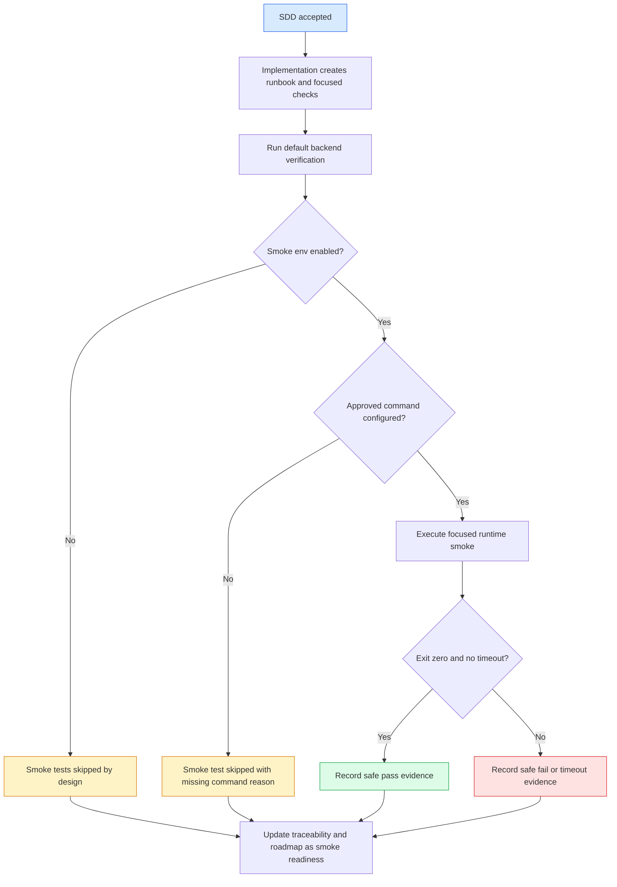

# Specification: Runtime Smoke Config And Runbook

> **Source stories:** US-RUNTIME-SMOKE-CONFIG-AND-RUNBOOK-001 to US-RUNTIME-SMOKE-CONFIG-AND-RUNBOOK-005
> **Spec status:** Accepted and implemented on 2026-07-05. Runtime smoke readiness only; not production operations readiness.
> **Last updated:** 2026-07-05

## Overview

### Feature Summary

`runtime-smoke-config-and-runbook` turns the optional real-runtime smoke checks introduced by `real-office-parser-runtime` into an explicit, safe, and repeatable readiness workflow. It documents the smoke-only environment variables, distinguishes them from Spring adapter runtime properties, and defines the runbook and verification evidence needed before approved local binaries are trusted for controlled internal checks.

### Business Objective

Atlas needs a path for validating local `trinity-office` and `document-normalize` availability without making ordinary CI dependent on real binaries, leaking local machine details, or weakening the parser/converter adapter boundary.

### In-Scope Outcome

After accepted implementation, the repository will contain a bilingual runtime smoke runbook and focused verification updates that show:

- default smoke tests self-skip safely when runtime env vars are absent;
- approved local runtime commands can be smoke-checked deliberately;
- evidence explains skip/pass/fail states without raw command paths or private data;
- adapter boundaries and mock-safe CI remain intact.

## Source Stories

| Story | Title / Summary | Key Capability |
|---|---|---|
| US-RUNTIME-SMOKE-CONFIG-AND-RUNBOOK-001 | Accept runtime smoke scope before implementation | SDD acceptance gate |
| US-RUNTIME-SMOKE-CONFIG-AND-RUNBOOK-002 | Configure optional local runtime smoke checks | Smoke env var contract |
| US-RUNTIME-SMOKE-CONFIG-AND-RUNBOOK-003 | Capture safe runtime smoke evidence | Safe evidence and diagnostics |
| US-RUNTIME-SMOKE-CONFIG-AND-RUNBOOK-004 | Provide a mock-safe runtime runbook | Repeatable runbook |
| US-RUNTIME-SMOKE-CONFIG-AND-RUNBOOK-005 | Preserve adapter boundaries during smoke readiness work | Adapter seam protection |

## Actors / Users

| Actor | Role |
|---|---|
| Product owner | Accepts SDD scope before implementation. |
| Platform administrator | Provides approved local command env vars when real binaries are available. |
| Implementation agent | Updates runbook/tests only after acceptance. |
| Delivery lead | Reviews smoke evidence and residual risk language. |
| Security reviewer | Checks that diagnostics and docs do not leak secrets or private paths. |

## Functional Scope

### Core Capability Domains

- **Acceptance gate:** prevent implementation before SDD acceptance.
- **Smoke configuration contract:** document exact env vars and defaults used by optional smoke tests.
- **Runtime configuration separation:** distinguish smoke env vars from Spring runtime adapter properties.
- **Safe evidence:** require skip/pass/fail interpretation and sanitized diagnostics.
- **Runbook:** define safe setup, run, troubleshooting, rollback, and closeout.
- **Adapter boundary preservation:** keep direct runtime invocation inside adapter/runtime test scope.

### Lifecycle Stages

1. User accepts the SDD.
2. Implementation adds or updates smoke runbook and focused checks.
3. Ordinary verification runs with smoke disabled and skipped.
4. Approved local operator enables smoke env vars and runs focused smoke checks.
5. Results are interpreted as skip, pass, fail, timeout, or unsafe diagnostic.
6. Traceability and roadmap record readiness with non-production language.

### Workflow Boundaries

- **Entry point:** accepted `runtime-smoke-config-and-runbook` SDD.
- **Exit point:** bilingual runbook and verification evidence exist; no production readiness claim is made.
- **Out-of-band transitions:** if real binaries are unavailable, smoke evidence remains skipped by design.

## Functional Requirements

### SDD Gate

- **FR-RUNTIME-SMOKE-CONFIG-AND-RUNBOOK-001:** Implementation must not begin until this bilingual SDD set is accepted. (REQ-RUNTIME-SMOKE-CONFIG-AND-RUNBOOK-001)
- **FR-RUNTIME-SMOKE-CONFIG-AND-RUNBOOK-002:** Traceability must record Draft status now and user acceptance before later implementation. (REQ-RUNTIME-SMOKE-CONFIG-AND-RUNBOOK-001)

### Smoke Configuration Contract

- **FR-RUNTIME-SMOKE-CONFIG-AND-RUNBOOK-003:** The smoke configuration contract must include `ATLAS_RUNTIME_SMOKE_ENABLED`. Any value other than case-insensitive `true` keeps smoke checks skipped. (REQ-RUNTIME-SMOKE-CONFIG-AND-RUNBOOK-002, 004)
- **FR-RUNTIME-SMOKE-CONFIG-AND-RUNBOOK-004:** The Trinity smoke command must be read from `ATLAS_TRINITY_OFFICE_COMMAND`; args are read from `ATLAS_TRINITY_OFFICE_SMOKE_ARGS` and default to `--version` when absent. (REQ-RUNTIME-SMOKE-CONFIG-AND-RUNBOOK-002)
- **FR-RUNTIME-SMOKE-CONFIG-AND-RUNBOOK-005:** The Document Normalize smoke command must be read from `ATLAS_DOCUMENT_NORMALIZE_COMMAND`; args are read from `ATLAS_DOCUMENT_NORMALIZE_SMOKE_ARGS` and default to `--version` when absent. (REQ-RUNTIME-SMOKE-CONFIG-AND-RUNBOOK-002)
- **FR-RUNTIME-SMOKE-CONFIG-AND-RUNBOOK-006:** The runbook must not tell users to commit env vars, command paths, binary paths, `.env` files, shell history, or machine-specific logs. (REQ-RUNTIME-SMOKE-CONFIG-AND-RUNBOOK-005, 007)

### Runtime Configuration Separation

- **FR-RUNTIME-SMOKE-CONFIG-AND-RUNBOOK-007:** The docs must distinguish smoke-test env vars from Spring adapter properties `atlas.runtime.trinity-office.enabled`, `atlas.runtime.trinity-office.command`, `atlas.runtime.document-normalize.enabled`, and `atlas.runtime.document-normalize.command`. (REQ-RUNTIME-SMOKE-CONFIG-AND-RUNBOOK-003)
- **FR-RUNTIME-SMOKE-CONFIG-AND-RUNBOOK-008:** The smoke check must remain a runtime health check, not a replacement for adapter conversion/parser contract tests. (REQ-RUNTIME-SMOKE-CONFIG-AND-RUNBOOK-003, 008)

### Safe Evidence And Diagnostics

- **FR-RUNTIME-SMOKE-CONFIG-AND-RUNBOOK-009:** Smoke pass evidence must identify runtime family and command result without including the raw command string. (REQ-RUNTIME-SMOKE-CONFIG-AND-RUNBOOK-005)
- **FR-RUNTIME-SMOKE-CONFIG-AND-RUNBOOK-010:** Smoke failure evidence must be bounded and sanitized before being written into traceability or final response. (REQ-RUNTIME-SMOKE-CONFIG-AND-RUNBOOK-006)
- **FR-RUNTIME-SMOKE-CONFIG-AND-RUNBOOK-011:** Smoke outcome interpretation must cover disabled, missing command, skipped by design, pass, non-zero exit, timeout, unsafe diagnostic, and blocked by missing binary approval. (REQ-RUNTIME-SMOKE-CONFIG-AND-RUNBOOK-010)

### Runbook

- **FR-RUNTIME-SMOKE-CONFIG-AND-RUNBOOK-012:** The runbook must include prerequisites, env var setup, default skip command, focused smoke command, optional approved pass command, troubleshooting, disable/rollback, evidence checklist, and data-safety rules. (REQ-RUNTIME-SMOKE-CONFIG-AND-RUNBOOK-007, 010, 011)
- **FR-RUNTIME-SMOKE-CONFIG-AND-RUNBOOK-013:** The runbook must explicitly forbid real company documents, private local paths, raw command output, secrets, provider logs, internal hostnames, and screenshots as committed evidence. (REQ-RUNTIME-SMOKE-CONFIG-AND-RUNBOOK-007)

### Adapter Boundary And CI Safety

- **FR-RUNTIME-SMOKE-CONFIG-AND-RUNBOOK-014:** Default `mvn verify` must continue to pass without real binaries, with optional smoke tests skipped when env vars are absent. (REQ-RUNTIME-SMOKE-CONFIG-AND-RUNBOOK-004, 009)
- **FR-RUNTIME-SMOKE-CONFIG-AND-RUNBOOK-015:** Seam guard verification must continue to prove direct process/runtime references are limited to allowed adapter/runtime implementation scope and tests. (REQ-RUNTIME-SMOKE-CONFIG-AND-RUNBOOK-008)
- **FR-RUNTIME-SMOKE-CONFIG-AND-RUNBOOK-016:** Roadmap and traceability must qualify this as runtime smoke readiness only. (REQ-RUNTIME-SMOKE-CONFIG-AND-RUNBOOK-012)

## Non-Functional Requirements

| Category | Requirement |
|---|---|
| Security | No secrets, raw command paths, private absolute paths, internal hostnames, raw runtime logs, shell history, or real company data in docs, tests, committed evidence, or final response. |
| Reliability | Smoke checks are opt-in and self-skipping; missing binaries do not break default verification. |
| Observability | Evidence distinguishes skipped, passed, failed, timed out, and blocked states with safe summaries. |
| Extensibility | Runtime smoke guidance remains tool-specific at the adapter boundary but does not bind product services to one runtime. |
| Testability | Verification includes default skip behavior and, when locally approved binaries exist, focused pass/fail smoke evidence. |

## Workflow / System Flow

### User Flow Diagram

### Main Flow

1. The user accepts this SDD.
2. The implementation creates the runbook and, if needed, focused smoke assertions.
3. Backend verification runs without approved runtime env vars; optional smoke tests self-skip.
4. If approved local binaries exist, the operator sets smoke env vars outside the repository.
5. Focused smoke tests execute only the approved command and smoke args.
6. Diagnostics are sanitized and bounded before inclusion in any report.
7. The slice closes with maturity-qualified roadmap and traceability language.

## Data / Configuration Requirements

### Key Entities

| Entity | Description | Key Attributes |
|---|---|---|
| Smoke configuration | Local environment contract for optional smoke tests | enable flag, command env var, smoke args env var |
| Smoke outcome | Safe evidence state for a focused runtime check | runtime family, skipped/pass/fail/timeout, safe summary |
| Runbook entry | Durable operational instruction page | prerequisites, commands, outcome matrix, troubleshooting, evidence checklist |

### Configuration Objects / Parameters

| Name | Scope | Default / Behavior | Sensitive? |
|---|---|---|---|
| `ATLAS_RUNTIME_SMOKE_ENABLED` | Smoke test only | not `true` means self-skip | No |
| `ATLAS_TRINITY_OFFICE_COMMAND` | Smoke test only | missing means Trinity smoke self-skips | Yes, treat as local path |
| `ATLAS_TRINITY_OFFICE_SMOKE_ARGS` | Smoke test only | defaults to `--version` | No, but do not commit machine-specific values |
| `ATLAS_DOCUMENT_NORMALIZE_COMMAND` | Smoke test only | missing means Document Normalize smoke self-skips | Yes, treat as local path |
| `ATLAS_DOCUMENT_NORMALIZE_SMOKE_ARGS` | Smoke test only | defaults to `--version` | No, but do not commit machine-specific values |
| `atlas.runtime.trinity-office.enabled` | Spring adapter runtime | false unless explicitly configured | No |
| `atlas.runtime.trinity-office.command` | Spring adapter runtime | blank means missing/misconfigured | Yes, treat as local path |
| `atlas.runtime.document-normalize.enabled` | Spring adapter runtime | false unless explicitly configured | No |
| `atlas.runtime.document-normalize.command` | Spring adapter runtime | blank means missing/misconfigured | Yes, treat as local path |

### Statuses / State Machine

- Smoke status: `DISABLED -> SKIPPED | ENABLED_WITH_MISSING_COMMAND -> SKIPPED | ENABLED_WITH_COMMAND -> PASSED | FAILED | TIMED_OUT`
- Documentation status: `DRAFT -> ACCEPTED -> IMPLEMENTED_WITH_SKIP_EVIDENCE | IMPLEMENTED_WITH_APPROVED_PASS_EVIDENCE`

## Integrations

| System | Purpose | Boundary |
|---|---|---|
| `trinity-office` | Optional local command smoke check and existing configured converter adapter runtime | Converter adapter/runtime boundary only |
| `document-normalize` | Optional local command smoke check and existing configured parser adapter runtime | Parser adapter/runtime boundary only |
| JUnit assumptions | Self-skip mechanism for absent optional runtime config | Test-only |

## Dependencies

### Upstream Dependencies

- `real-office-parser-runtime` implementation and optional smoke test behavior.
- Existing runtime executor bounded capture and sanitizer.
- Existing seam guard for adapter/runtime boundaries.

### Downstream Dependencies

- Future `secret-manager-integration` may replace local command handling with managed secret/config state.
- Future `deployment-monitoring-runbook` may promote smoke evidence into broader environment health checks.

## Risks / Ambiguities

| # | Description | Type | Impact | Recommendation |
|---|---|---|---|---|
| R-01 | The current smoke test checks command health only and does not process a sample document. | Gap | Medium | Keep this slice honest as command-level smoke readiness; defer sample processing to a later accepted scope. |
| R-02 | Command env vars may contain private paths. | Risk | High | Treat command env vars as sensitive local config and never commit or echo them raw. |
| R-03 | Developers may confuse Spring adapter runtime config with smoke-test env vars. | Risk | Medium | Runbook must include a side-by-side distinction table. |
| R-04 | A failing local binary could be mistaken for product regression. | Risk | Medium | Outcome matrix must separate optional smoke failure from default CI failure. |

## Acceptance Matrix

| Requirement | Observable check |
|---|---|
| REQ-RUNTIME-SMOKE-CONFIG-AND-RUNBOOK-001 | Traceability remains Draft until user acceptance; no product code changed in SDD pass. |
| REQ-RUNTIME-SMOKE-CONFIG-AND-RUNBOOK-002 to 003 | Spec/API guide/design list exact smoke env vars and Spring properties separately. |
| REQ-RUNTIME-SMOKE-CONFIG-AND-RUNBOOK-004 | Focused smoke test evidence shows self-skip when env vars are absent. |
| REQ-RUNTIME-SMOKE-CONFIG-AND-RUNBOOK-005 to 006 | Tests/static inspection verify raw command strings are not included in diagnostics. |
| REQ-RUNTIME-SMOKE-CONFIG-AND-RUNBOOK-007 | Runbook contains mock/sample-safe fixture and real-data bans. |
| REQ-RUNTIME-SMOKE-CONFIG-AND-RUNBOOK-008 | Seam guard still passes. |
| REQ-RUNTIME-SMOKE-CONFIG-AND-RUNBOOK-009 | `cd backend && mvn verify` passes without local binaries. |
| REQ-RUNTIME-SMOKE-CONFIG-AND-RUNBOOK-010 to 011 | Runbook and tasks include outcome matrix and closeout evidence checklist. |
| REQ-RUNTIME-SMOKE-CONFIG-AND-RUNBOOK-012 | Roadmap/traceability use runtime smoke readiness language only. |

## Out Of Scope

- New public API endpoints.
- Production deployment monitoring.
- Secret manager integration.
- Auth/RBAC/audit/rate limit hardening.
- Full sample document conversion/parser smoke.
- Default CI dependence on real binaries.

## Open Questions

| ID | Question | Raised from | Owner |
|---|---|---|---|
| OQ-RUNTIME-SMOKE-CONFIG-AND-RUNBOOK-001 | Should the accepted runbook live under `docs/00-context/runbooks/` or `docs/07-acceptance/`? | Requirements | Product / Platform |
| OQ-RUNTIME-SMOKE-CONFIG-AND-RUNBOOK-002 | Should future smoke checks validate a tiny approved sample conversion/parse fixture, or stay at command health checks only? | Requirements | Platform / Security |
