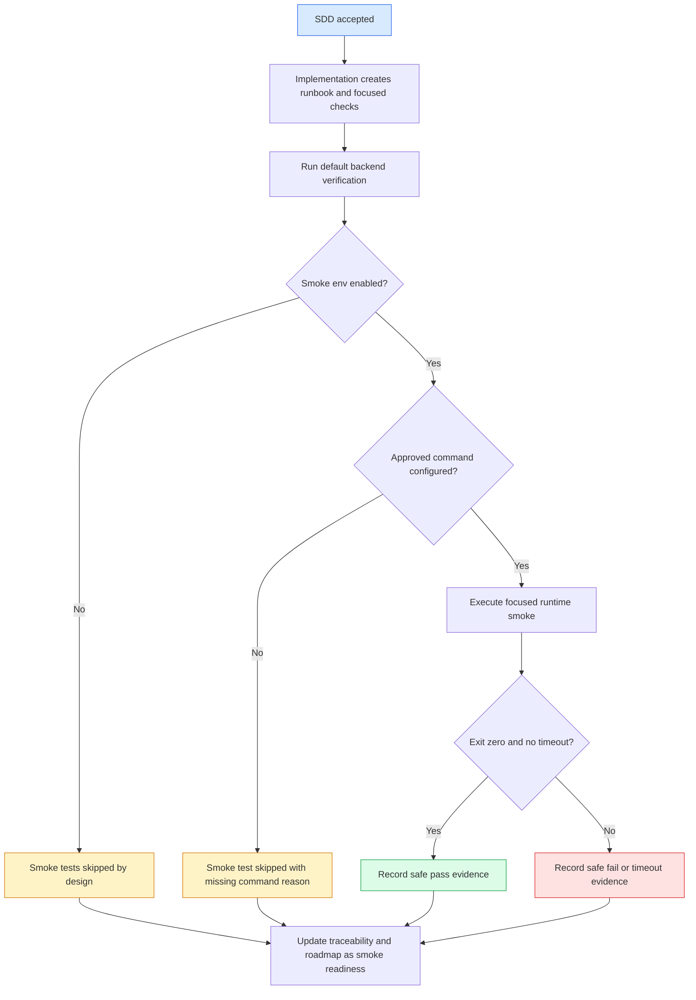

# 规格：Runtime Smoke Config And Runbook

> **来源故事:** US-RUNTIME-SMOKE-CONFIG-AND-RUNBOOK-001 到 US-RUNTIME-SMOKE-CONFIG-AND-RUNBOOK-005  
> **Spec 状态:** 已于 2026-07-05 接受并实现。仅代表 runtime smoke readiness，不代表 production operations readiness。  
> **最后更新:** 2026-07-05

## 概述

### 功能摘要

`runtime-smoke-config-and-runbook` 将 `real-office-parser-runtime` 引入的 optional real-runtime smoke checks 转换为明确、安全、可重复的 readiness workflow。它记录 smoke-only 环境变量，区分这些变量与 Spring adapter runtime properties，并定义 approved local binaries 在受控内部检查前所需的 runbook 与验证证据。

### 业务目标

Atlas 需要一种方式来验证本地 `trinity-office` 与 `document-normalize` 可用性，同时不让普通 CI 依赖真实 binaries，不泄露本机细节，也不削弱 parser/converter adapter boundary。

### 范围内结果

在用户接受并完成实现后，仓库将包含双语 runtime smoke runbook 与聚焦验证更新，证明：

- 默认 smoke tests 在 runtime env vars 缺失时安全 self-skip；
- approved local runtime commands 可以被有意执行 smoke check；
- evidence 能解释 skip/pass/fail 状态，且不包含 raw command paths 或私有数据；
- adapter boundaries 与 mock-safe CI 保持不变。

## 来源故事

| Story | 标题 / 摘要 | 核心能力 |
|---|---|---|
| US-RUNTIME-SMOKE-CONFIG-AND-RUNBOOK-001 | 实现前接受 runtime smoke 范围 | SDD 接受门 |
| US-RUNTIME-SMOKE-CONFIG-AND-RUNBOOK-002 | 配置 optional local runtime smoke checks | Smoke env var contract |
| US-RUNTIME-SMOKE-CONFIG-AND-RUNBOOK-003 | 捕获安全 runtime smoke evidence | 安全 evidence 与 diagnostics |
| US-RUNTIME-SMOKE-CONFIG-AND-RUNBOOK-004 | 提供 mock-safe runtime runbook | 可重复 runbook |
| US-RUNTIME-SMOKE-CONFIG-AND-RUNBOOK-005 | 在 smoke readiness 工作中保留 adapter boundaries | Adapter seam protection |

## 参与者 / 用户

| Actor | 角色 |
|---|---|
| Product owner | 在实现前接受 SDD 范围。 |
| Platform administrator | 当真实 binaries 可用时提供 approved local command env vars。 |
| Implementation agent | 只在接受后更新 runbook/tests。 |
| Delivery lead | 审阅 smoke evidence 与残留风险语言。 |
| Security reviewer | 检查 diagnostics 与 docs 不泄露 secrets 或 private paths。 |

## 功能范围

### 核心能力域

- **Acceptance gate:** 在 SDD 接受前阻止 implementation。
- **Smoke configuration contract:** 记录 optional smoke tests 使用的精确 env vars 与默认值。
- **Runtime configuration separation:** 区分 smoke env vars 与 Spring runtime adapter properties。
- **Safe evidence:** 要求 skip/pass/fail 解释与 sanitized diagnostics。
- **Runbook:** 定义安全 setup、run、troubleshooting、rollback 与 closeout。
- **Adapter boundary preservation:** 将 direct runtime invocation 限制在 adapter/runtime test scope 内。

### 生命周期阶段

1. 用户接受 SDD。
2. Implementation 增加或更新 smoke runbook 与聚焦 checks。
3. 普通 verification 在 smoke disabled 状态下运行并 skipped。
4. 如 approved local binaries 存在，operator 在仓库外设置 smoke env vars。
5. Focused smoke tests 只执行 approved command 与 smoke args。
6. Diagnostics 在进入任何报告前 sanitized 且 bounded。
7. 切片用非生产语言更新 traceability 与 roadmap 后关闭。

### 工作流边界

- **入口:** 已接受的 `runtime-smoke-config-and-runbook` SDD。
- **出口:** 双语 runbook 与 verification evidence 存在；不做 production readiness 宣称。
- **异常转移:** 如果真实 binaries 不可用，smoke evidence 按设计保持 skipped。

## 功能需求

### SDD Gate

- **FR-RUNTIME-SMOKE-CONFIG-AND-RUNBOOK-001:** 在本双语 SDD set 被接受前不得开始 implementation。 (REQ-RUNTIME-SMOKE-CONFIG-AND-RUNBOOK-001)
- **FR-RUNTIME-SMOKE-CONFIG-AND-RUNBOOK-002:** Traceability 当前必须记录 Draft 状态，并在后续 implementation 前记录用户接受。 (REQ-RUNTIME-SMOKE-CONFIG-AND-RUNBOOK-001)

### Smoke Configuration Contract

- **FR-RUNTIME-SMOKE-CONFIG-AND-RUNBOOK-003:** Smoke 配置契约必须包含 `ATLAS_RUNTIME_SMOKE_ENABLED`。除大小写不敏感的 `true` 之外，任何值都让 smoke checks 保持 skipped。 (REQ-RUNTIME-SMOKE-CONFIG-AND-RUNBOOK-002, 004)
- **FR-RUNTIME-SMOKE-CONFIG-AND-RUNBOOK-004:** Trinity smoke command 必须从 `ATLAS_TRINITY_OFFICE_COMMAND` 读取；args 从 `ATLAS_TRINITY_OFFICE_SMOKE_ARGS` 读取，缺失时默认为 `--version`。 (REQ-RUNTIME-SMOKE-CONFIG-AND-RUNBOOK-002)
- **FR-RUNTIME-SMOKE-CONFIG-AND-RUNBOOK-005:** Document Normalize smoke command 必须从 `ATLAS_DOCUMENT_NORMALIZE_COMMAND` 读取；args 从 `ATLAS_DOCUMENT_NORMALIZE_SMOKE_ARGS` 读取，缺失时默认为 `--version`。 (REQ-RUNTIME-SMOKE-CONFIG-AND-RUNBOOK-002)
- **FR-RUNTIME-SMOKE-CONFIG-AND-RUNBOOK-006:** Runbook 不得要求用户提交 env vars、command paths、binary paths、`.env` files、shell history 或机器特定 logs。 (REQ-RUNTIME-SMOKE-CONFIG-AND-RUNBOOK-005, 007)

### Runtime Configuration Separation

- **FR-RUNTIME-SMOKE-CONFIG-AND-RUNBOOK-007:** 文档必须区分 smoke-test env vars 与 Spring adapter properties：`atlas.runtime.trinity-office.enabled`、`atlas.runtime.trinity-office.command`、`atlas.runtime.document-normalize.enabled`、`atlas.runtime.document-normalize.command`。 (REQ-RUNTIME-SMOKE-CONFIG-AND-RUNBOOK-003)
- **FR-RUNTIME-SMOKE-CONFIG-AND-RUNBOOK-008:** Smoke check 必须保持 runtime health check，不替代 adapter conversion/parser contract tests。 (REQ-RUNTIME-SMOKE-CONFIG-AND-RUNBOOK-003, 008)

### Safe Evidence And Diagnostics

- **FR-RUNTIME-SMOKE-CONFIG-AND-RUNBOOK-009:** Smoke pass evidence 必须标识 runtime family 与 command result，但不得包含 raw command string。 (REQ-RUNTIME-SMOKE-CONFIG-AND-RUNBOOK-005)
- **FR-RUNTIME-SMOKE-CONFIG-AND-RUNBOOK-010:** Smoke failure evidence 在写入 traceability 或 final response 前必须 bounded 且 sanitized。 (REQ-RUNTIME-SMOKE-CONFIG-AND-RUNBOOK-006)
- **FR-RUNTIME-SMOKE-CONFIG-AND-RUNBOOK-011:** Smoke outcome interpretation 必须覆盖 disabled、missing command、skipped by design、pass、non-zero exit、timeout、unsafe diagnostic、blocked by missing binary approval。 (REQ-RUNTIME-SMOKE-CONFIG-AND-RUNBOOK-010)

### Runbook

- **FR-RUNTIME-SMOKE-CONFIG-AND-RUNBOOK-012:** Runbook 必须包含 prerequisites、env var setup、default skip command、focused smoke command、optional approved pass command、troubleshooting、disable/rollback、evidence checklist 与 data-safety rules。 (REQ-RUNTIME-SMOKE-CONFIG-AND-RUNBOOK-007, 010, 011)
- **FR-RUNTIME-SMOKE-CONFIG-AND-RUNBOOK-013:** Runbook 必须明确禁止真实公司文档、私有本地路径、raw command output、secrets、provider logs、内部 hostnames 与 screenshots 作为 committed evidence。 (REQ-RUNTIME-SMOKE-CONFIG-AND-RUNBOOK-007)

### Adapter Boundary And CI Safety

- **FR-RUNTIME-SMOKE-CONFIG-AND-RUNBOOK-014:** 默认 `mvn verify` 必须在没有真实 binaries 的情况下继续通过，且 optional smoke tests 在 env vars 缺失时 skipped。 (REQ-RUNTIME-SMOKE-CONFIG-AND-RUNBOOK-004, 009)
- **FR-RUNTIME-SMOKE-CONFIG-AND-RUNBOOK-015:** Seam guard verification 必须继续证明 direct process/runtime references 仅限允许的 adapter/runtime implementation scope 与 tests。 (REQ-RUNTIME-SMOKE-CONFIG-AND-RUNBOOK-008)
- **FR-RUNTIME-SMOKE-CONFIG-AND-RUNBOOK-016:** Roadmap 与 traceability 必须将本切片限定为 runtime smoke readiness。 (REQ-RUNTIME-SMOKE-CONFIG-AND-RUNBOOK-012)

## 非功能需求

| 类别 | 需求 |
|---|---|
| Security | Docs、tests、committed evidence 或 final response 中不得出现 secrets、raw command paths、private absolute paths、internal hostnames、raw runtime logs、shell history 或真实公司数据。 |
| Reliability | Smoke checks 为 opt-in 且 self-skipping；缺少 binaries 不破坏默认 verification。 |
| Observability | Evidence 用安全 summary 区分 skipped、passed、failed、timed out 与 blocked states。 |
| Extensibility | Runtime smoke guidance 在 adapter boundary 内保持 tool-specific，但不把 product services 绑定到单一 runtime。 |
| Testability | Verification 包含默认 skip 行为；当本地 approved binaries 存在时，包含 focused pass/fail smoke evidence。 |

## 工作流 / 系统流

### 用户流图

### 主流程

1. 用户接受本 SDD。
2. Implementation 创建 runbook，并在需要时增加 focused smoke assertions。
3. Backend verification 在没有 approved runtime env vars 时运行；optional smoke tests self-skip。
4. 如果 approved local binaries 存在，operator 在仓库外设置 smoke env vars。
5. Focused smoke tests 只执行 approved command 和 smoke args。
6. Diagnostics 在进入任何报告前被 sanitized 和 bounded。
7. 切片用成熟度限定语言更新 roadmap 与 traceability 后关闭。

## 数据 / 配置需求

### 关键实体

| Entity | 描述 | 关键属性 |
|---|---|---|
| Smoke configuration | Optional smoke tests 的本地环境契约 | enable flag、command env var、smoke args env var |
| Smoke outcome | Focused runtime check 的安全 evidence state | runtime family、skipped/pass/fail/timeout、safe summary |
| Runbook entry | 持久化操作说明页 | prerequisites、commands、outcome matrix、troubleshooting、evidence checklist |

### 配置对象 / 参数

| 名称 | 范围 | 默认 / 行为 | 敏感性 |
|---|---|---|---|
| `ATLAS_RUNTIME_SMOKE_ENABLED` | Smoke test only | 不是 `true` 即 self-skip | 否 |
| `ATLAS_TRINITY_OFFICE_COMMAND` | Smoke test only | 缺失则 Trinity smoke self-skip | 是，按本地路径处理 |
| `ATLAS_TRINITY_OFFICE_SMOKE_ARGS` | Smoke test only | 默认 `--version` | 否，但不要提交机器特定值 |
| `ATLAS_DOCUMENT_NORMALIZE_COMMAND` | Smoke test only | 缺失则 Document Normalize smoke self-skip | 是，按本地路径处理 |
| `ATLAS_DOCUMENT_NORMALIZE_SMOKE_ARGS` | Smoke test only | 默认 `--version` | 否，但不要提交机器特定值 |
| `atlas.runtime.trinity-office.enabled` | Spring adapter runtime | 未显式配置时 false | 否 |
| `atlas.runtime.trinity-office.command` | Spring adapter runtime | 空值代表 missing/misconfigured | 是，按本地路径处理 |
| `atlas.runtime.document-normalize.enabled` | Spring adapter runtime | 未显式配置时 false | 否 |
| `atlas.runtime.document-normalize.command` | Spring adapter runtime | 空值代表 missing/misconfigured | 是，按本地路径处理 |

### 状态 / 状态机

- Smoke status: `DISABLED -> SKIPPED | ENABLED_WITH_MISSING_COMMAND -> SKIPPED | ENABLED_WITH_COMMAND -> PASSED | FAILED | TIMED_OUT`
- Documentation status: `DRAFT -> ACCEPTED -> IMPLEMENTED_WITH_SKIP_EVIDENCE | IMPLEMENTED_WITH_APPROVED_PASS_EVIDENCE`

## 集成

| System | 目的 | 边界 |
|---|---|---|
| `trinity-office` | Optional local command smoke check 与现有 configured converter adapter runtime | 仅 Converter adapter/runtime boundary |
| `document-normalize` | Optional local command smoke check 与现有 configured parser adapter runtime | 仅 Parser adapter/runtime boundary |
| JUnit assumptions | 缺少 optional runtime config 时的 self-skip 机制 | Test-only |

## 依赖

### 上游依赖

- `real-office-parser-runtime` implementation 与 optional smoke test behavior。
- 现有 runtime executor bounded capture 与 sanitizer。
- 现有 adapter/runtime boundaries 的 seam guard。

### 下游依赖

- 未来 `secret-manager-integration` 可能用 managed secret/config state 替代本地 command handling。
- 未来 `deployment-monitoring-runbook` 可能将 smoke evidence 纳入更广泛的 environment health checks。

## 风险 / 歧义

| # | 描述 | 类型 | 影响 | 建议 |
|---|---|---|---|---|
| R-01 | 当前 smoke test 只检查 command health，不处理 sample document。 | Gap | Medium | 将本切片如实限定为 command-level smoke readiness；sample processing 推迟到后续 accepted scope。 |
| R-02 | Command env vars 可能包含 private paths。 | Risk | High | 将 command env vars 视为敏感本地配置，绝不 raw commit 或 echo。 |
| R-03 | 开发者可能混淆 Spring adapter runtime config 与 smoke-test env vars。 | Risk | Medium | Runbook 必须包含 side-by-side distinction table。 |
| R-04 | 本地 binary failure 可能被误判为产品 regression。 | Risk | Medium | Outcome matrix 必须区分 optional smoke failure 与 default CI failure。 |

## 验收矩阵

| Requirement | 可观察检查 |
|---|---|
| REQ-RUNTIME-SMOKE-CONFIG-AND-RUNBOOK-001 | Traceability 在用户接受前保持 Draft；SDD pass 不改产品代码。 |
| REQ-RUNTIME-SMOKE-CONFIG-AND-RUNBOOK-002 到 003 | Spec/API guide/design 分别列出精确 smoke env vars 与 Spring properties。 |
| REQ-RUNTIME-SMOKE-CONFIG-AND-RUNBOOK-004 | Focused smoke test evidence 显示 env vars 缺失时 self-skip。 |
| REQ-RUNTIME-SMOKE-CONFIG-AND-RUNBOOK-005 到 006 | Tests/static inspection 验证 diagnostics 中不包含 raw command strings。 |
| REQ-RUNTIME-SMOKE-CONFIG-AND-RUNBOOK-007 | Runbook 包含 mock/sample-safe fixture 与 real-data bans。 |
| REQ-RUNTIME-SMOKE-CONFIG-AND-RUNBOOK-008 | Seam guard 继续通过。 |
| REQ-RUNTIME-SMOKE-CONFIG-AND-RUNBOOK-009 | `cd backend && mvn verify` 在没有本地 binaries 时通过。 |
| REQ-RUNTIME-SMOKE-CONFIG-AND-RUNBOOK-010 到 011 | Runbook 与 tasks 包含 outcome matrix 与 closeout evidence checklist。 |
| REQ-RUNTIME-SMOKE-CONFIG-AND-RUNBOOK-012 | Roadmap/traceability 只使用 runtime smoke readiness 语言。 |

## 范围外

- 新公开 API endpoint。
- 生产部署监控。
- Secret manager integration。
- Auth/RBAC/audit/rate limit hardening。
- 完整 sample document conversion/parser smoke。
- 默认 CI 依赖真实 binaries。

## 待确认问题

| ID | 问题 | 来源 | 负责人 |
|---|---|---|---|
| OQ-RUNTIME-SMOKE-CONFIG-AND-RUNBOOK-001 | 被接受后的 runbook 应放在 `docs/00-context/runbooks/` 还是 `docs/07-acceptance/`？ | Requirements | Product / Platform |
| OQ-RUNTIME-SMOKE-CONFIG-AND-RUNBOOK-002 | 后续 smoke checks 应验证一个很小的 approved sample conversion/parse fixture，还是继续只做 command health checks？ | Requirements | Platform / Security |
