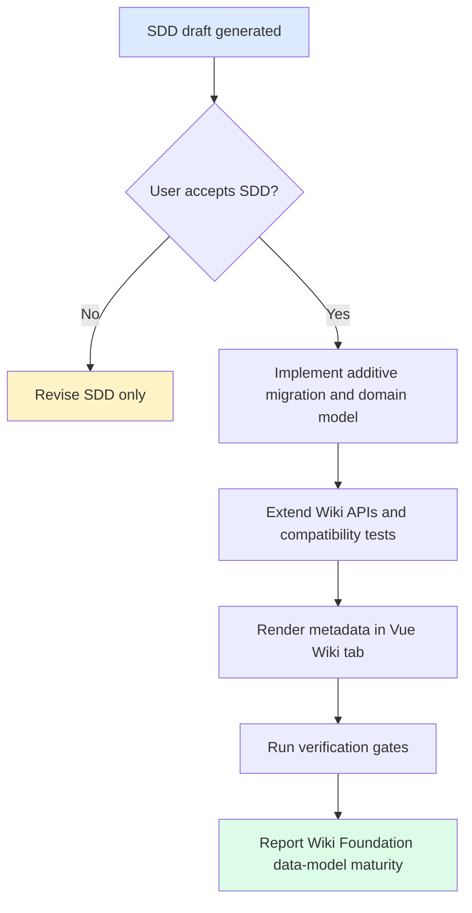

# Specification: Wiki Data Model

## Status

Draft for user acceptance. Slice `wiki-data-model`. Phase 4 hardening / Wiki Foundation.

## Overview

`wiki-data-model` extends Atlas Wiki metadata so future Auto Wiki slices can generate, refresh, link, lint, and audit Wiki pages without reshaping the foundation again. The slice is data-model and contract focused: it preserves the existing review-publish API surface, adds richer page metadata and supporting entities, and exposes minimal read APIs for folders, runs, logs, and issues.

## Source Stories

| Story | Capability |
|---|---|
| US-WIKI-DATA-MODEL-001 | Human-accepted SDD gate before code. |
| US-WIKI-DATA-MODEL-002 | Stable slug and page type lookup. |
| US-WIKI-DATA-MODEL-003 | Traceable source and chunk references. |
| US-WIKI-DATA-MODEL-004 | Minimal Wiki folder browsing. |
| US-WIKI-DATA-MODEL-005 | Generation runs, logs, and issues inspection. |
| US-WIKI-DATA-MODEL-006 | Vue Wiki metadata display with fallback safety. |
| US-WIKI-DATA-MODEL-007 | Compatibility, adapter, and safety verification. |

## Actors

| Actor | Role |
|---|---|
| Knowledge user | Browses Wiki pages and visible metadata. |
| SME reviewer | Uses references, confidence, review state, and issues to judge trust. |
| Delivery lead | Reviews generation/log/issue metadata for readiness. |
| Knowledge space administrator | Uses folders and page metadata to organize Wiki information. |
| Implementation agent | Implements only after SDD acceptance and follows `docs/06-tasks/wiki-data-model-tasks.md`. |

## Functional Scope

### S1. SDD Acceptance Gate

- The complete bilingual SDD set is required before code changes.
- Product implementation is blocked until the current user accepts the SDD.
- Scope language must distinguish Wiki Foundation data readiness from Auto Wiki ingest completion and production readiness.

### S2. Wiki Page Metadata Extension

- Wiki pages include:
  - `slug`
  - `pageType`
  - `aliases`
  - `sourceRefs`
  - `chunkRefs`
  - `inLinks`
  - `outLinks`
  - `version`
  - `sourceMode`
  - `refreshPolicy`
- Existing fields remain available: `id`, `spaceId`, `title`, `markdownPath`, `sourceDocumentIds`, `confidence`, `reviewStatus`, `owner`, `lastUpdated`.
- Existing publish/list/get-by-id APIs remain compatible and include the new fields.
- `slug` lookup is scoped by `spaceId`.
- Existing seeded pages must remain readable after migration.

### S3. Minimal Folder Model

- Folders are scoped to one Knowledge Space.
- Folders may have a nullable parent folder for hierarchy.
- Pages may have a nullable folder reference.
- This slice does not define folder permission inheritance, drag/drop ordering UX, or production RBAC.

### S4. Generation Run, Log, And Issue Read Models

- `wikiGenerationRun` records future run metadata such as status, source mode, refresh policy, counts, started/finished timestamps, and safe error summary.
- `wikiLogEntry` records safe lifecycle events for pages or runs.
- `wikiPageIssue` records future maintenance issues such as stale source, broken link, orphan page, thin content, and review required.
- This slice stores and reads these records; it does not execute generation, linkify, lint, repair, or retraction workflows.

### S5. API Behavior

- New or extended read endpoints use Atlas `ApiEnvelope`.
- API response shapes include safe metadata only.
- Errors must be user-safe and must not reveal stack traces, SQL, secrets, provider payloads, private absolute paths, or raw document content.
- Pagination may be simple and bounded for logs/issues when implemented; unbounded log reads are not allowed.

### S6. Vue Wiki Metadata Display

- The API-backed Wiki tab displays the new page metadata when present.
- Fallback sample-safe pages remain deterministic when API pages are unavailable.
- Existing review-publish, graph, and Ask user flows must not regress.

## Functional Requirements

| FR | Requirement | Source |
|---|---|---|
| FR-WDM-001 | Generate bilingual SDD artifacts and block product code until user acceptance. | REQ-WIKI-DATA-MODEL-001 |
| FR-WDM-002 | Extend Wiki page responses with slug, type, aliases, refs, links, version, source mode, and refresh policy. | REQ-WIKI-DATA-MODEL-002 |
| FR-WDM-003 | Enforce slug lookup by `spaceId` and `slug`. | REQ-WIKI-DATA-MODEL-003 |
| FR-WDM-004 | Add minimal folder read model scoped by space. | REQ-WIKI-DATA-MODEL-004 |
| FR-WDM-005 | Add generation run read model without executing ingest. | REQ-WIKI-DATA-MODEL-005 |
| FR-WDM-006 | Add safe Wiki log read model. | REQ-WIKI-DATA-MODEL-006 |
| FR-WDM-007 | Add safe Wiki page issue read model without evaluating rules. | REQ-WIKI-DATA-MODEL-007 |
| FR-WDM-008 | Extend API responses and errors using Atlas envelope conventions. | REQ-WIKI-DATA-MODEL-008 |
| FR-WDM-009 | Preserve existing publish/list/id-detail behavior. | REQ-WIKI-DATA-MODEL-009 |
| FR-WDM-010 | Render visible new metadata in Vue Wiki tab. | REQ-WIKI-DATA-MODEL-010 |
| FR-WDM-011 | Preserve sample-safe fallback behavior. | REQ-WIKI-DATA-MODEL-011 |
| FR-WDM-012 | Preserve source trace, confidence, and review status. | REQ-WIKI-DATA-MODEL-012 |
| FR-WDM-013 | Keep migration additive and V1-V9 compatible. | REQ-WIKI-DATA-MODEL-013 |
| FR-WDM-014 | Preserve parser/converter/model/vector/storage/search adapter boundaries. | REQ-WIKI-DATA-MODEL-014 |
| FR-WDM-015 | Cover backend, frontend, E2E, safety, and compatibility verification. | REQ-WIKI-DATA-MODEL-015 |

## Non-Functional Requirements

- **Security:** No real company documents, raw secrets, private paths, provider payloads, raw prompts, or raw document text in code, seed data, API responses, logs, or docs.
- **Reliability:** Migration must be additive and compatible with existing V1-V9 seeded data.
- **Auditability:** Logs and generation runs store safe summaries and references, not raw operational payloads.
- **Performance:** List endpoints for folders, runs, logs, and issues must be bounded or scoped by space/page.
- **Adapter boundaries:** Product logic must not directly invoke parser, converter, model, vector, storage, or search engines.
- **Product maturity:** Completion of this slice means Wiki Foundation data model readiness only; it does not mean Auto Wiki ingest or production readiness.

## Workflow

## State And Enum Rules

| Field | Allowed values |
|---|---|
| `pageType` | `INDEX`, `TOPIC`, `SOURCE_SUMMARY`, `ENTITY`, `CONCEPT`, `MANUAL` |
| `sourceMode` | `PUBLISHED_FILE`, `AUTO_GENERATED`, `MANUAL`, `HYBRID` |
| `refreshPolicy` | `MANUAL`, `ON_SOURCE_CHANGE`, `SCHEDULED`, `LOCKED` |
| `generationRunStatus` | `REQUESTED`, `RUNNING`, `SUCCEEDED`, `PARTIAL_FAILED`, `FAILED`, `CANCELLED` |
| `issueType` | `STALE_SOURCE`, `BROKEN_LINK`, `ORPHAN_PAGE`, `THIN_CONTENT`, `REVIEW_REQUIRED`, `MISSING_SOURCE_REF` |
| `issueStatus` | `OPEN`, `ACKNOWLEDGED`, `RESOLVED`, `IGNORED` |

Edge-case trace:

- Existing publish page without explicit type -> defaults to `SOURCE_SUMMARY`; keeps `PUBLISHED`.
- Manual/sample page with no folder -> remains listable; folder field is nullable.
- Same slug in two spaces -> valid; lookup includes `spaceId`.

## API Surface

Full payloads live in `docs/05-design/contracts/wiki-data-model-API_IMPLEMENTATION_GUIDE.md`.

| Interface | Behavior |
|---|---|
| `POST /api/files/{fileId}/publish` | Existing endpoint; response gains new page metadata defaults. |
| `GET /api/spaces/{spaceId}/wiki-pages` | Existing endpoint; list published pages with new fields. |
| `GET /api/wiki-pages/{wikiPageId}` | Existing endpoint; get one page by id. |
| `GET /api/spaces/{spaceId}/wiki-pages/by-slug/{slug}` | New slug lookup scoped by space. |
| `GET /api/spaces/{spaceId}/wiki-folders` | New minimal folder tree/list read endpoint. |
| `GET /api/spaces/{spaceId}/wiki-generation-runs` | New read endpoint for safe generation run metadata. |
| `GET /api/wiki-pages/{wikiPageId}/logs` | New bounded read endpoint for safe page log entries. |
| `GET /api/wiki-pages/{wikiPageId}/issues` | New bounded read endpoint for page issues. |

## Acceptance Matrix

| Requirement | Observable Check |
|---|---|
| REQ-WIKI-DATA-MODEL-001 | All 20 expected SDD files exist and IDs match across languages. |
| REQ-WIKI-DATA-MODEL-002 | Backend response and frontend type tests include all new Wiki page fields. |
| REQ-WIKI-DATA-MODEL-003 | Contract tests prove slug lookup is space-scoped. |
| REQ-WIKI-DATA-MODEL-004 | Folder API contract test reads space-scoped folders. |
| REQ-WIKI-DATA-MODEL-005 | Generation run API contract test reads safe run metadata. |
| REQ-WIKI-DATA-MODEL-006 | Log API contract test reads safe entries and excludes unsafe content. |
| REQ-WIKI-DATA-MODEL-007 | Issue API contract test reads issue metadata without rule execution. |
| REQ-WIKI-DATA-MODEL-008 | API responses use `ApiEnvelope` and safe errors. |
| REQ-WIKI-DATA-MODEL-009 | Existing review-publish tests and E2E publish/list flows pass. |
| REQ-WIKI-DATA-MODEL-010 | Vue tests/E2E assert visible new metadata. |
| REQ-WIKI-DATA-MODEL-011 | Vue tests assert fallback sample Wiki pages remain available. |
| REQ-WIKI-DATA-MODEL-012 | Graph/Ask regression checks preserve evidence with review status and confidence. |
| REQ-WIKI-DATA-MODEL-013 | `cd backend && mvn verify` applies Flyway migration successfully. |
| REQ-WIKI-DATA-MODEL-014 | Network/dependency scan finds no direct engine/provider calls. |
| REQ-WIKI-DATA-MODEL-015 | Final report lists all required verification and skipped checks with reasons. |

## Out Of Scope

- Auto Wiki ingest, map/reduce generation, summarization, or page merging.
- Linkify or lint rule execution.
- Production auth/RBAC, permission inheritance, or audit retention policy.
- Real company documents, external cloud providers, new model services, raw prompts, or raw provider logs.
- Full Wiki editor, folder write UI, page refresh UI, or navigation redesign.

## Open Questions

- OQ-WIKI-DATA-MODEL-001: Future generated-page initial status.
- OQ-WIKI-DATA-MODEL-002: Future checksum/freshness shape for `sourceRefs`.
- OQ-WIKI-DATA-MODEL-003: Future folder ordering model.
