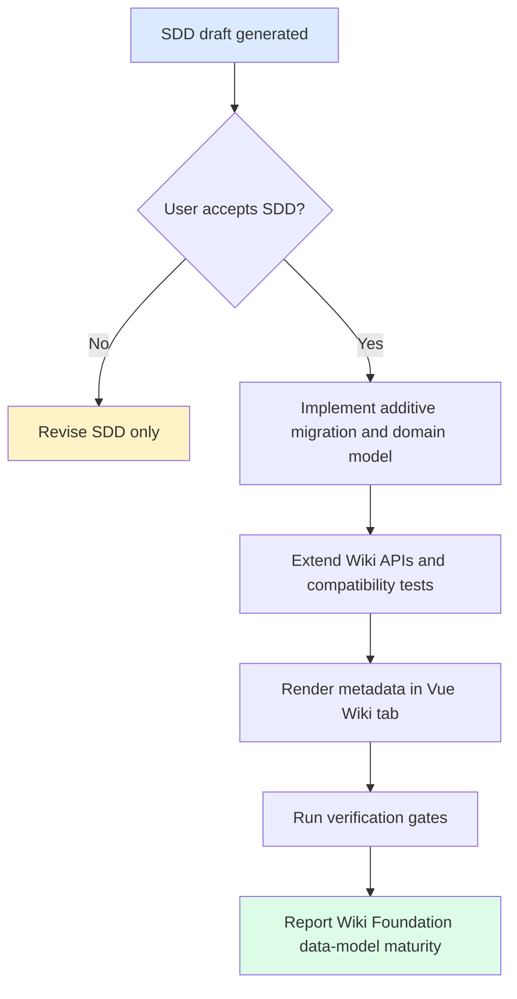

# 规格：Wiki 数据模型

## 状态

待用户接受的草案。切片 `wiki-data-model`。Phase 4 hardening / Wiki Foundation。

## 概述

`wiki-data-model` 扩展 Atlas Wiki metadata，使未来 Auto Wiki 切片可以生成、刷新、互链、lint 和审计 Wiki pages，而不再重塑底层模型。本切片聚焦数据模型与契约：保留现有 review-publish API surface，增加更丰富的页面 metadata 和支撑实体，并为 folders、runs、logs、issues 提供最小读取 API。

## 来源故事

| Story | Capability |
|---|---|
| US-WIKI-DATA-MODEL-001 | 编码前的人工 SDD 接受门。 |
| US-WIKI-DATA-MODEL-002 | 稳定 slug 和 page type 查询。 |
| US-WIKI-DATA-MODEL-003 | 可追溯 source 和 chunk references。 |
| US-WIKI-DATA-MODEL-004 | 最小 Wiki folder 浏览。 |
| US-WIKI-DATA-MODEL-005 | Generation runs、logs、issues 检查。 |
| US-WIKI-DATA-MODEL-006 | Vue Wiki metadata 展示和 fallback safety。 |
| US-WIKI-DATA-MODEL-007 | 兼容性、adapter 和安全验证。 |

## 角色

| Actor | Role |
|---|---|
| Knowledge user | 浏览 Wiki pages 和可见 metadata。 |
| SME reviewer | 使用 references、confidence、review state 和 issues 判断可信度。 |
| Delivery lead | 查看 generation/log/issue metadata 以判断 readiness。 |
| Knowledge space administrator | 使用 folders 和 page metadata 组织 Wiki 信息。 |
| Implementation agent | 仅在 SDD 被接受后实现，并遵循 `docs/06-tasks/wiki-data-model-tasks.md`。 |

## 功能范围

### S1. SDD 接受门

- 代码变更前必须具备完整双语 SDD 集。
- 当前用户接受 SDD 前，产品实现被阻塞。
- 范围语言必须区分 Wiki Foundation 数据就绪、Auto Wiki ingest 完成和生产就绪。

### S2. Wiki Page Metadata 扩展

- Wiki pages 包含：
  - `slug`
  - `pageType`
  - `aliases`
  - `sourceRefs`
  - `chunkRefs`
  - `inLinks`
  - `outLinks`
  - `version`
  - `sourceMode`
  - `refreshPolicy`
- 现有字段继续可用：`id`、`spaceId`、`title`、`markdownPath`、`sourceDocumentIds`、`confidence`、`reviewStatus`、`owner`、`lastUpdated`。
- 现有 publish/list/get-by-id APIs 保持兼容，并包含新增字段。
- `slug` lookup 按 `spaceId` scoped。
- 现有 seeded pages 在 migration 后必须仍可读取。

### S3. 最小 Folder Model

- Folders scoped 到单个 Knowledge Space。
- Folders 可有 nullable parent folder 表示层级。
- Pages 可有 nullable folder reference。
- 本切片不定义 folder permission inheritance、drag/drop ordering UX 或生产 RBAC。

### S4. Generation Run、Log 和 Issue Read Models

- `wikiGenerationRun` 记录未来 run metadata，例如 status、source mode、refresh policy、counts、started/finished timestamps 和 safe error summary。
- `wikiLogEntry` 记录 page 或 run 的安全生命周期事件。
- `wikiPageIssue` 记录未来维护问题，例如 stale source、broken link、orphan page、thin content 和 review required。
- 本切片存储并读取这些记录；不执行 generation、linkify、lint、repair 或 retraction workflows。

### S5. API 行为

- 新增或扩展的读取 endpoints 使用 Atlas `ApiEnvelope`。
- API response shapes 只包含安全 metadata。
- Errors 必须用户安全，不能暴露 stack trace、SQL、secret、provider payload、private absolute path 或 raw document content。
- Logs/issues 实现时必须按 space/page scoped 或 bounded；禁止无界读取 logs。

### S6. Vue Wiki Metadata 展示

- API-backed Wiki tab 在字段存在时展示新增 page metadata。
- API pages 不可用时保留确定性的 sample-safe pages。
- 现有 review-publish、graph、Ask 用户流程不得回退。

## 功能需求

| FR | Requirement | Source |
|---|---|---|
| FR-WDM-001 | 生成双语 SDD artifacts，并在用户接受前阻塞产品代码。 | REQ-WIKI-DATA-MODEL-001 |
| FR-WDM-002 | 用 slug、type、aliases、refs、links、version、source mode、refresh policy 扩展 Wiki page responses。 | REQ-WIKI-DATA-MODEL-002 |
| FR-WDM-003 | 按 `spaceId` 和 `slug` 执行 slug lookup。 | REQ-WIKI-DATA-MODEL-003 |
| FR-WDM-004 | 增加按 space scoped 的最小 folder read model。 | REQ-WIKI-DATA-MODEL-004 |
| FR-WDM-005 | 增加 generation run read model，但不执行 ingest。 | REQ-WIKI-DATA-MODEL-005 |
| FR-WDM-006 | 增加安全 Wiki log read model。 | REQ-WIKI-DATA-MODEL-006 |
| FR-WDM-007 | 增加安全 Wiki page issue read model，但不评估规则。 | REQ-WIKI-DATA-MODEL-007 |
| FR-WDM-008 | 使用 Atlas envelope conventions 扩展 API responses 和 errors。 | REQ-WIKI-DATA-MODEL-008 |
| FR-WDM-009 | 保留现有 publish/list/id-detail 行为。 | REQ-WIKI-DATA-MODEL-009 |
| FR-WDM-010 | 在 Vue Wiki tab 渲染可见新增 metadata。 | REQ-WIKI-DATA-MODEL-010 |
| FR-WDM-011 | 保留 sample-safe fallback 行为。 | REQ-WIKI-DATA-MODEL-011 |
| FR-WDM-012 | 保留 source trace、confidence、review status。 | REQ-WIKI-DATA-MODEL-012 |
| FR-WDM-013 | 保持 migration additive 且兼容 V1-V9。 | REQ-WIKI-DATA-MODEL-013 |
| FR-WDM-014 | 保留 parser/converter/model/vector/storage/search adapter boundaries。 | REQ-WIKI-DATA-MODEL-014 |
| FR-WDM-015 | 覆盖 backend、frontend、E2E、安全和兼容性验证。 | REQ-WIKI-DATA-MODEL-015 |

## 非功能需求

- **Security:** 代码、seed data、API responses、logs 或 docs 中不得出现真实公司文档、raw secrets、private paths、provider payloads、raw prompts 或 raw document text。
- **Reliability:** Migration 必须 additive，并兼容现有 V1-V9 seeded data。
- **Auditability:** Logs 和 generation runs 存 safe summaries/references，不存 raw operational payloads。
- **Performance:** Folder、run、log、issue list endpoints 必须按 space/page scoped 或 bounded。
- **Adapter boundaries:** Product logic 不得直接调用 parser、converter、model、vector、storage 或 search engines。
- **Product maturity:** 本切片完成仅表示 Wiki Foundation 数据模型就绪，不表示 Auto Wiki ingest 或生产就绪。

## 工作流

## 状态与枚举规则

| Field | Allowed values |
|---|---|
| `pageType` | `INDEX`, `TOPIC`, `SOURCE_SUMMARY`, `ENTITY`, `CONCEPT`, `MANUAL` |
| `sourceMode` | `PUBLISHED_FILE`, `AUTO_GENERATED`, `MANUAL`, `HYBRID` |
| `refreshPolicy` | `MANUAL`, `ON_SOURCE_CHANGE`, `SCHEDULED`, `LOCKED` |
| `generationRunStatus` | `REQUESTED`, `RUNNING`, `SUCCEEDED`, `PARTIAL_FAILED`, `FAILED`, `CANCELLED` |
| `issueType` | `STALE_SOURCE`, `BROKEN_LINK`, `ORPHAN_PAGE`, `THIN_CONTENT`, `REVIEW_REQUIRED`, `MISSING_SOURCE_REF` |
| `issueStatus` | `OPEN`, `ACKNOWLEDGED`, `RESOLVED`, `IGNORED` |

边界用例 trace：

- 现有 publish page 没有显式 type -> 默认 `SOURCE_SUMMARY`；保持 `PUBLISHED`。
- Manual/sample page 没有 folder -> 仍可 list；folder 字段 nullable。
- 两个 space 有相同 slug -> 合法；lookup 包含 `spaceId`。

## API Surface

完整 payload 位于 `docs/05-design/contracts/wiki-data-model-API_IMPLEMENTATION_GUIDE.md`。

| Interface | Behavior |
|---|---|
| `POST /api/files/{fileId}/publish` | 现有 endpoint；response 增加新的 page metadata defaults。 |
| `GET /api/spaces/{spaceId}/wiki-pages` | 现有 endpoint；列出已发布 pages，并带新增字段。 |
| `GET /api/wiki-pages/{wikiPageId}` | 现有 endpoint；按 id 读取一个 page。 |
| `GET /api/spaces/{spaceId}/wiki-pages/by-slug/{slug}` | 新增按 space scoped 的 slug lookup。 |
| `GET /api/spaces/{spaceId}/wiki-folders` | 新增最小 folder tree/list read endpoint。 |
| `GET /api/spaces/{spaceId}/wiki-generation-runs` | 新增安全 generation run metadata read endpoint。 |
| `GET /api/wiki-pages/{wikiPageId}/logs` | 新增 bounded 安全 page log entries read endpoint。 |
| `GET /api/wiki-pages/{wikiPageId}/issues` | 新增 bounded page issues read endpoint。 |

## 验收矩阵

| Requirement | Observable Check |
|---|---|
| REQ-WIKI-DATA-MODEL-001 | 20 个预期 SDD 文件存在且跨语言 ID 一致。 |
| REQ-WIKI-DATA-MODEL-002 | 后端 response 和前端 type tests 包含所有新增 Wiki page fields。 |
| REQ-WIKI-DATA-MODEL-003 | Contract tests 证明 slug lookup 按 space scoped。 |
| REQ-WIKI-DATA-MODEL-004 | Folder API contract test 读取 space-scoped folders。 |
| REQ-WIKI-DATA-MODEL-005 | Generation run API contract test 读取安全 run metadata。 |
| REQ-WIKI-DATA-MODEL-006 | Log API contract test 读取安全 entries 并排除 unsafe content。 |
| REQ-WIKI-DATA-MODEL-007 | Issue API contract test 读取 issue metadata 且不执行规则。 |
| REQ-WIKI-DATA-MODEL-008 | API responses 使用 `ApiEnvelope` 和 safe errors。 |
| REQ-WIKI-DATA-MODEL-009 | 现有 review-publish tests 和 E2E publish/list flows 通过。 |
| REQ-WIKI-DATA-MODEL-010 | Vue tests/E2E 断言新增 metadata 可见。 |
| REQ-WIKI-DATA-MODEL-011 | Vue tests 断言 fallback sample Wiki pages 保留。 |
| REQ-WIKI-DATA-MODEL-012 | Graph/Ask regression checks 保留 evidence、review status 和 confidence。 |
| REQ-WIKI-DATA-MODEL-013 | `cd backend && mvn verify` 成功应用 Flyway migration。 |
| REQ-WIKI-DATA-MODEL-014 | Network/dependency scan 未发现直接 engine/provider calls。 |
| REQ-WIKI-DATA-MODEL-015 | 最终报告列出全部必需验证和 skipped checks 原因。 |

## 范围外

- Auto Wiki ingest、map/reduce generation、summarization 或 page merging。
- Linkify 或 lint rule execution。
- 生产 auth/RBAC、permission inheritance 或 audit retention policy。
- 真实公司文档、外部 cloud providers、新模型服务、raw prompts 或 raw provider logs。
- 完整 Wiki editor、folder write UI、page refresh UI 或 navigation redesign。

## 待确认问题

- OQ-WIKI-DATA-MODEL-001: 未来 generated-page initial status。
- OQ-WIKI-DATA-MODEL-002: `sourceRefs` 的未来 checksum/freshness shape。
- OQ-WIKI-DATA-MODEL-003: 未来 folder ordering model。
