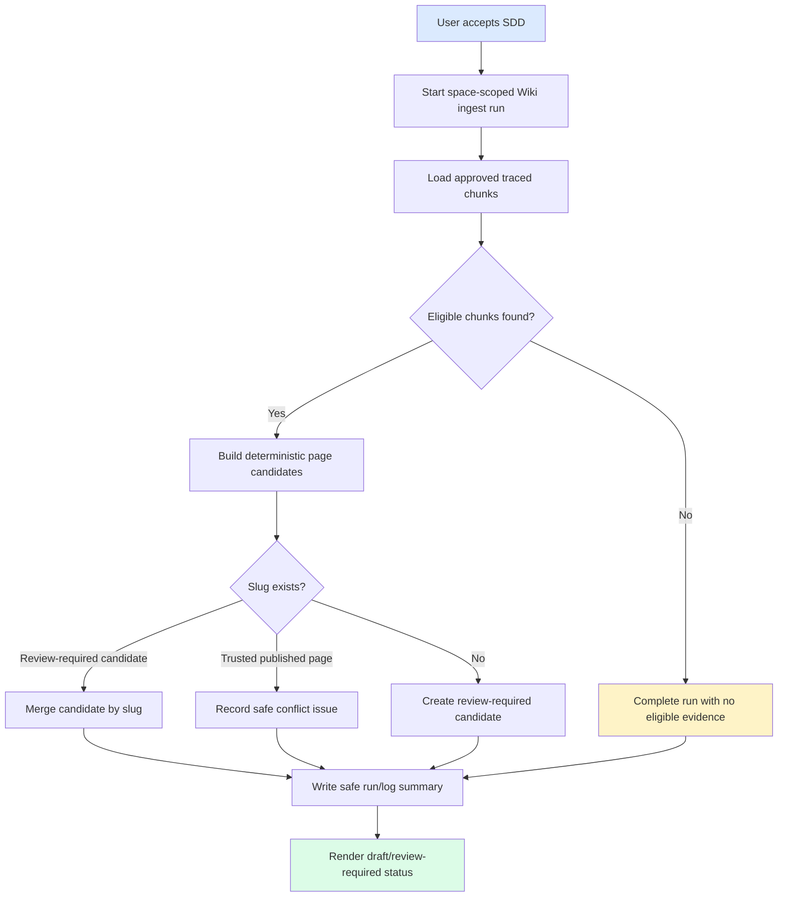

# Specification: Wiki Ingest v0

## Status

Accepted by user. Slice `wiki-ingest-v0`. Product code may proceed strictly against this spec and `docs/06-tasks/wiki-ingest-v0-tasks.md`.

## Overview

`wiki-ingest-v0` adds the first Auto Wiki generation workflow on top of the completed Wiki data model. The slice starts a space-scoped ingest run, selects approved source chunks, creates deterministic Wiki page candidates, merges them by slug, and records safe generation evidence. Generated candidates are review-required and are not trusted Ask or Graph evidence until later governance slices approve them.

## Source Stories

| Story | Capability |
|---|---|
| US-WIKI-INGEST-V0-001 | SDD acceptance gate before code. |
| US-WIKI-INGEST-V0-002 | Review-required Wiki candidate generation. |
| US-WIKI-INGEST-V0-003 | Adapter and safety boundary preservation. |
| US-WIKI-INGEST-V0-004 | Idempotent slug merge. |
| US-WIKI-INGEST-V0-005 | Safe run evidence inspection. |
| US-WIKI-INGEST-V0-006 | Status display and verification. |

## Actors

| Actor | Role |
|---|---|
| Knowledge manager | Starts ingest runs and reviews generated candidates. |
| SME reviewer | Uses source refs, chunk refs, confidence, and run summaries to validate candidates. |
| Knowledge user | Sees generated pages as draft/review-required, not trusted published content. |
| Implementation agent | Implements only after SDD acceptance and follows the task list. |

## Functional Scope

### S1. SDD Acceptance Gate

- The bilingual SDD set must exist before implementation.
- Implementation is blocked until the current user accepts this SDD.
- Scope language must distinguish Auto Wiki ingest v0 from linkify/lint, review gate, refresh/retract, connector, and production readiness.

### S2. Input Eligibility

- A run is scoped to one Knowledge Space.
- Eligible inputs are source chunks that:
  - belong to the selected space through their file and batch;
  - have `APPROVED` review status;
  - include source file metadata and page or section evidence;
  - include confidence when available.
- Chunks that are review-required, need-fix, OCR-required, failed, unsupported, or missing trace are excluded and counted.

### S3. Candidate Generation

- v0 candidate generation is deterministic by default.
- A candidate includes:
  - `slug`
  - `title`
  - `pageType`
  - `aliases`
  - `sourceRefs`
  - `chunkRefs`
  - `confidence`
  - `reviewStatus=REVIEW_REQUIRED`
  - `sourceMode=AUTO_GENERATED`
  - `refreshPolicy=ON_SOURCE_CHANGE`
- Candidate body content is written as a generated Markdown artifact containing a deterministic safe summary and source/chunk reference labels.
- Model-assisted text generation is out of scope for v0. Any future model-assisted mode must use ModelAdapter and still produce review-required output.

### S4. Idempotent Merge

- Candidate slug is scoped by `spaceId`.
- Re-running the same evidence set updates or merges the same candidate slug.
- A generated candidate must not silently overwrite an existing `PUBLISHED_FILE` trusted page.
- On trusted-page slug collision, the run records a safe issue or conflict summary and leaves the trusted page unchanged.

### S5. Run, Log, And Issue Evidence

- Each ingest run records a `wiki_generation_run` with status, mode, input refs, created page ids, updated page ids, issue ids, safe summary, and safe error.
- Lifecycle events are written to `wiki_log_entry`.
- Candidate conflicts or missing evidence are represented through safe issue metadata when needed.
- Logs and errors must exclude raw source text, prompts, provider responses, stack traces, secrets, private absolute paths, and confidential data.

### S6. API Behavior

- Start-run endpoint returns an Atlas envelope containing run summary and affected candidate IDs.
- Read endpoints return safe run and candidate metadata.
- `FAILED` and `PARTIAL_FAILED` states are visible and safe.
- Existing publish/list/id-detail APIs continue to work for published pages.

### S7. UI Behavior

- Vue may show generated candidates and run status only as draft/review-required.
- Existing API-backed Wiki pages and fallback sample behavior must not regress.
- UI must not present generated pages as trusted, approved, or production-ready.

## Functional Requirements

| FR | Requirement | Source |
|---|---|---|
| FR-WIV0-001 | Generate complete bilingual SDD and block code until user acceptance. | REQ-WIKI-INGEST-V0-001 |
| FR-WIV0-002 | Select only approved, traceable source chunks. | REQ-WIKI-INGEST-V0-002 |
| FR-WIV0-003 | Produce safe deterministic Wiki candidates with required metadata. | REQ-WIKI-INGEST-V0-003 |
| FR-WIV0-004 | Keep v0 deterministic and document future model use behind ModelAdapter. | REQ-WIKI-INGEST-V0-004 |
| FR-WIV0-005 | Merge repeated runs by space-scoped slug. | REQ-WIKI-INGEST-V0-005 |
| FR-WIV0-006 | Preserve trusted `PUBLISHED_FILE` pages on generated slug collisions. | REQ-WIKI-INGEST-V0-006 |
| FR-WIV0-007 | Default generated content to `REVIEW_REQUIRED`. | REQ-WIKI-INGEST-V0-007 |
| FR-WIV0-008 | Record safe run, log, and issue evidence. | REQ-WIKI-INGEST-V0-008 |
| FR-WIV0-009 | Represent safe failure and partial-failure states. | REQ-WIKI-INGEST-V0-009 |
| FR-WIV0-010 | Expose start/read API contracts with Atlas envelope. | REQ-WIKI-INGEST-V0-010 |
| FR-WIV0-011 | Display generated/review-required state without trusted-publish claims. | REQ-WIKI-INGEST-V0-011 |
| FR-WIV0-012 | Preserve parser/converter/model/vector/storage/search adapter boundaries. | REQ-WIKI-INGEST-V0-012 |
| FR-WIV0-013 | Use mock/sample-safe data and no external calls by default. | REQ-WIKI-INGEST-V0-013 |
| FR-WIV0-014 | Verify contracts, idempotency, UI status, regressions, and safety. | REQ-WIKI-INGEST-V0-014 |

## Non-Functional Requirements

- **Security:** No raw secrets, prompts, provider payloads, private paths, stack traces, or raw source text in API responses, logs, docs, tests, or artifacts.
- **Reliability:** Repeated runs over the same input set are idempotent by slug.
- **Auditability:** Run summaries and logs are safe, scoped, and traceable.
- **Adapter boundaries:** Model assistance is optional and only through ModelAdapter. Parser/converter/vector/storage/search are not called directly.
- **Product maturity:** Completion means Auto Wiki ingest v0 foundation, not production readiness.

## Workflow

## State Rules

| Entity | States |
|---|---|
| Ingest run | `REQUESTED -> RUNNING -> SUCCEEDED`, `REQUESTED -> RUNNING -> PARTIAL_FAILED`, `REQUESTED -> RUNNING -> FAILED`, `REQUESTED -> CANCELLED` |
| Generated page | `REVIEW_REQUIRED` only in this slice |
| Candidate source mode | `AUTO_GENERATED` |
| Candidate refresh policy | `ON_SOURCE_CHANGE` |

Edge-case trace:

- No eligible chunks -> run `SUCCEEDED` with zero created and safe summary.
- Same approved chunk set twice -> first run creates or updates candidates; second run updates the same slugs and does not increase page count.
- Generated slug collides with a trusted published page -> trusted page remains unchanged and run records safe issue/conflict.

## API Surface

Full payloads live in `docs/05-design/contracts/wiki-ingest-v0-API_IMPLEMENTATION_GUIDE.md`.

| Interface | Behavior |
|---|---|
| `POST /api/spaces/{spaceId}/wiki-ingest-runs` | Start deterministic v0 run for approved source chunks. |
| `GET /api/spaces/{spaceId}/wiki-generation-runs/{runId}` | Read one safe run summary. |
| `GET /api/spaces/{spaceId}/wiki-generation-runs` | Reuse existing run list shape with ingest-v0 fields. |
| `GET /api/spaces/{spaceId}/wiki-pages?includeDrafts=true` | Shows generated review-required candidates alongside published pages when explicitly requested. |
| Existing Wiki read APIs | Continue to return published pages by default without exposing generated drafts as trusted. |

## Acceptance Matrix

| Requirement | Observable Check |
|---|---|
| REQ-WIKI-INGEST-V0-001 | All expected SDD files exist and IDs match across languages. |
| REQ-WIKI-INGEST-V0-002 | Backend tests prove non-approved or untraced chunks are excluded. |
| REQ-WIKI-INGEST-V0-003 | Backend tests assert candidate metadata fields and safe refs. |
| REQ-WIKI-INGEST-V0-004 | Network/dependency scan and tests prove no direct provider call in default mode. |
| REQ-WIKI-INGEST-V0-005 | Idempotency test proves repeated run does not duplicate pages. |
| REQ-WIKI-INGEST-V0-006 | Collision test preserves existing trusted published page. |
| REQ-WIKI-INGEST-V0-007 | Contract tests prove generated pages are `REVIEW_REQUIRED`. |
| REQ-WIKI-INGEST-V0-008 | Run/log tests prove safe summaries and no raw content. |
| REQ-WIKI-INGEST-V0-009 | Partial failure and no-evidence states are covered. |
| REQ-WIKI-INGEST-V0-010 | API contract tests cover start and read endpoints. |
| REQ-WIKI-INGEST-V0-011 | Vue tests/E2E show generated status without trusted-publish wording. |
| REQ-WIKI-INGEST-V0-012 | Adapter boundary scan finds no direct engine/provider coupling. |
| REQ-WIKI-INGEST-V0-013 | Secret/private-path scan and fixture review pass. |
| REQ-WIKI-INGEST-V0-014 | Final report lists run/skipped verification with reasons. |

## Out Of Scope

- Linkify/lint, refresh/retract, review approval workflow, production RBAC, connector sync, model-assisted generation, external provider calls, and real company data.

## Resolved Decisions

- v0 creates `TOPIC` pages only.
- v0 writes generated Markdown artifacts with deterministic safe summaries.
- v0 aggregates confidence using the minimum included chunk confidence.
