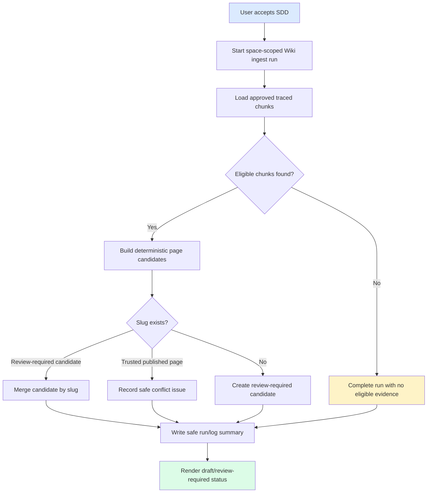

# 规格：Wiki Ingest v0

## 状态

已由用户接受。Slice `wiki-ingest-v0`。产品代码可严格依据本 spec 与 `docs/06-tasks/wiki-ingest-v0-tasks.md` 推进。

## 概述

`wiki-ingest-v0` 基于已完成的 Wiki data model 增加第一版 Auto Wiki 生成工作流。该 slice 启动 space-scoped ingest run，选择 approved source chunks，创建确定性 Wiki page candidates，按 slug 合并，并记录安全 generation evidence。Generated candidates 保持 review-required，在后续治理 slice 批准前不进入可信 Ask 或 Graph evidence。

## Source Stories

| Story | Capability |
|---|---|
| US-WIKI-INGEST-V0-001 | 代码前 SDD acceptance gate。 |
| US-WIKI-INGEST-V0-002 | 生成需审核 Wiki candidates。 |
| US-WIKI-INGEST-V0-003 | 保留 adapter 和安全边界。 |
| US-WIKI-INGEST-V0-004 | 幂等 slug merge。 |
| US-WIKI-INGEST-V0-005 | 安全 run evidence inspection。 |
| US-WIKI-INGEST-V0-006 | Status display 和 verification。 |

## Actors

| Actor | Role |
|---|---|
| Knowledge manager | 启动 ingest runs。 |
| SME reviewer | 用 source refs、chunk refs、confidence 和 run summaries 校验 candidates。 |
| Knowledge user | 看到 generated pages 是 draft/review-required，而不是 trusted published content。 |
| Implementation agent | 仅在 SDD 被接受后按 task list 实现。 |

## Functional Scope

### S1. SDD Acceptance Gate

- 实现前必须存在双语 SDD set。
- 当前用户接受本 SDD 前，implementation 被阻止。
- Scope 必须区分 Auto Wiki ingest v0 与 linkify/lint、review gate、refresh/retract、connector 和 production readiness。

### S2. Input Eligibility

- Run scoped to one Knowledge Space。
- Eligible inputs 是满足以下条件的 source chunks：
  - 通过 file 和 batch 属于 selected space；
  - review status 为 `APPROVED`；
  - 包含 source file metadata 与 page 或 section evidence；
  - 如可用则包含 confidence。
- Review-required、need-fix、OCR-required、failed、unsupported 或 missing trace 的 chunks 被排除并计数。

### S3. Candidate Generation

- v0 candidate generation 默认确定性。
- Candidate 包含：
  - `slug`
  - `title`
  - `pageType`
  - `aliases`
  - `sourceRefs`
  - `chunkRefs`
  - `confidence`
  - `reviewStatus=REVIEW_REQUIRED`
  - `sourceMode=AUTO_GENERATED`
  - `refreshPolicy=ON_SOURCE_CHANGE`
- Candidate body content 写为 generated Markdown artifact，内容包含确定性安全摘要以及 source/chunk reference labels。
- Model-assisted text generation 不属于 v0 范围。任何未来 model-assisted mode 都必须使用 ModelAdapter，且输出仍 review-required。

### S4. Idempotent Merge

- Candidate slug 以 `spaceId` 为 scope。
- 重跑同一 evidence set 会更新或合并同一 candidate slug。
- Generated candidate 不得静默覆盖现有 `PUBLISHED_FILE` trusted page。
- trusted-page slug collision 时，run 记录 safe issue 或 conflict summary，并保持 trusted page 不变。

### S5. Run, Log, And Issue Evidence

- 每个 ingest run 记录一个 `wiki_generation_run`，包含 status、mode、input refs、created page ids、updated page ids、issue ids、safe summary 和 safe error。
- Lifecycle events 写入 `wiki_log_entry`。
- Candidate conflicts 或 missing evidence 必要时通过 safe issue metadata 表示。
- Logs 和 errors 必须排除 raw source text、prompts、provider responses、stack traces、secrets、private absolute paths 和 confidential data。

### S6. API Behavior

- Start-run endpoint 返回包含 run summary 与 affected candidate IDs 的 Atlas envelope。
- Read endpoints 返回 safe run 与 candidate metadata。
- `FAILED` 和 `PARTIAL_FAILED` 状态可见且安全。
- 现有 publish/list/id-detail APIs 对 published pages 继续工作。

### S7. UI Behavior

- Vue 只能将 generated candidates 展示为 draft/review-required。
- 现有 API-backed Wiki pages 与 fallback sample 行为不得回退。
- UI 不得将 generated pages 展示为 trusted、approved 或 production-ready。

## Functional Requirements

| FR | Requirement | Source |
|---|---|---|
| FR-WIV0-001 | 生成完整双语 SDD，并在用户接受前阻止代码变更。 | REQ-WIKI-INGEST-V0-001 |
| FR-WIV0-002 | 只选择 approved、traceable source chunks。 | REQ-WIKI-INGEST-V0-002 |
| FR-WIV0-003 | 生成带必需 metadata 的安全确定性 Wiki candidates。 | REQ-WIKI-INGEST-V0-003 |
| FR-WIV0-004 | 保持 v0 deterministic，并记录未来 model usage 必须位于 ModelAdapter 之后。 | REQ-WIKI-INGEST-V0-004 |
| FR-WIV0-005 | 按 space-scoped slug 合并重复 runs。 | REQ-WIKI-INGEST-V0-005 |
| FR-WIV0-006 | 在 generated slug collision 时保留 trusted `PUBLISHED_FILE` pages。 | REQ-WIKI-INGEST-V0-006 |
| FR-WIV0-007 | Generated content 默认 `REVIEW_REQUIRED`。 | REQ-WIKI-INGEST-V0-007 |
| FR-WIV0-008 | 记录安全 run、log 和 issue evidence。 | REQ-WIKI-INGEST-V0-008 |
| FR-WIV0-009 | 表示安全 failure 和 partial-failure states。 | REQ-WIKI-INGEST-V0-009 |
| FR-WIV0-010 | 用 Atlas envelope 暴露 start/read API contracts。 | REQ-WIKI-INGEST-V0-010 |
| FR-WIV0-011 | 展示 generated/review-required state，且不宣称可信发布。 | REQ-WIKI-INGEST-V0-011 |
| FR-WIV0-012 | 保留 parser/converter/model/vector/storage/search adapter boundaries。 | REQ-WIKI-INGEST-V0-012 |
| FR-WIV0-013 | 使用 mock/sample-safe 数据，默认无外部调用。 | REQ-WIKI-INGEST-V0-013 |
| FR-WIV0-014 | 验证 contracts、idempotency、UI status、regressions 和 safety。 | REQ-WIKI-INGEST-V0-014 |

## Non-Functional Requirements

- **Security:** API responses、logs、docs、tests 或 artifacts 中不得出现 raw secrets、prompts、provider payloads、private paths、stack traces 或 raw source text。
- **Reliability:** 对同一 input set 的重复 runs 按 slug 幂等。
- **Auditability:** Run summaries 和 logs 安全、scoped、可追溯。
- **Adapter boundaries:** Model assistance 可选且只能通过 ModelAdapter。不得直接调用 parser/converter/vector/storage/search。
- **Product maturity:** 完成只表示 Auto Wiki ingest v0 foundation，不代表生产就绪。

## Workflow

## State Rules

| Entity | States |
|---|---|
| Ingest run | `REQUESTED -> RUNNING -> SUCCEEDED`, `REQUESTED -> RUNNING -> PARTIAL_FAILED`, `REQUESTED -> RUNNING -> FAILED`, `REQUESTED -> CANCELLED` |
| Generated page | 本 slice 中只允许 `REVIEW_REQUIRED` |
| Candidate source mode | `AUTO_GENERATED` |
| Candidate refresh policy | `ON_SOURCE_CHANGE` |

Edge-case trace:

- No eligible chunks -> run `SUCCEEDED`，created 为 0，并写入 safe summary。
- Same approved chunk set twice -> 第一次创建或更新 candidates；第二次更新相同 slugs，不增加 page count。
- Generated slug collides with trusted published page -> trusted page 保持不变，run 记录 safe issue/conflict。

## API Surface

完整 payload 位于 `docs/05-design/contracts/wiki-ingest-v0-API_IMPLEMENTATION_GUIDE.md`。

| Interface | Behavior |
|---|---|
| `POST /api/spaces/{spaceId}/wiki-ingest-runs` | 为 approved source chunks 启动 deterministic v0 run。 |
| `GET /api/spaces/{spaceId}/wiki-generation-runs/{runId}` | 读取单个 safe run summary。 |
| `GET /api/spaces/{spaceId}/wiki-generation-runs` | 复用现有 run list shape，并携带 ingest-v0 fields。 |
| `GET /api/spaces/{spaceId}/wiki-pages?includeDrafts=true` | 显式请求时，将 generated review-required candidates 与 published pages 一起展示。 |
| Existing Wiki read APIs | 默认继续只返回 published pages，不把 generated drafts 暴露为 trusted。 |

## Acceptance Matrix

| Requirement | Observable Check |
|---|---|
| REQ-WIKI-INGEST-V0-001 | 所有预期 SDD 文件存在，且 IDs 跨语言一致。 |
| REQ-WIKI-INGEST-V0-002 | Backend tests 证明 non-approved 或 untraced chunks 被排除。 |
| REQ-WIKI-INGEST-V0-003 | Backend tests 断言 candidate metadata fields 和 safe refs。 |
| REQ-WIKI-INGEST-V0-004 | Network/dependency scan 与 tests 证明 default mode 无直接 provider call。 |
| REQ-WIKI-INGEST-V0-005 | Idempotency test 证明 repeated run 不重复建页。 |
| REQ-WIKI-INGEST-V0-006 | Collision test 保留现有 trusted published page。 |
| REQ-WIKI-INGEST-V0-007 | Contract tests 证明 generated pages 为 `REVIEW_REQUIRED`。 |
| REQ-WIKI-INGEST-V0-008 | Run/log tests 证明 safe summaries 且无 raw content。 |
| REQ-WIKI-INGEST-V0-009 | Partial failure 和 no-evidence states 有覆盖。 |
| REQ-WIKI-INGEST-V0-010 | API contract tests 覆盖 start 与 read endpoints。 |
| REQ-WIKI-INGEST-V0-011 | Vue tests/E2E 展示 generated status 且无 trusted-publish wording。 |
| REQ-WIKI-INGEST-V0-012 | Adapter boundary scan 未发现 direct engine/provider coupling。 |
| REQ-WIKI-INGEST-V0-013 | Secret/private-path scan 与 fixture review 通过。 |
| REQ-WIKI-INGEST-V0-014 | Final report 列出已运行/跳过的 verification 及原因。 |

## Out Of Scope

- Linkify/lint、refresh/retract、review approval workflow、production RBAC、connector sync、model-assisted generation、外部 provider calls 和真实公司数据。

## 已解决决策

- v0 只创建 `TOPIC` pages。
- v0 写入带确定性安全摘要的 generated Markdown artifacts。
- v0 使用 included chunk confidence 的最低值聚合 confidence。
