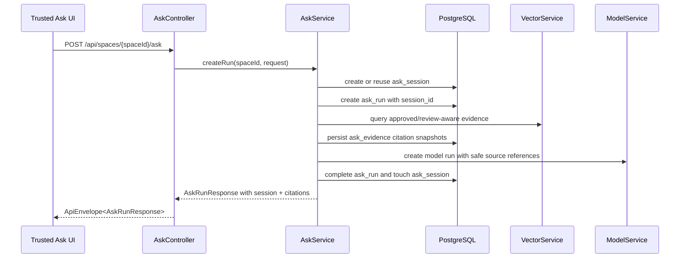
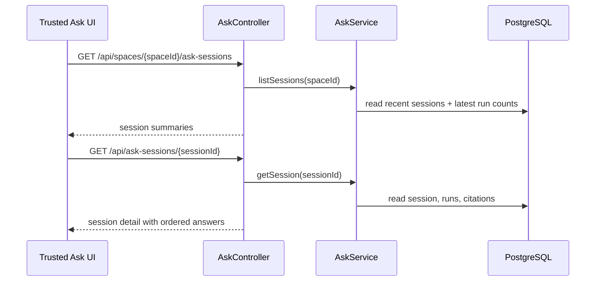

# Data Flow: Ask Session Citations

## Create Ask Run With Session

## Read Session History

## Citation Safety Flow

1. Vector results provide source chunk id, file item id, source file, page, section, confidence, review status, vector key, and score.
2. `AskService` filters by review policy.
3. `AskService` derives safe `evidenceLabel` and `sourceLocator`.
4. `AskService` sets `citationStatus`, `reviewEligible`, and `excludedReason`.
5. `AskEvidence` stores the citation snapshot.
6. DTO mapping returns safe fields only.

## Error Flow

- Unknown session: safe not-found response.
- Cross-space session: safe validation response.
- Unsafe session title or requestedBy: safe validation response.
- Model/vector failure: existing Ask failure behavior stores a safe message and returns `FAILED`.

## Verification Points

- API contract tests assert create/reuse/list/detail paths.
- Unit tests assert citation status derivation and safe labels.
- Frontend tests assert session and citation rendering.
