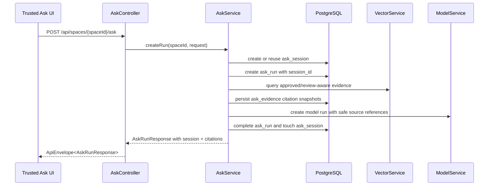
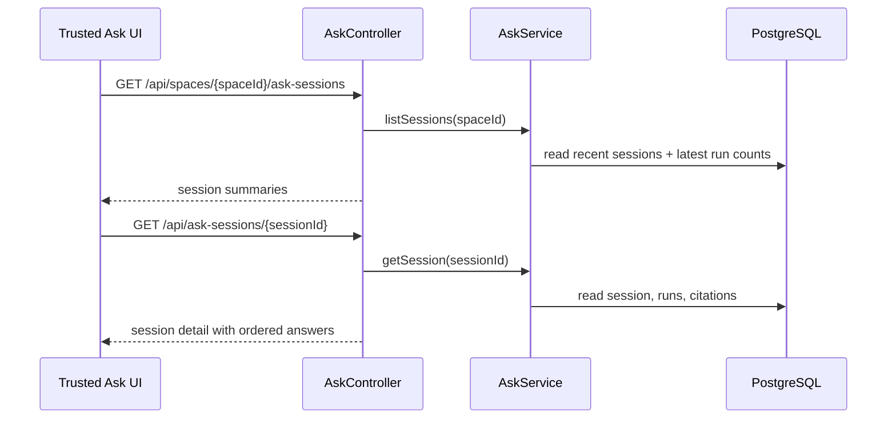

# 数据流：Ask Session Citations

## 使用 Session 创建 Ask Run

## 读取 Session History

## Citation Safety Flow

1. Vector results 提供 source chunk id、file item id、source file、page、section、confidence、review status、vector key 和 score。
2. `AskService` 按 review policy 过滤。
3. `AskService` 派生安全 `evidenceLabel` 和 `sourceLocator`。
4. `AskService` 设置 `citationStatus`、`reviewEligible` 与 `excludedReason`。
5. `AskEvidence` 存储 citation snapshot。
6. DTO mapping 只返回安全字段。

## Error Flow

- Unknown session: 安全 not-found response。
- Cross-space session: 安全 validation response。
- Unsafe session title 或 requestedBy: 安全 validation response。
- Model/vector failure: 复用现有 Ask failure behavior，存储 safe message 并返回 `FAILED`。

## Verification Points

- API contract tests 断言 create/reuse/list/detail paths。
- Unit tests 断言 citation status derivation 和 safe labels。
- Frontend tests 断言 session 与 citation 渲染。
