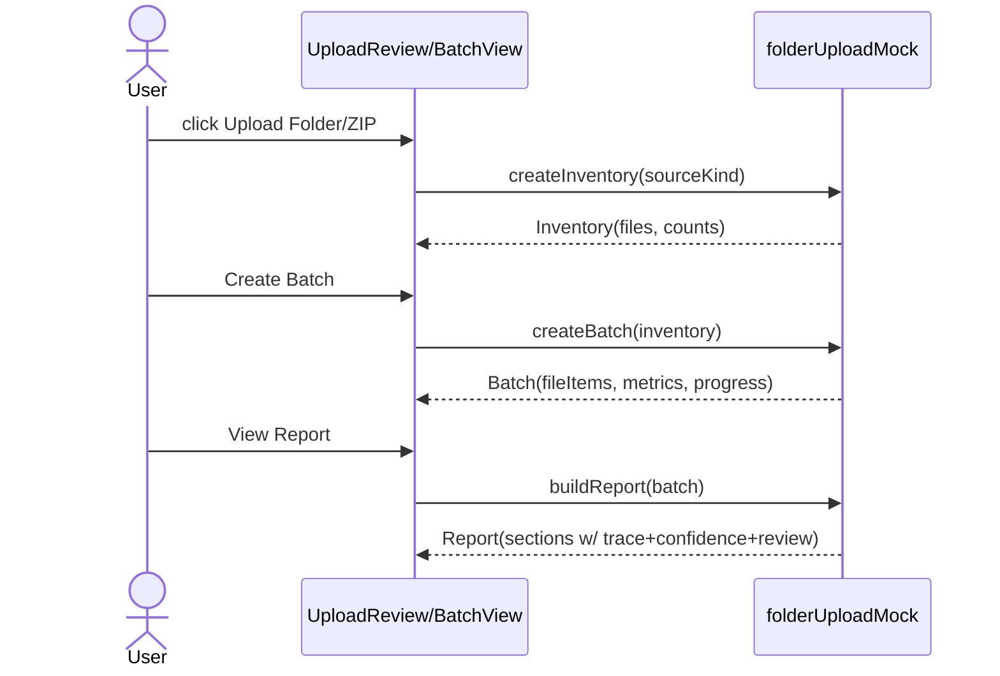

# Data Flow: Folder Upload

## Status

Draft. Phase 1 FE, mock-only. Derived from `docs/03-spec/folder-upload-spec.md` and `docs/04-architecture/folder-upload-architecture.md`.

## Overview

All flows are in-memory and synchronous-from-the-user's-view. No network, no disk, no adapters. The `folderUploadMock` module is the single data source and the future adapter seam.

## Flow 1: Trigger → Inventory

```
User clicks Upload Folder / Upload ZIP
   → view calls folderUploadMock.createInventory(sourceKind)
   → module returns Inventory { sourceKind, packageName, files[], detectedCount }
   → each file classified supported|unsupported by type
   → view renders UploadReview (state INVENTORY_READY or INVENTORY_EMPTY)
```

No file is read; `createInventory` returns a seeded representative sample. `sourceKind` only sets the label (`Folder` vs `ZIP`).

## Flow 2: Inventory → Batch

```
User clicks Create Batch (enabled iff supportedCount >= 1)
   → view calls folderUploadMock.createBatch(inventory)
   → module builds Batch:
        - id, name (package name), uploadedAt (mock now), owner (mock)
        - fileItems[]: each supported file gets a seeded target FileStatus
          along the design status flow; unsupported → UNSUPPORTED
        - confidence + reviewStatus per item (generated/low → REVIEW_REQUIRED)
        - metrics derived by counting fileItems by status
        - progress[]: 4 stages with mock percentages derived from metrics
   → view transitions to BATCH_CREATED and re-renders Documents tab with the batch
```

## Flow 3: Batch → Report

```
User clicks View Report
   → view calls folderUploadMock.buildReport(batch)
   → module returns Report {
        inventory[], unsupported[], conversionFailures[],
        lowConfidence[], reviewRequired[], approvedPublished[]
     }, each entry carrying sourceTrace + confidence + reviewStatus
   → view opens BatchReport (state REPORT_OPEN)
```

## Flow 4: Cross-cutting (language/theme)

```
User switches language or theme while in any upload state
   → only presentation copy/tokens change
   → inventory/batch/report state objects are preserved unchanged
```

## Status Transition (mock)

Batch creation assigns each supported file a deterministic terminal-for-now status along:

```
NEW → UPLOADED → PDF_CONVERTED → MARKDOWN_GENERATED → REVIEW_REQUIRED → APPROVED → PUBLISHED
                     ├→ PDF_CONVERT_FAILED → FAILED
                     ├→ LOW_CONFIDENCE
                     └→ OCR_REQUIRED
Unsupported → UNSUPPORTED (bypasses the flow)
```

The mock distributes statuses so metrics are representative (some converted, some markdown, some review-required, a few failed/unsupported), mirroring the baseline `batch` sample proportions. No automatic advance to `APPROVED`/`PUBLISHED` for generated content — that gate belongs to the future review slice.

## Error / Empty Paths

| Trigger | Data-flow result |
|---|---|
| `createInventory` yields 0 files | Inventory.detectedCount = 0 → state INVENTORY_EMPTY, Create Batch disabled |
| all files unsupported | supportedCount = 0 → state INVENTORY_EMPTY, unsupported group shown |
| Cancel | pending Inventory discarded; active batch unchanged |
| inventory exceeds cap | Inventory.files truncated to max; `truncated: true` flag surfaced in UI note |

## Sequence (Mermaid)



## Constraints Recap

- No network/disk/adapter calls anywhere in these flows (mock-only).
- Trace/confidence/review preserved on every generated object.
- Future real flows swap `folderUploadMock` for adapter-backed calls without changing view contracts.
