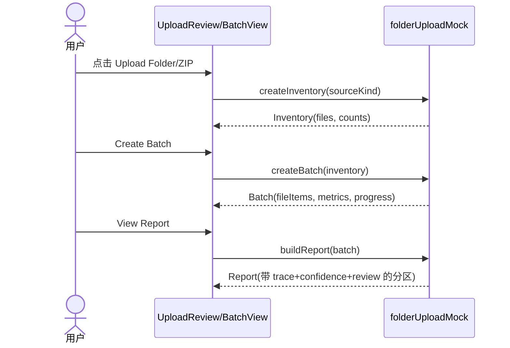

# 数据流：文件夹上传（Folder Upload）

## 状态

草稿。Phase 1 前端，仅 mock。源自 `docs/03-spec/folder-upload-spec.md` 与 `docs/04-architecture/folder-upload-architecture.md`。

## 概述

所有流程在内存中、从用户视角同步。无网络、无磁盘、无适配器。`folderUploadMock` 模块是唯一数据源，也是未来适配器缝隙。

## 流程 1：触发 → 清单

```
用户点击 Upload Folder / Upload ZIP
   → 视图调用 folderUploadMock.createInventory(sourceKind)
   → 模块返回 Inventory { sourceKind, packageName, files[], detectedCount }
   → 每个文件按类型分类 supported|unsupported
   → 视图渲染 UploadReview（状态 INVENTORY_READY 或 INVENTORY_EMPTY）
```

不读取任何文件；`createInventory` 返回种子化的代表性样本。`sourceKind` 仅设置标签（`Folder` vs `ZIP`）。

## 流程 2：清单 → 批次

```
用户点击 Create Batch（当 supportedCount >= 1 时可用）
   → 视图调用 folderUploadMock.createBatch(inventory)
   → 模块构建 Batch：
        - id、name（包名）、uploadedAt（mock now）、owner（mock）
        - fileItems[]：每个支持文件沿设计状态流得到种子目标 FileStatus；
          不支持 → UNSUPPORTED
        - 每项 confidence + reviewStatus（生成/低置信 → REVIEW_REQUIRED）
        - metrics 由按状态计数 fileItems 派生
        - progress[]：4 阶段，mock 百分比由 metrics 派生
   → 视图转到 BATCH_CREATED 并以该批次重渲染 Documents 标签页
```

## 流程 3：批次 → 报告

```
用户点击 View Report
   → 视图调用 folderUploadMock.buildReport(batch)
   → 模块返回 Report {
        inventory[]、unsupported[]、conversionFailures[]、
        lowConfidence[]、reviewRequired[]、approvedPublished[]
     }，每条携带 sourceTrace + confidence + reviewStatus
   → 视图打开 BatchReport（状态 REPORT_OPEN）
```

## 流程 4：横切（语言/主题）

```
用户在任一上传状态下切换语言或主题
   → 仅展示文案/token 变化
   → 清单/批次/报告状态对象保持不变
```

## 状态转换（mock）

批次创建为每个支持文件沿以下路径分配确定性的（当前为终态的）状态：

```
NEW → UPLOADED → PDF_CONVERTED → MARKDOWN_GENERATED → REVIEW_REQUIRED → APPROVED → PUBLISHED
                     ├→ PDF_CONVERT_FAILED → FAILED
                     ├→ LOW_CONFIDENCE
                     └→ OCR_REQUIRED
不支持 → UNSUPPORTED（绕过流程）
```

mock 分布状态使指标具代表性（部分 converted、部分 markdown、部分 review-required、少量 failed/unsupported），对齐基线 `batch` 样本比例。生成内容不会自动前进到 `APPROVED`/`PUBLISHED` —— 该门属未来 review 切片。

## 错误 / 空态路径

| 触发 | 数据流结果 |
|---|---|
| `createInventory` 产出 0 文件 | Inventory.detectedCount = 0 → 状态 INVENTORY_EMPTY，Create Batch 禁用 |
| 全部文件不支持 | supportedCount = 0 → 状态 INVENTORY_EMPTY，展示不支持分组 |
| Cancel | 丢弃待定 Inventory；活动批次不变 |
| 清单超过上限 | Inventory.files 截断到上限；UI 提示暴露 `truncated: true` 标志 |

## 时序（Mermaid）



## 约束回顾

- 这些流程中任何位置都无网络/磁盘/适配器调用（仅 mock）。
- 每个生成对象保留 trace/confidence/review。
- 未来真实流程把 `folderUploadMock` 换成适配器支撑的调用，且不改视图契约。
