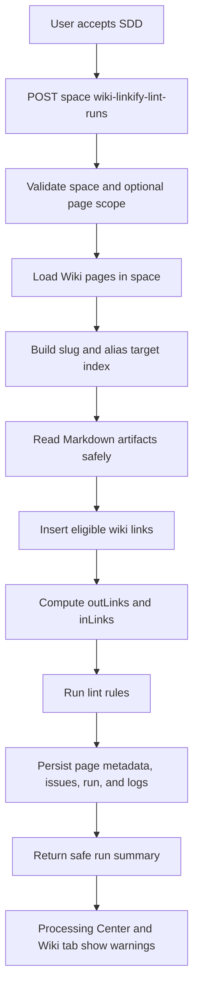

# Data Flow: Wiki Linkify And Lint

## Status

Draft for user review.

## Main Flow

## State Transitions

| Entity | Transition |
|---|---|
| Run | `REQUESTED -> RUNNING -> SUCCEEDED`, `PARTIAL_FAILED`, or `FAILED`. |
| Wiki page | `inLinks`, `outLinks`, `version`, and `lastUpdated` may change; `reviewStatus` does not change. |
| Issue | New/open lint issues are written as `OPEN`; previous matching open issues may be resolved or replaced deterministically. |
| Log | `RUN_STARTED`, `METADATA_UPDATED`, `ISSUE_RECORDED`, and `RUN_FINISHED` events are appended. |

## Edge Cases

| Case | Expected behavior |
|---|---|
| No Wiki pages | Run succeeds with zero pages scanned and safe summary. |
| Ambiguous alias | No link inserted for that alias; affected page receives `REVIEW_REQUIRED` issue. |
| Missing artifact | Page metadata is not rewritten; safe issue/log is recorded. |
| Existing broken link | `BROKEN_LINK` issue is recorded without deleting the original link. |
| Root/index orphan | `INDEX` or root page types may be exempt from orphan warnings. |
| Repeated run | Link arrays and issues remain deterministic; no duplicate links. |

## Verification Hooks

- Unit tests for Markdown protected-region parsing and link insertion.
- Service tests for target index, stale source, broken link, orphan, thin content, and idempotency.
- API tests for validation and safe response shape.
- Frontend tests for Processing Center and Wiki page warnings.
