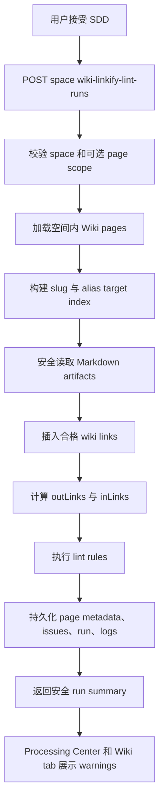

# 数据流：Wiki 自动互链与质量检查

## 状态

供用户审阅的草稿。

## 主流程

## 状态转换

| Entity | Transition |
|---|---|
| Run | `REQUESTED -> RUNNING -> SUCCEEDED`、`PARTIAL_FAILED` 或 `FAILED`。 |
| Wiki page | `inLinks`、`outLinks`、`version`、`lastUpdated` 可能变化；`reviewStatus` 不变化。 |
| Issue | 新/open lint issues 写为 `OPEN`；之前匹配的 open issues 可被确定性 resolved 或 replaced。 |
| Log | 追加 `RUN_STARTED`、`METADATA_UPDATED`、`ISSUE_RECORDED`、`RUN_FINISHED` 事件。 |

## 边界场景

| Case | Expected behavior |
|---|---|
| 没有 Wiki pages | run 成功，scanned pages 为 0，并返回 safe summary。 |
| Alias 有歧义 | 不为该 alias 插入链接；相关页面获得 `REVIEW_REQUIRED` issue。 |
| Artifact 缺失 | 不重写页面 metadata；记录安全 issue/log。 |
| 已有 broken link | 记录 `BROKEN_LINK` issue，但不删除原始链接。 |
| Root/index orphan | `INDEX` 或 root page types 可豁免 orphan warning。 |
| 重复 run | Link arrays 和 issues 保持确定性；不产生重复 links。 |

## 验证锚点

- Markdown protected-region parsing 与 link insertion 单元测试。
- Target index、stale source、broken link、orphan、thin content、idempotency 服务测试。
- Validation 与 safe response shape API 测试。
- Processing Center 与 Wiki page warnings 前端测试。
